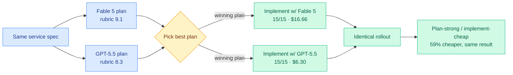

# Plan With the Strong Model, Implement With the Cheap One (Kilo)

**TL;DR.** Kilo ran a controlled head-to-head: both Claude Fable 5 and GPT-5.5 planned the same service, the plans were scored against a rubric, then both models implemented the *winning* plan from identical starting points in Kilo Code CLI. Fable 5 wrote the clearly better plan (9.1 vs 8.3 on the rubric). But when both models implemented that same plan, both passed all 15 acceptance checks and produced identical rollout behavior — and GPT-5.5 did it for $6.30 versus Fable 5's $16.66. Planning with Fable 5 and implementing with GPT-5.5 produced the same service for **59% less** than using Fable 5 for both phases. Surfaced via the Twitter farmer (@kilocode), with the blog body captured.

## What it is

A practitioner experiment that separates a coding task into two phases — *planning* and *implementation* — and routes each to the model that is cost-effective for it. The finding is that the planning/implementation split is where model quality differences actually live: the stronger model's advantage shows up in the plan (9.1 vs 8.3), but once a good plan exists, a cheaper model executes it just as well (both 15/15 acceptance, identical rollout) at a fraction of the cost. Switching models between phases is one click in Kilo. The post was written and tested on the pre-shutdown Claude Fable 5; Kilo notes the finding ("plan with your strongest model, implement with a cheaper one") holds regardless of which specific strong model you use, which is more relevant now that Fable 5 access was pulled.

## How it relates to prior wiki knowledge

This is a clean **phase-level instance of trajectory routing**, extending the [routing page's](llm-routing.md) production-evidence line. The [Kilo Code audit](2026-06-07-kilo-code-model-task-routing-audit.md) (06-07) established two production findings: more reasoning is not monotonically better, and *coverage is disjoint* (cheap and expensive models catch different bugs). This new experiment adds a third, sharper one: **capability is phase-localized.** The expensive model earns its cost in planning (the high-leverage, hard-to-verify phase); the cheap model suffices for implementation (the verifiable, plan-constrained phase). That is exactly the trajectory-routing axis the page defined (pick the model *per step* from trajectory signals) realized at the coarsest, most actionable granularity — two phases, two models.

It is the workflow-level twin of two architecture-level results from the same day. [VibeThinker-3B](../inference-efficiency/2026-06-16-vibethinker-3b-compression-coverage.md) (06-16) argues *verifiable* reasoning compresses into a small model — implementation against a fixed plan is exactly the verifiable phase, so a small/cheap model should suffice, which is what Kilo measured. [FastContext](../agentic-systems/2026-06-16-fastcontext-exploration-subagent.md) (06-16) splits exploration to a cheap subagent for the same reason. Three same-day datapoints — workflow phase (Kilo), model architecture (VibeThinker), subtask (FastContext) — all say: decompose the agent loop and right-size the model per piece, rather than running one frontier model end to end.

It also sits against the wiki's standing tension with the orchestration line ([Conductor](2026-05-11-conductor-sakana-orchestrating-frontier-models.md), [Orchestra-o1](2026-06-15-orchestra-o1-omnimodal-orchestration.md)): those *learn* the routing policy with RL; Kilo shows a hand-specified two-phase split already captures most of the cost win, which sets the bar a learned orchestrator must beat.

## Gaps

A single service-building task with one rubric — n=1, not a benchmark. "Identical rollout" and 15/15 on both implementations may reflect a task whose implementation phase was easy once planned; harder tasks might show the cheap model failing at execution too. The plan-quality rubric is Kilo's own. Whether the 59% saving generalizes across task types (vs this one webhook-style service) is unestablished.

## Industrial implication

For coding-agent products on metered billing, the immediately actionable rule is: do not pay frontier prices for the implementation phase. Plan with the strongest available model, then switch to a cheaper one to execute the plan. Kilo ships this as a one-click phase switch, which makes it a product feature, not just an experiment. Combined with the Anthropic Fable 5 shutdown pushing teams off a single provider, phase-split routing across providers becomes both a cost and a resilience strategy.

**Source:** Twitter (@kilocode) — surfaced via farmer · [Blog](https://blog.kilo.ai/p/claude-fable-5-vs-gpt-5-5) · [Raw tweet](../../raw/twitter/2026-06-15-evening.md)
