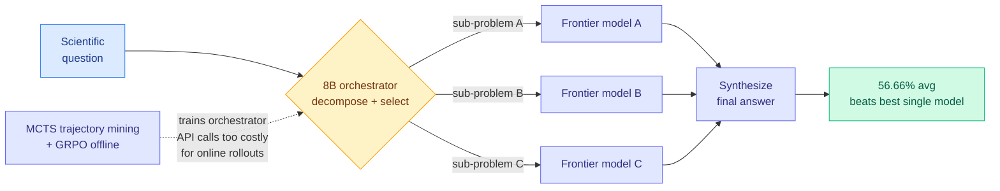

# SciOrch: Learning to Orchestrate Expert LLMs for Solving Frontier Multimodal Scientific Reasoning Tasks

**Source:** HuggingFace daily papers, 2026-06-18.
**arxiv:** [2606.15872](https://arxiv.org/abs/2606.15872)
**Tier:** 1 — Routing (learned model-level orchestration, trained offline)

## TL;DR

SciOrch trains a lightweight 8B model to act as an orchestrator over frontier commercial LLMs for hard scientific reasoning. The orchestrator decomposes each question, delegates the sub-problems to selected frontier models through API calls, and then synthesizes a final answer. The key difficulty is that every routing action is an API call that costs real dollars and real latency, which makes the standard online rollouts that agentic RL depends on infeasible. SciOrch solves this by mining orchestration trajectories offline with MCTS (Monte Carlo Tree Search, which explores decision branches by sampling rollouts and backing up their values), extracting per-node single-turn samples from those trajectories, and then optimizing the orchestrator with GRPO-style training (Group Relative Policy Optimization, which scores a group of candidate actions against each other instead of using a learned value critic). On a 240-question test set spanning SGI-Reasoning and Scientists' First Exam, the 8B orchestrator reaches 56.66% average accuracy. That beats the strongest single commercial model by 3.74 points and the strongest multi-agent baseline by 3.33 points, while spending less than half the API cost of typical multi-agent methods. The headline finding is that a small learned router beats the best single frontier model and does it cheaper.

## Key findings and claims

- **A small learned orchestrator beats the best single frontier model.** 56.66% average accuracy, which is 3.74 points above the strongest single commercial model and 3.33 points above the strongest multi-agent baseline.
- **It wins on cost, not just accuracy.** SciOrch attains the best accuracy on both SGI-Reasoning and Scientists' First Exam (SFE) while using less than half the API cost of typical multi-agent methods.
- **The complementarity premise is the whole point.** Single-model evaluation hides large complementarity: different frontier models excel on different question types, and no single model captures the full picture. Orchestration exists to harvest that.
- **Offline trajectory mining replaces online rollouts.** Because each routing action triggers an expensive API call, standard online agentic RL is infeasible. SciOrch instead produces diverse orchestration trajectories with MCTS, extracts per-node single-turn samples, and trains the orchestrator with GRPO-style optimization on that mined data.

## How it relates to prior wiki pages

SciOrch is the newest entry in the wiki's "routing IS the policy" line, the recurring finding that the right place for orchestration is a learned policy, not a hand-built prompt graph (see [llm-routing.md](llm-routing.md)).

- **[Conductor](2026-05-11-conductor-sakana-orchestrating-frontier-models.md)** (05-11, a 7B model trained with RL to orchestrate frontier workers like GPT-5 and Claude Sonnet 4, beating every individual model at ~3 calls per question) established the template: a small RL-trained router over frontier models that decides topology and per-worker prompts as one policy.
- **[Maestro](2026-05-23-maestro-rl-orchestrated-model-skill-ensemble.md)** (05-23, a 4B orchestrator that uses outcome-only RL to coordinate frozen experts across a model-skill registry and beats GPT-5 on multimodal benchmarks) extended the template to a hierarchical model-skill ensemble and showed generalization to unseen experts.
- **[Orchestra-o1](2026-06-15-orchestra-o1-omnimodal-orchestration.md)** (06-15, an 8B orchestrator trained with DA-GRPO whose reward is aligned to routing decisions, beating the second-best system by 10.3% on OmniGAIA) pushed the template into the omnimodal regime and made the reward decision-aligned.

What SciOrch adds is the **training-cost constraint as a first-class problem**. Conductor, Maestro, and Orchestra-o1 all assume online RL rollouts are affordable. SciOrch's premise is that they are not: when each orchestration action is a paid frontier-model API call, you cannot do millions of online rollouts. Its answer is to decouple exploration from optimization. MCTS does the expensive trajectory exploration once, the per-node single-turn samples it produces become a reusable offline dataset, and GRPO-style training optimizes the 8B orchestrator on that dataset without further live calls. This is the same "orchestrator is the model, routing is the learned policy" frame, but it is the first in this wiki to confront the dollar-and-latency cost of *training* the orchestrator rather than only the cost of *running* it. And like Conductor (which beat every individual worker) and Maestro (which beat GPT-5), SciOrch beats the best single frontier model, now with an explicit ledger showing it does so at under half the API cost of multi-agent baselines.

## Research angle (open problems)

- **Does the orchestrator generalize beyond scientific reasoning?** SciOrch is trained and tested entirely on scientific-reasoning suites (SGI-Reasoning, SFE). Whether the learned decompose-delegate-synthesize policy transfers to coding, open-ended, or general agentic tasks is unknown. Maestro raised the same question about cross-task-family transfer and did not fully settle it; SciOrch inherits it.
- **Must the model pool be fixed at train time?** The orchestrator is trained against a specific set of commercial models. If the pool changes (a model is deprecated, a cheaper one appears), does the policy still route well, or does it need retraining? Conductor's randomized-agent-pool training and Maestro's registry-expansion result both attacked this; whether SciOrch's offline-mined policy has the same robustness is untested.
- **The cost of the orchestrator's own MCTS training.** The offline trajectory mining still issues many API calls to build the dataset. The paper reports inference-time API savings, but the up-front MCTS exploration cost is part of the true total. The amortization story (how many queries you must serve before offline-trained SciOrch is cheaper than running a multi-agent baseline online) is the production-relevant number and is not laid out.

## Gaps in the study

- **Small test set.** 240 questions across two suites is a thin evaluation for a 3-4 point accuracy claim. Confidence intervals and per-suite breakdowns matter at this size, and benchmark-specific artifacts are hard to rule out.
- **Single domain.** Scientific reasoning only. No evidence the approach holds outside it.
- **Fixed commercial model pool.** The delegation targets are a fixed set; robustness to pool changes is not demonstrated.
- **Training cost not fully accounted.** The API cost of the MCTS trajectory-mining phase is not reported alongside the inference-time savings, so the end-to-end economic comparison against multi-agent baselines is incomplete.

## Links

- [Paper](https://arxiv.org/abs/2606.15872)
- [LLM Routing concept page](llm-routing.md)
- [Conductor (05-11)](2026-05-11-conductor-sakana-orchestrating-frontier-models.md) · [Maestro (05-23)](2026-05-23-maestro-rl-orchestrated-model-skill-ensemble.md) · [Orchestra-o1 (06-15)](2026-06-15-orchestra-o1-omnimodal-orchestration.md)
- Raw source: [../../../raw/huggingface/2026-06-18-sciorch-learning-to-orchestrate-expert-llms-for-solving-fron.md](../../../raw/huggingface/2026-06-18-sciorch-learning-to-orchestrate-expert-llms-for-solving-fron.md)
