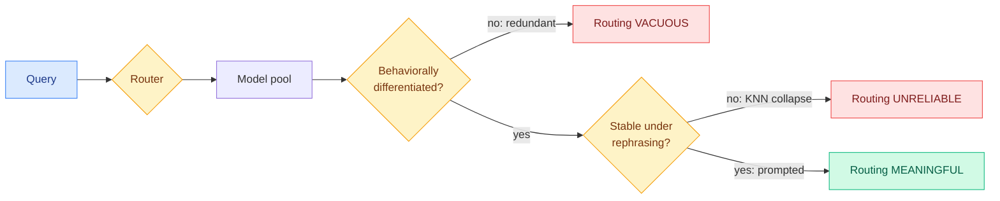

# When Is Routing Meaningful? Diversity and Robustness in Language Model Societies

**Source:** DAIR.AI Top Papers of the Week (July 13-19), via Gmail starred | **arXiv:** [2607.09197](https://arxiv.org/abs/2607.09197) | **Authors:** Fantine Huot, Michael Kaisers, Mirella Lapata (DeepMind-affiliated)

## TL;DR

Model-selection routers are judged on task accuracy and inference cost. This paper shows both can be high while the router is meaningless: if the model pool is behaviorally redundant, routing is vacuous; if the router is unstable under query rephrasing, routing is unreliable. It introduces two diagnostics orthogonal to accuracy: Hierarchic Social Entropy (HSE) for pool diversity, and a perturbation-based robustness metric for stability. On EmbedLLM and RouterBench, learned KNN routers gain accuracy but collapse under paraphrase, while prompted routing stays stable. A curated subset of fewer than 10 agents recovers most of a large pool's diversity.

## Diagram

## Key points

- **Two conditions for meaningful routing**, both orthogonal to accuracy: (1) behavioral differentiation of the model society (identical actors → routing is vacuous); (2) routing stability (surface-form variants of a query must route to the same actor).
- **Hierarchic Social Entropy (HSE)**, adapted from multi-agent-systems theory, scores genuine behavioral diversity accounting for hierarchical structure, not just model count.
- **Perturbation robustness metric**: rephrase a query, check it still routes the same way.
- **Findings.** HSE shows strong diminishing returns → fewer-than-10-agent coreset recovers most diversity (practical society-design heuristic). KNN routers: accuracy up on specialist pools, robustness collapses under perturbation. Prompted routing: stable across all perturbation types. Accuracy and meaningfulness sharply diverge.

## Relation to prior wiki knowledge

- **The falsification test the routing thread never had.** Prior wiki routing work covered *where* the decision is made: TraceR (model level), MinT (adapter level), CaRE / BEAM (expert level), per-token and per-head variants, DLR (latent-code level). All were scored on accuracy/cost. This paper is the evaluation substrate they now must answer to.
- **Coreset finding rebukes large-pool complexity.** "Route across 30 models" is mostly wasted operational complexity if <10 curated models recover the diversity.
- **KNN-collapse is a live production warning.** Many production routers are learned embedding/KNN classifiers, exactly the fragile-under-paraphrase kind.

## Gaps

Diagnostic, not a method (tells you if a router is meaningful, not how to build a better one). Tested on open benchmarks (EmbedLLM, RouterBench); coreset finding untested on pools with proprietary frontier models. Perturbations are surface-form rephrasing; deeper semantic-preserving transforms not measured.

## Research angle

Turn HSE from a diagnostic into a training objective: optimize a router for HSE-weighted accuracy under a perturbation-consistency constraint, directly fixing the KNN-collapse failure. Falsifiable: such a router should retain accuracy on specialist pools while matching prompted routing's paraphrase robustness.

## Raw source

[arXiv 2607.09197](https://arxiv.org/abs/2607.09197) · DAIR.AI weekly · captured in `raw/gmail/2026-07-20-starred.md`, `raw/huggingface/2026-07-20.md`
