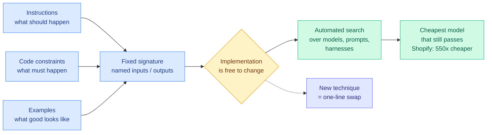

# Separating the Task from the Model — the 550x Cost Cut Behind a Fixed Contract

**TL;DR.** Maxime Rivest and Isaac Miller (DSPy) argue that a repeated AI task should be a named function with defined inputs and outputs, so the implementation inside is free to change. Fix that contract and swapping models becomes a one-line experiment rather than a rewrite. The headline evidence: Shopify cut an AI workload's cost by **550x**, not through a clever technique, but by holding the contract fixed and letting search find the cheapest model that still passed. Their second claim is the more original one: a complete task specification needs three languages, not one. Natural-language instructions for what *should* happen, code for what *must* happen, and examples for what *good* looks like.

## The three-language argument

The interesting part is *why* three specification languages, rather than "write better prompts."

**Instructions** are efficient for anything you can articulate. Rivest's analogy: explaining a board game to a friend in two minutes, versus making them learn it from self-play like AlphaZero. When articulation works, it is enormously cheaper than demonstration.

**Code** is the only reliable way to enforce a hard constraint. His invoice example: run a cheap predict first, escalate to chain-of-thought only if the cheap path returned nothing, and hard-throw to a human if the value is negative. Those are invariants that must hold regardless of model capability. His line, which is the sharpest in the talk: *even with AGI, I still want these things to be true.*

**Examples** are the only way to transmit the latent long tail, which is why internships exist. His father could not explain in words or in code how he knew a tree was a maple.

Once all three are present, the goal is fully specified and can be optimized automatically. That is the whole argument: the specification is the durable asset, and the model is a swappable implementation detail.

## The 550x number

Shopify's reduction came from swapping an expensive model for a cheap one while keeping business logic intact. The flexible contract is what made the swap safe. The cost reduction is what made a previously infeasible data scale feasible. That is the important second-order effect: routing to a cheap model is usually framed as saving money on existing work, but here it changed what work was possible at all.

## What is shipping in DSPy 4

- **`dspy.flex`** extends the optimization target from few-shot examples to prompts to *actual code*, learning a custom harness for a function over time. Optimizing the harness, not just the prompt, is a meaningful widening of the search space.
- **Qualitative learning**, explicitly framed as an open research question. The argument against conventional evals is three-part: defining "good" is hard for real problems; scalar labels destroy information (knowing an email is bad carries far less signal than knowing what to change); and any hill you construct is a proxy for reality. The proposal is to let models interpret whatever textual feedback already exists in the environment (traces, user actions, product analytics) and convert that into both the eval and the hill, refining both over time.

Their answer to "what about AGI" deserves quoting: intelligence is very different from being all-knowing. Ask Einstein to help with your emails and he would ask what an email is. A capable model will not know your context, your relationships, or your problem, so the last-mile specification problem survives arbitrary capability gains.

## Why it matters (relation to prior wiki)

This is the *engineering precondition* for everything on the [llm-routing](llm-routing.md) page, and no prior wiki entry states it explicitly.

Every routing result the wiki has logged assumes you can swap the model without breaking the system. [The Kilo Code audit (06-07)](2026-06-07-kilo-code-model-task-routing-audit.md), which found MiniMax M3 caught 13 of 17 planted bugs for $0.07 where the cheapest Claude run caught the same 13 for $1.30, is a *measurement* that presupposes swappability. [Kilo's plan/implement split (06-16)](2026-06-16-kilo-plan-implement-model-split.md), which cut cost 59% by using the strong model only for planning, presupposes it twice. DSPy's contribution is naming the thing that makes swappability real and treating it as the architectural decision.

It also converges with Dan Farrelly's agent-architecture talk from the same AI Engineer conference ([video](https://www.youtube.com/watch?v=X1kp-ABIIxQ), 07-21), which argued that context (models, prompts, tools) has a half-life of weeks to months while the execution layer can last years, and that the failure mode is coupling them so the fastest-decaying layer's half-life leaks into the others. Two independent talks at the same event making the same structural claim: **isolate the model behind a stable boundary, because the model is the part that changes fastest.** That is now a three-datapoint pattern when you add Microsoft's [MAI production routing](2026-07-25-microsoft-mai-production-routing.md), where routing across Copilot, Excel, and Outlook is only possible because the task boundary is already fixed.

It is also the most direct answer available to the open lever the 06-07 audit named. That audit found cheap and expensive models catch *disjoint* bug sets, and concluded the win is coverage-aware routing rather than cheapest-capable selection. DSPy's automated search over a fixed contract is the machinery that could actually find a coverage-aware policy, because it optimizes against the eval rather than against a hand-written cost rule.

## Gaps

550x is one workload at one company, reported secondhand in a conference talk, with no description of what the original implementation was doing wrong. A large fraction of a 550x gap is usually the baseline, not the optimizer. Qualitative learning is presented as an open question rather than a shipped capability, and converting ambient product analytics into an eval hill is exactly the setting where reward hacking is easiest, which the talk does not address.

- Source: [The Unreasonable Effectiveness of Separating the Task from the Model](https://www.youtube.com/watch?v=GgLQ02aO-hs) (AI Engineer, 2026-07-23) — Maxime Rivest, Isaac Miller
- Raw: `raw/youtube-ai-tech/2026-07-23-Separating-The-Task-From-The-Model-DSPy.md`
- Related: [Kilo Code routing audit](2026-06-07-kilo-code-model-task-routing-audit.md) · [Kilo plan/implement split](2026-06-16-kilo-plan-implement-model-split.md) · [Microsoft MAI production routing](2026-07-25-microsoft-mai-production-routing.md) · [llm-routing](llm-routing.md)
