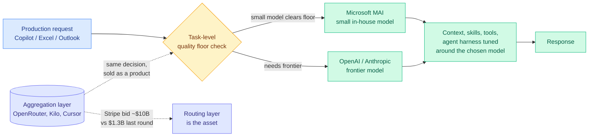

# Microsoft MAI Routing, and Stripe's Reported $10B Bid for OpenRouter

**TL;DR.** Two industry events on the same day price the routing thesis. Satya Nadella's post on Microsoft's MAI model family reveals that Microsoft now routes production traffic in GitHub Copilot, Excel, and Outlook to its own smaller models whenever those models match or beat frontier alternatives on the specific task, keeping OpenAI and Anthropic models in the pool for work that needs them. Separately, the WSJ reports Stripe is in talks to acquire OpenRouter, the model marketplace, at around **$10B** against a last private valuation of **$1.3B**. Routing has gone from a research topic to a shipped default at the largest enterprise software vendor, and to an eight-figure-multiple acquisition target, inside one news cycle.

## What Microsoft actually said

Nadella's framing, quoted by Kilo Code's Brian Turcotte, is: "using the right model for each task, and optimizing the context, skills, tools, and agent harness around it."

The operational content matters more than the MAI benchmark numbers that accompanied it. Microsoft is not announcing that its small models are better. It is announcing that it evaluates *per task* whether a small in-house model clears the quality bar, and routes to it when it does. Frontier models remain in the mix for work that needs them. That is capability-based routing with a cost objective, running in three of the highest-volume software products on earth.

Kilo's self-interested but checkable counter-datapoint: their Auto Efficient mode reportedly reaches **71% of frontier completion rate at 72% lower cost**, with no custom models. Their argument is that you do not need to train your own MAI to get the same economics; you need a router and a diverse pool.

## What the OpenRouter number means

OpenRouter is a routing and billing layer. It trains no models and owns no weights. A reported ~$10B price against a $1.3B last round is roughly an 8x markup on an aggregation business whose entire value proposition is that no single lab wins every task.

Two readings, and they are not mutually exclusive. The generous one, which Kilo pushed publicly, is that the price is the market putting a number on model choice: aggregation captures value precisely because capability is jagged across labs and prices vary by an order of magnitude for adjacent quality. The cynical one is that Stripe is buying a payments rail with unusually good AI-spend telemetry, and the routing is incidental to the metering.

The wiki's own prior evidence favors the first reading. The [Kilo Code audit (06-07)](2026-06-07-kilo-code-model-task-routing-audit.md) found that MiniMax M3 caught 13 of 17 planted bugs for about $0.07 where the cheapest Claude Opus 4.8 run caught the same 13 for $1.30, and critically that the cheap and expensive runs **did not catch the same bugs**. Disjoint coverage at wildly different prices is exactly the market structure that makes an aggregator valuable.

## Why it matters (relation to prior wiki)

This is the strongest industry validation the [llm-routing](llm-routing.md) page has recorded, and it lands on a specific open question.

The page has tracked the **routing-as-substitute** thesis (a router over commodity models can stand in for one expensive model) through [Conductor (05-11)](2026-05-11-conductor-sakana-orchestrating-frontier-models.md), a 7B RL-trained orchestrator over frontier workers that beat every individual worker at about three calls per question, and its commercialized descendant [Sakana Fugu Ultra v1.1 (07-24)](2026-07-24-sakana-fugu-ultra-router.md), which claims to beat Anthropic's Fable 5 without Fable 5 in its pool. Microsoft's MAI decision is a weaker but far better-evidenced version of the same claim: not "a router beats the frontier model," but "for most production traffic, the frontier model is not the right answer, and we can tell which traffic is which."

It also directly tests [When is routing meaningful (07-20)](2026-07-20-when-is-routing-meaningful.md), the DeepMind-derived skepticism that routing only pays off when the pool is genuinely diverse in cost and capability. Microsoft's pool (in-house small models plus OpenAI plus Anthropic) satisfies the diversity condition about as well as any pool can, which is why the routing works. That is a confirmation of the skeptical position, not a refutation of it: the condition is met, so the gain is real.

The phase-routing line ([Kilo plan/implement split, 06-16](2026-06-16-kilo-plan-implement-model-split.md), where the strong model wrote the better plan but both models implemented it identically, cutting cost 59%) predicted exactly this production shape. What Microsoft adds is scale: Copilot, Excel, and Outlook are not a benchmark.

The economic urgency the page flagged on 06-07 (GitHub Copilot moved to usage-based billing on 06-01, Uber reportedly burned its 2026 AI-coding budget by April) is now visible in Microsoft's own routing decision. The company that changed Copilot's billing model is the company routing Copilot's traffic away from frontier models.

## Open question this raises

Every routing result the wiki tracks optimizes cost against a quality floor. None of them optimize **coverage** (predict which model catches which failure class), which the 06-07 audit identified as the unexploited lever because the disjoint-coverage finding implies an orchestrated ensemble beats cheapest-capable selection. If Microsoft is routing at Copilot scale on a quality-floor rule alone, it is leaving the coverage gain on the table, and a competitor's coverage-aware router is the obvious attack.

## Gaps and caveats

The Nadella post is a corporate blog and gives no routing accuracy, no fallback rate, and no measure of how often the small model is chosen. Kilo's 71%/72% figure is a vendor number on a vendor benchmark. The Stripe-OpenRouter deal is reported as talks, not signed, and the $10B is a WSJ-sourced range.

- Sources: [Kilo Code analysis of Microsoft MAI](https://blog.kilo.ai/p/microsofts-mai) (Brian Turcotte, 2026-07-24) · [WSJ: Stripe in talks to buy OpenRouter](https://www.wsj.com/tech/ai/stripe-in-talks-to-buy-buzzy-ai-model-marketplace-openrouter-decc6a74) · [@kilocode](https://x.com/kilocode/status/2080693273601929333)
- Raw: `raw/twitter/2026-07-25-afternoon.json`
- Related: [Kilo Code routing audit](2026-06-07-kilo-code-model-task-routing-audit.md) · [Kilo plan/implement split](2026-06-16-kilo-plan-implement-model-split.md) · [When is routing meaningful](2026-07-20-when-is-routing-meaningful.md) · [Sakana Fugu Ultra](2026-07-24-sakana-fugu-ultra-router.md) · [llm-routing](llm-routing.md)
