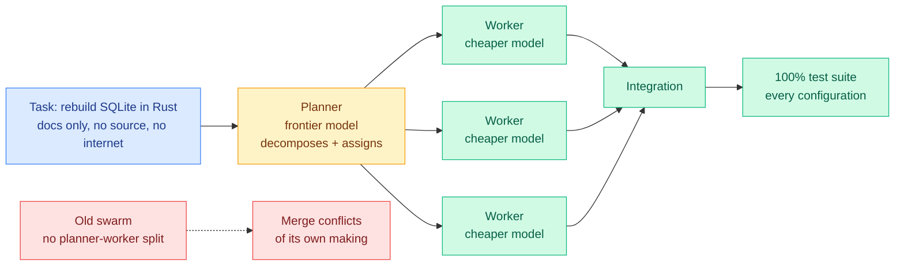

# Cursor's Agent Swarm: Separate the Planner From the Workers

**Source:** The Decoder, 2026-07-26 | **Link:** [The Decoder](https://the-decoder.com/cursors-agent-swarm-suggests-cheaper-models-can-handle-most-coding-when-frontier-models-plan-the-work/) | **Raw:** [raw file](../../raw/rss/2026-07-26-the-decoder-cursor-s-agent-swarm-suggests-cheaper-models-can-handle.md)

## TL;DR

Cursor set its upgraded agent swarm and the previous version the same task: rebuild SQLite in Rust from documentation alone, with no source code and no internet access. Every configuration of the new system, which separates a planner from the workers that execute, eventually reached 100% on the test suite. The old swarm, which did not make that separation, choked on merge conflicts it created itself. The conclusion Cursor draws is the one the wiki has been assembling from four other directions: cheaper models can do most of the coding provided a frontier model does the planning.

## Diagram

## What it is

A production coding product reorganising its multi-agent architecture around an explicit role split. The planner is the expensive model and does decomposition and assignment. The workers are cheaper models and do the writing. The benchmark is deliberately contamination-resistant in the same spirit as [Masov (07-26)](../responsible-ai/2026-07-26-masov-access-control-cyber-benchmark.md), the access-control cyber benchmark built from unpublished zero-days: withholding the SQLite source and the internet means the swarm cannot retrieve the answer, though SQLite's design is unquestionably in pretraining data, which is a weaker guarantee than Masov's.

## The interesting failure, not the interesting success

The headline is that the new swarm hits 100%. The more informative fact is *how the old one failed*: merge conflicts it generated itself. That is not a capability failure of any individual worker. It is a coordination failure, and it says the binding constraint in multi-agent coding is write-conflict management rather than per-agent code quality. Adding a planner fixes it because the planner partitions the work so the workers do not collide, which means the planner's real job is less "think hard" and more "carve the task into non-overlapping pieces."

That reframing matters for cost. If the planner's value is partitioning rather than reasoning depth, the frontier model may be overkill for it, and nobody has tested a cheap partitioner against an expensive one on this axis.

## Relation to prior wiki state

This is the fifth independent datapoint for role-based model assignment in about six weeks, and the threshold for calling it a settled pattern is well past:

- [Kilo (06-16)](2026-06-16-kilo-plan-implement-model-split.md) ran the controlled version: Fable 5 wrote the better plan (rubric 9.1 vs 8.3), but when both models implemented that same winning plan, both passed 15/15 acceptance checks and GPT-5.5 did it for $6.30 against Fable 5's $16.66. Plan strong, implement cheap, 59% cheaper.
- [Disentangling Agent Self-Evolution (06-08)](../agentic-systems/2026-06-08-disentangling-agent-self-evolution.md) found harness-updating is flat across model tiers, so a Qwen3.5-9B edits scaffolding about as well as Claude Opus 4.6, while the benefit of those edits is non-monotonic in solver strength. Cheap model to the editor role, frontier capacity to solving.
- [Conductor (05-11)](2026-05-11-conductor-sakana-orchestrating-frontier-models.md) trained a 7B RL orchestrator that beats every individual frontier worker it directs, at roughly 3 calls per question.
- [DSPy / Shopify (07-25)](2026-07-25-dspy-task-model-separation-550x.md) reported a 550x cost cut from fixing the task contract and searching for the cheapest passing model.
- [Multi-Head Latent Control (07-27)](2026-07-27-multi-head-latent-control.md), today, does the same split automatically and per-instance by reading the small model's hidden states, cutting large-model usage up to 90.7% on AndroidWorld.

The pattern: **no frontier model is Pareto-dominant across the roles inside one task, and the money is in assigning roles rather than picking a winner.** Cursor is the datapoint that says a shipped product now depends on it.

## Gaps

The Decoder's writeup carries no cost figures, no model names, and no worker count, so "cheaper models can handle most coding" is a directional claim rather than a measured ledger. "Every configuration eventually scored 100%" hides the variable that matters most in production, which is how long eventually took and how many tokens it burned. One task, one target, and SQLite is unusually well-specified by its documentation, which is exactly the condition that makes clean partitioning possible. A codebase with tangled cross-cutting concerns is the case where the planner-worker split should degrade, and it is untested.

## Related pages

- [LLM Routing](llm-routing.md) — concept page
- [Multi-Head Latent Control](2026-07-27-multi-head-latent-control.md) — the automatic version of this split
- [Kilo: plan strong, implement cheap](2026-06-16-kilo-plan-implement-model-split.md)
- [Multi-Agent Systems](../agentic-systems/multi-agent-systems.md)
