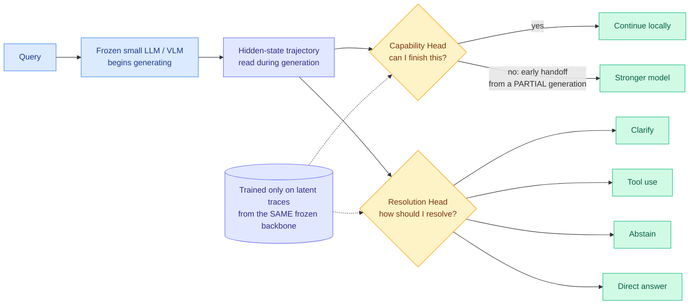

# Multi-Head Latent Control: Reading the Router Off the Hidden States

**Source:** HuggingFace Daily Papers, 2026-07-27 | **arXiv:** [2607.14277](https://arxiv.org/abs/2607.14277) | **Raw:** [raw file](../../raw/huggingface/2026-07-27-multi-head-latent-control-a-unified-interface-for-llm-agent.md)

## TL;DR

Every router the wiki has catalogued so far reads the **input**: the query text, an embedding of it, a learned classifier over it. Multi-Head Latent Control (MHLC) reads the **generation instead**. Two lightweight heads sit on top of a frozen LLM or VLM and consume its hidden-state trajectory as it produces tokens. A Capability Head predicts whether this model can finish the instance or should hand off to a stronger one. A Resolution Head picks among clarify, call a tool, abstain, or just answer. Because the signal is the model's own partial generation rather than the prompt, handoff can fire mid-answer. Reported result: up to **90.7% fewer large-model calls on AndroidWorld** and 27 to 53% fewer on average across benchmarks, while retaining most large-model performance, plus up to +158% relative gain on tool-use decision quality and 65.5% fewer missed required tool calls.

## Diagram

## What it is

A post-hoc control layer. The backbone is frozen and never modified. Both heads train only on latent traces harvested from that same backbone, which means the adaptation is cheap and does not touch the weights people actually serve. The paper's framing is that agentic deployment needs more decisions than next-token prediction supplies: proceed, defer, ask, call a tool, or refuse. Today those decisions are made by prompt-level routing, external orchestration, or task-specific fine-tuning, all of which read input-side signals and all of which the authors argue are costly to maintain as backbones churn.

## Why the latent side matters

The wiki's routing pages have been circling this for three months without naming it. [TRACER (04-17)](2026-04-17-tracer-llm-routing.md) trains a cheap surrogate on production traces and gates on a confidence threshold, but the surrogate still reads the input. [Step-level Optimization for computer-use agents (05-02)](2026-05-02-step-level-optimization-computer-use-agents.md) escalates when learned Stuck and Milestone monitors fire on the execution trace, which is trajectory-level and therefore the closest prior art, but the monitors watch environment state and progress rather than the model's internals. [DLR (05-15)](2026-05-15-dlr-dynamic-latent-routing-post-training.md) routes in latent space but within a model, not between models.

MHLC is the first entry here that makes the **inter-model** routing decision from **intra-model** evidence. That has one property none of the input-side routers can offer: the decision improves as the generation proceeds, because the trajectory carries more evidence at token 50 than at token 0. An input-side router has to commit before it has seen the model try.

## Relation to prior wiki state

- **Confirms the plan-strong / implement-cheap ledger, from a different layer.** [Kilo's controlled head-to-head (06-16)](2026-06-16-kilo-plan-implement-model-split.md) found that planning with Fable 5 and implementing the winning plan with GPT-5.5 passed all 15 acceptance checks for 59% less than using the frontier model throughout. Kilo split by *phase*, decided by a human, fixed in advance. MHLC splits by *instance difficulty*, decided by the model, at runtime. Same finding underneath: frontier capacity is needed for a minority of the work.
- **Extends the DSPy fixed-contract argument.** [Separating the Task from the Model (07-25)](2026-07-25-dspy-task-model-separation-550x.md) reported Shopify cutting an AI workload 550x by holding the task signature fixed and searching for the cheapest model that still passed. That search is offline and per-task. MHLC is the online, per-instance version of the same economics.
- **Runs directly into the meaningfulness diagnostics.** [When Is Routing Meaningful? (07-20)](2026-07-20-when-is-routing-meaningful.md) showed that a router can post high accuracy and low cost while being vacuous (if the model pool is behaviorally redundant) or unreliable (if it collapses under query rephrasing), and specifically found that learned KNN routers collapse under paraphrase while prompted routing stays stable. MHLC is a learned router, so it inherits that suspicion, but with an interesting twist: it conditions on the generation rather than the query, and paraphrase-invariance of a *generation trajectory* is plausibly higher than that of a query embedding. The paper does not test this. It is the single most valuable missing experiment.

## Gaps

The heads train on latent traces from one specific frozen backbone, so every backbone swap means retraining, which is the same maintenance cost the paper criticises prompt-level routing for, just relocated. The 90.7% reduction is on AndroidWorld, a GUI-agent benchmark, and the average across benchmarks is the far more modest 27 to 53%, so the headline is the best case rather than the typical one. No paraphrase-robustness or pool-diversity numbers in the sense [When Is Routing Meaningful?](2026-07-20-when-is-routing-meaningful.md) demands. And there is no latency accounting: reading hidden states during generation and running two heads is cheap in FLOPs but sits on the critical path, and an early handoff means the small model's partial generation is discarded work.

## Open questions this raises

1. **Is the latent signal paraphrase-stable where the input signal is not?** If yes, latent-side routing is not just cheaper but structurally more robust, and the KNN-collapse result stops being a general indictment of learned routers.
2. **How early does the Capability Head become accurate?** The value of the whole design is early handoff. A curve of handoff accuracy against tokens generated is the number that decides whether this ships.
3. **Cache interaction.** Discarding a partial generation and re-prefilling on the large model is exactly the cache-invalidation cost the [llm-routing](llm-routing.md) page has flagged as an unpublished open problem. MHLC makes routing decisions more often, so it makes that cost more frequent.

## Related pages

- [LLM Routing](llm-routing.md) — concept page
- [Kilo: plan strong, implement cheap](2026-06-16-kilo-plan-implement-model-split.md)
- [When Is Routing Meaningful?](2026-07-20-when-is-routing-meaningful.md)
- [DSPy task-model separation](2026-07-25-dspy-task-model-separation-550x.md)
- [Cursor's planner-worker agent swarm](2026-07-27-cursor-agent-swarm-planner-worker.md) — the same split, shipped
