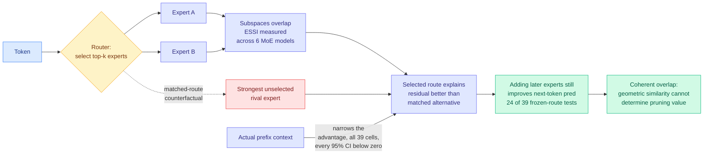

# Beyond Geometric Complementarity: Coherent Overlap in Sparse MoE Routing

**Source:** HuggingFace Daily Papers, 2026-07-31 · [arXiv 2607.28308](https://arxiv.org/abs/2607.28308) · [raw](../../raw/huggingface/2026-07-31-beyond-geometric-complementarity-coherent-overlap-in-sparse.md)

## TL;DR

The standard story for why sparse mixture-of-experts works, where each token is routed through a small subset of specialized sub-networks, is **geometric complementarity**: co-selected experts should contribute distinct representation directions, so routing to two experts buys you two different things. This paper measures that story and finds it false in its strong form and still fine in its weak one. Expert subspaces **overlap substantially** across six MoE architectures, yet the routes the model actually picks explain token representations better than matched alternatives, and adding a second expert still improves next-token prediction. The authors name the joint pattern **coherent overlap**: routing selects token-relevant experts from a **shared geometric neighbourhood**, and useful multi-expert computation persists **without disjoint linear coverage**.

## What it measures

The contribution is measurement discipline. Existing evidence for or against expert specialization conflates three quantities: **route coherence** (does the router pick a sensible set?), **candidate quality** (is the selected expert good?), and **candidate-by-context interaction** (does the surrounding prefix change which expert is good?). The paper separates them with:

- an **Expert Subspace Separation Index (ESSI)** to quantify geometric overlap between experts,
- **matched-route residuals**, comparing the selected route against the strongest unselected rival on the same token,
- a **prefix-controlled 2×2 factorial** across 39 cells in OLMoE, Mixtral and DeepSeek,
- **frozen-route interventions** and a controlled Top-k training study for functional value.

## Key findings

- Across **six MoE architectures**, expert subspaces overlap substantially. The clean-specialization picture is not what these models learned.
- In **every one of the 39 factorial cells**, the selected candidate explains more of the residual representation than the strongest unselected rival. The router is doing real work.
- The actual prefix **narrows** that advantage throughout: all interactions are negative and **every 95% confidence interval lies below zero**. Context makes the unselected rival relatively better, uniformly.
- Geometric narrowing does **not** imply functional redundancy. Adding later experts improves next-token prediction in **24 of 39** frozen-route comparisons, with the other 15 inconclusive. A controlled training study favours **Top-2 over Top-1 in all three seeds**.

## Gaps

Everything is measured on pretrained checkpoints of three model families in the factorial, so the negative-interaction result is an observation about learned routers rather than about MoE as an architecture. Frozen-route interventions test the marginal value of an expert *given* the route, not the value of the route itself. And 15 of 39 comparisons landing inconclusive is a statistical-power story the abstract does not quantify, which softens "useful multi-expert computation persists" more than the framing suggests.

## Relation to prior wiki state

**Directly bears on the pruning line.** [HodgeCover (05-18)](../inference-efficiency/2026-05-18-hodgecover-simplicial-laplacian-moe-compression.md) compressed MoE by treating expert coverage geometrically, and [BEAM (05-16)](2026-05-16-beam-binary-expert-activation-masking-moe.md) masks expert activation. Both belong to a family that reasons about which experts are redundant using representation geometry. This paper's closing claim is that **geometric similarity alone cannot determine redundancy or pruning value**, which is a direct caution to that family: two experts occupying overlapping subspaces can still both be functionally necessary, so a geometry-based pruning criterion will over-prune.

**Refines the routing-as-policy thread on [llm-routing.md](llm-routing.md).** That page's convergence claim from [Conductor, CaRE and MISA](llm-routing.md) is that routing *is* the policy. Coherent overlap says the policy is not selecting from disjoint capabilities, it is selecting a good point inside a shared neighbourhood, which changes what a router can be expected to buy. The practical read for anyone building a router: the gain does not come from experts being different, so a router trained to maximize expert diversity is optimizing the wrong objective.

**Same-week rhyme with [EMO pretraining (05-09)](../inference-efficiency/2026-05-09-emo-pretraining-moe-emergent-modularity.md)** on emergent modularity and [UniPool (05-09)](../inference-efficiency/2026-05-09-unipool-shared-expert-pool-moe.md) on shared expert pools: UniPool's design already assumed experts share structure. This paper supplies the measurement that says they do.

## Links

- [llm-routing.md](llm-routing.md)
- [Daily digest 2026-07-31](../daily-digest/2026-07/2026-07-31.md)
