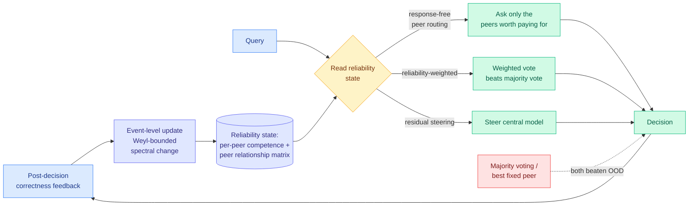

# Σ-Mem: An Online Reliability Memory for LLM-based Multi-Agent Systems

**arxiv:** [2607.27958](https://arxiv.org/abs/2607.27958) · **Source:** [HuggingFace Daily Papers 2026-07-31](../../raw/huggingface/2026-07-31-mem-an-online-reliability-memory-for-llm-based-multi-agent-s.md) (7 upvotes)

## TL;DR

Every memory system this wiki tracks stores **what happened**. Σ-Mem stores **who to trust**. In a multi-agent system a central model receives answers from peer agents and often cannot verify them directly, especially when the answers are plausible and, worse, **correlated** (two peers agreeing tells you nothing if they share a failure mode). Σ-Mem records **historical competence evidence for each peer** plus **peer relationship evidence across the peer set**, both maintained as **real symmetric matrices** updated from post-decision correctness feedback.

The mathematical move is what makes it online rather than a retraining loop. By **Weyl's inequality** (the classical bound on how far a symmetric matrix's eigenvalues can move under a perturbation), the spectral change caused by each event-level update is **bounded**, so the reliability state adapts stably without retraining any underlying model. Σ-Mem then exposes one write-and-read interface serving three different consumers: **residual steering** of the central model, **response-free peer routing** (choose which peer to ask *before* paying for its answer), and **reliability-weighted voting**. Across five Qwen-family models it tracks counterfactual reliability shifts, generalises to unseen peers and unseen task domains, and **direct memory readouts beat both majority voting and the best fixed peer over the full out-of-distribution evaluation set**. Performance improves monotonically as more correctness feedback arrives.

## Why response-free peer routing is the headline for this page

Every routing result on [llm-routing](llm-routing.md) decides where to send a query using something about **the query**. [TRACER (04-17)](2026-04-17-tracer-llm-routing.md) picks a model per query. [CaRE (05-11)](2026-05-11-care-bi-level-routing-moe-continual-learning.md) picks a task-axis expert. [MISA](../inference-efficiency/2026-05-11-misa-mixture-of-indexer-sparse-attention.md) picks per-head KV. [Kilo's plan/implement split (06-16)](2026-06-16-kilo-plan-implement-model-split.md) picks by phase. [Multi-Head Latent Control (07-27)](2026-07-27-multi-head-latent-control.md) reads the model's hidden states mid-generation rather than reading the prompt, cutting large-model calls by up to 90.7%, which was the first move away from query-conditioning.

Σ-Mem routes on **accumulated evidence about the candidate**, not on the query and not on a partial generation. "Response-free" is the operative word: it decides which peer to ask without generating that peer's answer first, which is the difference between a router and a re-ranker. Everything on this page that beats a single model by comparing candidate outputs is paying for all the candidates. Σ-Mem pays for one.

This is the exact lever the page has flagged as unexploited for two months and nobody has pulled. The [Kilo routing audit (06-07)](2026-06-07-kilo-code-model-task-routing-audit.md) found that models have **disjoint coverage**, meaning each catches failure classes the others miss, and the page has repeatedly noted that Microsoft MAI, OpenRouter, Kilo, and Anthropic all route on a quality-floor or safety rule and **none of them routes on coverage** (predict which model catches which failure class). Σ-Mem's peer-relationship matrix is a coverage model. It is not merely per-peer accuracy; the off-diagonal terms encode **which peers fail together**, which is precisely what you need to know whether a second opinion is informative. That is the first concrete mechanism on this page for coverage-aware routing.

## Key results

- **Direct memory readouts beat both majority voting and the best fixed peer** over the full OOD evaluation set. Beating the best fixed peer is the meaningful bar, because it is what [When is routing meaningful (07-20)](2026-07-20-when-is-routing-meaningful.md) argued most routing papers fail to clear once you honestly account for what a well-chosen single model achieves.
- **Adapts to counterfactual reliability shifts** and **generalises to unseen peers and unseen task domains**, evaluated across five Qwen-family models.
- **Weyl's inequality bounds each update's spectral change**, giving stable online adaptation with no retraining of any model.
- **Monotone improvement with feedback volume**, which is the property that makes it a deployable asset rather than a one-time calibration.
- One interface, three consumers: residual steering, response-free routing, reliability-weighted voting.

## How this relates to prior wiki pages

**It answers the routing question [InMind (07-29)](../agentic-systems/2026-07-29-inmind-implicit-association-blind-spot.md) reframed, from the opposite side.** InMind showed retrieval-based memory answers at most **14.4%** of indirect queries whose facts it demonstrably holds, versus **84.0%** with those facts in context, and named the open problem as routing over **which facts occupy context, decided before the query is known**. The wiki noted that this is structurally admission control rather than model selection, because the whole failure is that the query does not tell you what you need. Σ-Mem is the same structure applied to a different resource: decide **which peer occupies your budget** before the query tells you who is right. Both are pre-query allocation problems. Naming them as one class is more useful than treating them as a memory paper and a multi-agent paper.

**It is the first memory paper on the wiki whose stored content is a routing policy.** [agent-memory](../agentic-systems/agent-memory.md) lists five architectural axes (storage substrate, retrieval mechanism, write-time policy, staleness handling, visual fidelity) and every one assumes memory holds propositions about the world. Σ-Mem holds propositions about *other models*. That is a sixth axis, and the page's Open Problem 5, "memory-as-routing-signal: if memory staleness can be detected per-query, it can route to retrieval, refresh, or fallback paths. Untested," is now partially tested, though for peer selection rather than staleness.

**Against [multi-agent-systems](../agentic-systems/multi-agent-systems.md) it attacks the coordination default.** Majority voting and debate both assume peers are exchangeable and their errors independent. Correlated plausible errors break both, and the wiki has logged that failure repeatedly without a fix. Σ-Mem's relationship matrix is the fix: model the correlation explicitly and downweight agreement between peers known to fail together.

**The honest caution comes from this page's own scepticism.** [When is routing meaningful (07-20)](2026-07-20-when-is-routing-meaningful.md) found many reported routing gains do not survive honest accounting of the router's own cost, and [IBM's system-optimisation work (07-15)](2026-07-15-model-routing-system-optimization-ibm.md) argued routing is priced wrong because the router's own latency and error rate are usually excluded. Σ-Mem is unusually well positioned against both critiques, because its router is a matrix read rather than a model call, so its inference cost is nearly zero. But it has a cost the others do not: it needs **post-decision correctness feedback**, and in most production settings that label does not exist. That is the real adoption barrier, not compute.

## Gaps

- **Correctness feedback is assumed available.** The entire mechanism is driven by post-decision correctness. In verifiable domains (code that compiles, maths with an answer key) that is free. In the open-ended settings where routing saves the most money, it is exactly what is missing, and substituting an LLM judge reintroduces the false-positive basin [More Convincing, Not More Correct (07-26)](../llms-foundation-models/2026-07-26-self-play-reward-hacking-llm-judges.md) measured at a 0.719 rate.
- **Five Qwen-family models is a homogeneous peer set.** Peers from one family share pretraining and therefore share failure modes, which should make the relationship matrix *easier* to learn and less useful. A genuinely diverse pool (one closed frontier model, one open MoE, one small specialist) is the interesting test and is absent.
- **No cost numbers.** Response-free routing's whole selling point is not paying for unused peer responses, and the paper reports accuracy rather than cost-per-decision. That is the number that would make this an industrial result.
- **Cold start and adversarial peers.** Monotone improvement with feedback implies a cold-start period where the memory is worse than majority voting, unquantified. And a peer that is reliable during evaluation and then degrades, or is adversarial, is the obvious attack on a trust-accumulating system.

## Industrial implication

The natural home is any production system already fanning a request out to several models and voting or picking, which is now standard in agentic coding, ensemble classification, and LLM-judge pipelines. Those systems currently pay for every candidate and combine them naively. A reliability matrix that is cheap to read, updates in place, and encodes which models fail together turns that fan-out into a selection, and the saving scales with the number of peers you stop calling. The gating requirement is a correctness signal, which is why the first deployments will be in verifiable domains: CI-verified code generation, tool calls with schema validation, retrieval with citation checks. Watch for a serving layer that exposes per-model reliability as a queryable artefact; that is the productised form, and it is a short step from what an aggregator like OpenRouter already logs.

## Related pages

- [LLM Routing](llm-routing.md) — the coverage-aware routing lever this is the first mechanism for
- [Agent Memory](../agentic-systems/agent-memory.md) — memory whose content is a routing policy, a sixth axis
- [Multi-Agent Systems](../agentic-systems/multi-agent-systems.md) — the correlated-error failure this addresses
- [Metis (07-31)](../agentic-systems/2026-07-31-metis-memory-foundation-model.md) · [MemHarness (07-31)](../agentic-systems/2026-07-31-memharness-reconstruct-not-replay.md) — same-day memory cluster
- [Daily digest 2026-07-31](../daily-digest/2026-07/2026-07-31.md)
