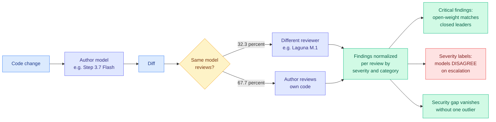

# Kilo: The State of Open-Weight Models in AI Code Review Workflows

**Source:** Twitter thread from [@kilocode](https://x.com/kilocode/status/2084286218435543358) (2026-08-03), linking [kilo.ai research post](https://kilo.ai/articles/open-weight-models-code-review) (published 2026-07-29, updated 2026-08-03) · raw: [`raw/twitter/2026-08-03-evening.json`](../../raw/twitter/2026-08-03-evening.json)

**Author:** Arkadiy Kondrashov (Kilo)

## TL;DR

Kilo analyzed **10,643 real Kilo Code Reviewer runs across 13 models**, classifying every finding by severity and category, then normalizing per review so models that emit more findings do not win by volume. Three claims come out of it. **Open-weight models matched closed leaders on critical findings.** The apparent security gap between open and closed reviewers **mostly disappears once one outlier model is removed**, meaning the aggregate "closed models are safer reviewers" story was carried by a single bad open-weight performer rather than by a systematic difference. And models **disagree substantially about what deserves escalation**, i.e. the severity axis is far less consistent across models than the detection axis. The routing observation is the most consequential for this page: **32.3% of attributed reviews used a different model than the one that wrote the code**, with the most common pairing being Step 3.7 Flash writing and Laguna M.1 reviewing. Kilo's framing is that authoring and reviewing are different jobs and teams are already splitting them in production.

---

---

## Key claims

- **Per-review normalization is the methodological move that makes the comparison mean anything.** A reviewer that flags everything looks thorough on raw counts. Normalizing findings per review and classifying by severity removes that artifact, and it is why the resulting ranking differs from the naive one.
- **One outlier drove the security gap.** This is the most quotable finding, because "open-weight reviewers are less secure" is a widely repeated procurement claim and the data says it was an averaging artifact. It also means the correct decision is model-specific, not tier-specific.
- **Detection and severity are different capabilities with different consistency.** Models agree far more on *what is wrong* than on *how bad it is*, which is exactly backwards from what an escalation-based workflow needs.
- **The author-reviewer split is already a third of production traffic.** Not a proposal, a measurement.

## Gaps

The 32.3% cross-model figure covers only *attributed* reviews, and the attribution rate is not stated, so the denominator is unclear. The outlier model that carried the security gap is not named in the thread, which makes the headline claim hard to act on without reading the full table. Kilo is a routing product and the finding that routing between models is what teams do is directionally favourable to its business, which does not make it wrong but does mean the framing should be read with that in mind. And "critical findings" is defined by Kilo's own classifier, so the severity-disagreement result is measured against a house standard rather than ground truth.

## How this relates to prior wiki pages

**It is the second production routing dataset Kilo has published in five days, and the two make different claims that fit together.** The [07-31 Kilo open-weights cost study](2026-07-31-kilo-open-weights-cost-routing.md) reported that open-weight models now carry **79% of Kilo's coding workload**, and that a Kimi K3 planning plus Grok 4.5 implementation pairing built the same embedded database as Claude Opus 5 for **$1.27 against $31.71**, scoring 93 versus 98, with the five-point gap coming entirely from tests, docs and code hygiene rather than correctness. That study routes on **cost against capability**. This one routes on **role**: authoring and reviewing are different jobs, and a third of production traffic already assigns them to different models. Together they describe a two-axis routing policy that the academic model-selection literature does not model at all, because it treats routing as one dispatch decision per query rather than as a division of labour across a task.

**And the role-split axis is the same structural claim as [Kilo's plan/implement split (06-16)](2026-06-16-kilo-plan-implement-model-split.md) and [Cursor's planner-worker agent swarm (07-27)](2026-07-27-cursor-agent-swarm-planner-worker.md), now with a third role.** Plan, implement, review. Three separate published production splits from two vendors in seven weeks, which is enough to name the pattern: **routing in shipped coding products is decomposition by role, not selection by difficulty.** The routing literature the [llm-routing](llm-routing.md) page tracks is almost entirely selection by difficulty, and [When is routing meaningful (07-20)](2026-07-20-when-is-routing-meaningful.md) found many of those reported gains vanish under honest cost accounting. That negative result may simply not bind the role-decomposition family, because a role split is not trying to pick the best single model for a query.

**The severity-disagreement finding is a measurement-validity result and belongs with this week's cluster of them.** It says the axis an escalation workflow depends on is the least consistent thing the models produce, which is the same shape as [Coherent Overlap (07-31)](2026-07-31-coherent-overlap-moe-routing.md) finding that expert-subspace similarity cannot determine pruning value, and [Eviction as Estimation (08-03)](../inference-efficiency/2026-08-03-eviction-as-estimation-rmm.md) finding that the KV-eviction benchmark suite cannot separate policies. In each case the instrument everyone uses is not measuring the quantity it is trusted for.

**Cross-model review is also a partial answer to a Kilo-adjacent open question.** If a reviewer model disagrees with the author model about severity, the disagreement is itself signal, and the natural next step is an explicit ensemble or adjudication layer rather than a single reviewer. Nothing in the study tests that, and it is the obvious follow-up given that 32.3% of traffic already has two opinions available.

## Related pages

- [LLM Routing](llm-routing.md)
- [Kilo: open weights and cost routing](2026-07-31-kilo-open-weights-cost-routing.md)
- [Kilo plan/implement model split](2026-06-16-kilo-plan-implement-model-split.md)
- [Cursor agent swarm: planner and worker](2026-07-27-cursor-agent-swarm-planner-worker.md)
