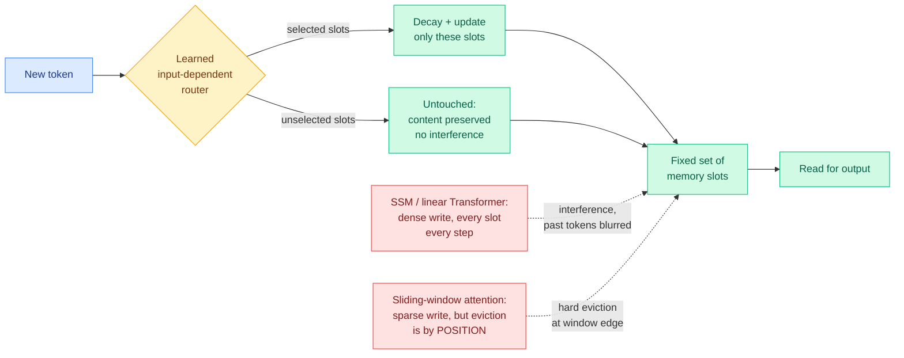

# Raven: High-Recall Sequence Modeling with Sparse Memory Routing

**TL;DR.** Every linear-time sequence model writes to memory in one of two ways, and both ways lose information. State-space models and linear Transformers write **densely**: every new token updates the entire fixed-size state, so nothing is ever formally evicted but everything interferes with everything else, and a specific past token becomes hard to pull back out. Sliding-window attention writes **sparsely**: it keeps explicit per-token representations, so in-window recall is exact, but the moment a token leaves the window it is gone. Raven sits between them. It maintains a fixed set of memory slots and, at each step, a learned input-dependent router selects a **subset** of slots to decay and update, leaving the rest untouched. That single change (route the write, and apply decay only where you wrote) removes sliding-window attention's position-based overwriting and hard eviction while cutting the interference that dense state updates cause. On recall-intensive benchmarks Raven matches or beats prior linear-time baselines, holds up when extrapolated to **16x its training context length**, and the gains carry into hybrid architectures. From Arshia Afzal and Volkan Cevher (EPFL) with Aviv Bick, Eric P. Xing and Albert Gu (CMU, Cartesia AI, MBZUAI).

## What the paper actually claims

The framing is a two-axis classification of how a linear-time model manages memory, and the axes are **write sparsity** and **eviction rule**.

- **Dense write, gradual forgetting.** Mamba, GLA, DeltaNet, Kimi Delta Attention. The state is one matrix, and every token's information is folded into all of it. Old content decays smoothly rather than being deleted, so persistence is in principle unbounded. The cost is interference: new writes dilute old associations, and recovering one specific earlier token means separating it from everything written since.
- **Sparse write, hard eviction.** Sliding-window attention. Token representations are stored explicitly, so an in-window read is exact. But which token gets dropped is decided by **position**, not by content or usefulness, and once dropped recall falls off a cliff.

Raven's contribution is filling the missing quadrant: **sparse write with content-selective, gradual decay.** A learned router reads the incoming token and picks which of the fixed slots to touch. Those slots get decayed and updated. The rest are left exactly as they were.

The comparison the paper is careful to draw is against Gated Slot Attention (GSA) and Attention with Bounded Memory Control (ABC). Both already had input-dependent routing over a fixed slot set. Both still **wrote densely to all slots**, so routing changed the weighting of the write but did not isolate or protect any particular memory. Raven's claim is that the protection is the load-bearing part: a slot you did not route to is a slot whose contents are still exactly retrievable.

## Key results

- Competitive with or better than prior linear-time baselines on recall-intensive benchmarks, specifically in the regime where **both sliding-window attention and SSMs degrade sharply**, which is long-range recall of a specific token.
- Effective when extrapolating to context lengths up to **16x the training length**. For a fixed-state model that number is the interesting one, because a fixed-size memory has no structural reason to extrapolate and usually does not.
- Gains persist **in hybrid architectures**, meaning Raven is a drop-in replacement for the linear layer in a linear-plus-full-attention stack rather than a standalone alternative to attention.

## How this relates to prior wiki pages

**It is the first entry on the routing page where the thing being routed is a memory slot.** [llm-routing](llm-routing.md) has tracked routing across models ([TRACER 04-17](2026-04-17-tracer-llm-routing.md), which picks a model per query), across task-axis experts ([CaRE 05-11](2026-05-11-care-bi-level-routing-moe-continual-learning.md)), across attention heads ([MISA 05-11](../inference-efficiency/2026-05-11-misa-mixture-of-indexer-sparse-attention.md), which picks per-head KV), and across workflow phases ([Kilo's plan/implement split 06-16](2026-06-16-kilo-plan-implement-model-split.md)). Raven routes the **write path into a fixed memory**, which is a different object from all of those: it is an admission-control decision made per token, before anything is read.

That makes it the direct constructive answer to the axis [InMind (07-29)](../agentic-systems/2026-07-29-inmind-implicit-association-blind-spot.md) opened. InMind measured the implicit-association blind spot, where retrieval-based agent memory only surfaces a fact when the fact resembles the query, so a stored tree-nut allergy never fires on a macaron request; six vector, graph and agentic memory systems reached at most 14.4% on indirect queries against 84.0% when the decisive memory was simply placed in context. The wiki's read at the time was that this is structurally **admission control against a fixed budget**, not query-conditioned routing, because the query does not tell you what you need. Raven is exactly that shape of mechanism, one level down: a learned decision about what stays resident, made without knowing the future query. It does not solve InMind's benchmark, which is about an agent's external memory store rather than a layer's internal state, but it is the first architecture in this wiki whose routing decision has the right causal structure.

**It refines the recurrent-rule line on [attention-mechanisms](../llms-foundation-models/attention-mechanisms.md).** That page tracks a sequence of improvements to *how the state updates*: Mamba2/GDN/KDA interpret the update as one step of online SGD on an implicit memorization objective, [MDN (05-11)](../inference-efficiency/2026-05-11-mdn-momentum-deltanet-linear-attention.md) added momentum to that step, [Gated DeltaNet-2 (05-24)](../inference-efficiency/2026-05-24-gated-deltanet-2-decoupled-erase-write.md) decoupled erase from write. Every one of those keeps the write dense. Raven changes the **support** of the write rather than its rule, which is an orthogonal axis, and it means the obvious composition (a momentum delta-rule applied only to routed slots) is unexplored.

It also sharpens what Gated DeltaNet-2's decoupling was reaching for. Separating erase from write is a step toward not destroying what you are not currently using; routing the write to a subset is the stronger version of the same instinct, because an unrouted slot needs no erase gate at all.

**It is a partial answer to the open problem the hybrid-convergence thread left.** [Rethinking Efficient Attention in Hybrid Architectures (06-17)](../inference-efficiency/2026-06-17-rethinking-efficient-attention-hybrid.md) found that long-range retrieval is carried by the **full-attention** layers and the efficient layers only shape their optimization trajectory, and named Large-Window Laziness: a bigger sliding window *delays* retrieval-head formation in the full layers because the cheap layers cover for them. If Raven raises what the efficient layer can recall on its own, the interesting question is whether that helps or whether it makes the laziness worse, because a more capable cheap layer is a better excuse for the full layers not to learn retrieval. The paper reports hybrid gains but this wiki has no evidence either way on retrieval-head formation, and it is the experiment to ask for.

**Against the KV cache accounting, it is on the right side of a claim that just got complicated.** The [local coding model report (07-30)](../inference-efficiency/2026-07-30-local-model-kv-cache-economics.md) measured a roughly 20x KV footprint gap between hybrid-attention and dense models on consumer hardware, and concluded the largest single win available is architectural. Today's [SemiAnalysis Kimi K3 analysis](../hardware/2026-08-04-semianalysis-kimi-k3-architecture.md) shows that in production the constant-state advantage is partly given back, because prefix caching for a linear layer forces you to snapshot the recurrent state at intervals, so serving-time memory grows with sequence length after all. Raven does not change that arithmetic, since it also carries a fixed state that has to be snapshotted. What it changes is the **quality per byte** of that state, which is the axis that survives the prefix-cache objection.

## Gaps

No model scale, parameter count or throughput number appears in the abstract, and for a paper whose entire pitch is linear-time efficiency the absence of a wall-clock or kernel comparison is the biggest hole. Routing a subset of slots per token is a gather-scatter pattern, which is precisely the access shape that does badly on a GPU relative to the dense matrix update it replaces, so "linear-time" and "fast" are not the same claim here and only the first is made. The recall benchmarks are unnamed in the abstract, and this wiki's standing caution applies: [LOCKS (07-29)](../inference-efficiency/2026-07-29-locks-page-local-key-summaries.md) found that selection methods looking healthy on long-context QA collapsed on long-form reasoning (AIME26, MATH-500), because QA has a locatable evidence span and diffuse reasoning does not. A router trained to protect slots holding retrievable facts has no obvious reason to protect slots holding a partial computation. Finally, the router is learned, so it is a component that can be wrong, and nothing reports what a routing mistake costs: writing to a slot that held the one fact you needed is a hard eviction, which is the failure mode Raven was built to avoid.

## Links

- Paper: [arXiv 2607.25357](https://arxiv.org/abs/2607.25357)
- Raw source: [Kurate cs.LG leaderboard, week of 2026-08-04](../../raw/kurate/2026-08-04-cs-lg.md) (#16, ai_rating 7.0/10)
- Related: [llm-routing](llm-routing.md) · [attention-mechanisms](../llms-foundation-models/attention-mechanisms.md) · [kv-cache](../inference-efficiency/kv-cache.md) · [InMind](../agentic-systems/2026-07-29-inmind-implicit-association-blind-spot.md) · [SemiAnalysis on Kimi K3](../hardware/2026-08-04-semianalysis-kimi-k3-architecture.md)
