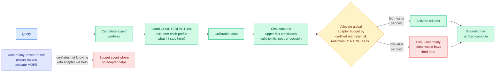

# VI-MoLE: Value-of-Information Routing for Mixtures of LoRA Experts

**Source:** Kurate weekly cs.LG leaderboard #5, ai_rating 5.0/10, tier 1 · [arXiv 2608.02528](https://arxiv.org/abs/2608.02528) · published 2026-08-03 · raw: [`raw/kurate/2026-08-05-cs-lg.md`](../../raw/kurate/2026-08-05-cs-lg.md)

**Authors:** Tom Saliencro (UC Irvine), Rohan Desai (U. Washington), Priya Nair (UC Irvine), Maya Lindqvist (UC Irvine), Daniel Whitmore (U. Washington)

**Not on HuggingFace Daily Papers. LLM-rated underrated.**

## TL;DR

A mixture of LoRA experts is a base model plus a library of cheap low-rank adapters, each specialized, with a router deciding which ones to activate per query. Nearly every such router in the literature is driven by uncertainty: when the model looks unsure, turn on more adapters. VI-MoLE's title states the objection directly, **uncertainty is not enough**, and the reasoning is that uncertainty tells you the model does not know, but says nothing about whether activating a particular adapter would help. Those are different questions, and only the second one is a routing decision. VI-MoLE reformulates routing as **certified value-of-information allocation**: for each candidate expert prefix, learn the counterfactual risk of stopping there, convert those estimates into *simultaneous upper-risk certificates* on held-out calibration data, and then spend a global adapter budget on whichever actions buy the largest certified marginal risk reduction per unit of cost. The word doing the work is *certified*. This is not a heuristic score, it is a statistical guarantee that holds jointly across all the decisions the router makes, which is what lets a fixed budget be allocated with a bound rather than a hope. The paper proves three things: that the certificates are simultaneously valid, that greedy allocation is optimal when certified gains diminish, and a regret bound on the allocation when value estimates are wrong. Evaluation covers matched-compute accuracy, certificate coverage, risk-coverage tradeoffs, robustness under distribution shift, and tail latency.

---

---

## Key claims

- **Uncertainty and value of information are different quantities and routers have been using the wrong one.** A model can be highly uncertain on a query no available adapter improves, and confidently wrong on one a specific adapter fixes. Uncertainty-driven routing spends budget on the first case and misses the second.
- **Certificates are simultaneous, not pointwise.** A per-decision confidence bound does not survive being applied across many decisions, which is the standard multiple-comparisons failure. The paper proves joint validity, which is what a router actually needs because it makes thousands of these calls.
- **Greedy allocation is proven optimal under diminishing certified gains**, so the practical algorithm is cheap and the cheapness is justified rather than assumed.
- **A regret bound under value-estimation error.** The counterfactual risk model will be wrong sometimes, and the paper bounds what that costs rather than assuming accuracy.
- **The evaluation axes are unusually well chosen for a routing paper**: matched-compute accuracy (the only fair way to compare routers), certificate coverage (does the guarantee hold empirically), risk-coverage tradeoffs, distribution-shift robustness, and **tail latency**. Tail latency in particular is the metric adaptive-compute methods usually omit and the one that decides whether they are deployable.

---

## How this relates to prior wiki pages

**This is the second paper in a week arguing that a standard MoE-routing signal does not measure what practitioners think it measures.** Coherent Overlap (07-31, currently Kurate cs.LG #1) found that expert-subspace similarity, the usual tool for deciding which experts are redundant and can be pruned, cannot actually determine redundancy, which means compression ratios derived from it need re-deriving. VI-MoLE makes the parallel claim one level up, about activation rather than pruning: uncertainty, the usual tool for deciding which experts to activate, does not measure whether activation helps. **Same structure, two different routing decisions, both indicting the incumbent signal.** The [08-04 Global View](../daily-digest/2026-08/2026-08-04.md) called this the week's real theme, that the instruments are broken rather than the mechanisms, and this is a further instance.

**It is the strongest formal treatment of the cost-aware routing thread on the [llm-routing page](llm-routing.md).** That page's recurring gap is that most routers optimize an unconstrained quality score and then get deployed under a hard compute budget, with no principled way to connect the two. VI-MoLE's marginal-risk-reduction-per-unit-cost objective is exactly that connection, and the certificates make the budget allocation auditable. This is also the same shadow-price framing that CLEAR used for rationing inference compute across a batch of queries, except VI-MoLE prices adapters within a query rather than queries within a batch. The two compose and neither cites the other.

**It sits next to a Kurate neighbour making a compatible argument.** "Scores Are Not Decisions: Cost-Aware Stopping for Tool Acquisition in LLM Agents" (cs.LG #3 this week) argues that a relevance score is not a stopping rule for agent tool acquisition. VI-MoLE argues an uncertainty score is not an activation rule for adapters. Two papers on the same board, same week, same complaint: **the field keeps using a calibrated-looking scalar as a decision rule without deriving the decision rule from a cost model.**

---

## Gaps

The abstract as posted gives no numbers at all, so the size of the gain over uncertainty-driven routing is unknown, and for a paper whose contribution is largely theoretical that is the first thing a reader needs. No model scales, adapter-library sizes, or task domains are named. Certificate-based methods require calibration data drawn from the deployment distribution, and the paper claims distribution-shift robustness is evaluated but a certificate's validity is precisely the thing that shift breaks, so how the guarantee degrades matters more here than the accuracy numbers. Learning counterfactual risk after each expert prefix implies either an expensive combinatorial estimation over prefixes or a strong factorization assumption, and which one is unstated. Kurate's own 3-LLM tournament rated it only 5.0/10, notably lower than several less interesting papers on the same board, which is itself a data point about the rating signal rather than about the paper.

---

## Industrial implication

Adapter libraries are how most enterprises actually deploy specialization, because full fine-tunes per use case are unaffordable and a base model plus a hundred LoRAs is not. The routing layer over that library is currently a heuristic almost everywhere, and the failure mode VI-MoLE names is the expensive one: burning budget activating adapters on queries where the model is uncertain for reasons no adapter addresses. A certified allocation gives an operations team something they cannot currently get, which is a defensible statement of the form "at this compute budget, risk is bounded by X," rather than an average-case benchmark number. Tail latency being in the evaluation set is the tell that the authors are thinking about serving rather than leaderboards. The honest caveat is that certificates are only as good as the calibration set, so this moves the operational burden from tuning a router to maintaining a representative calibration distribution, which is a better problem to have but not a free one.

---

## 2026-08-25 update: the mechanism named precisely, and an independent derivation at the model level

Two things resolved since this page was written on 08-05.

**Affiliations located** (UC Irvine and University of Washington), closing one of the gaps flagged below. Co-author **Daniel Whitmore** crossed the Kurate rising-author threshold on 08-25 with three top-10 appearances in four weeks at score 16.7, on this paper (cs.LG #5 in W32, #4 in W33) and on SPARCL, spectral partitioned analytic continual learning (cs.LG #3 in W35).

**The failure mode has a sharper name than "uncertainty is not enough."** The paper's own framing is that uncertainty-driven routers **confound uncertainty magnitude with uncertainty reducibility**. Split into two cases: **recoverable risk**, where an unqueried expert holds complementary evidence and querying it genuinely helps, and **residual risk**, where the input is inherently ambiguous and will stay ambiguous after you have queried everything. Existing routers spend identically in both. That is the precise version of this page's original claim that uncertainty "says nothing about whether activating a particular adapter would help," and it is the distinction the certificates are bounding.

**The prior art it is arguing against is a specific lineage**, worth recording because it shows how crowded this niche already is: fixed top-k routing (constant experts per input), dynamic-cardinality methods (AdaMoLE learns activation thresholds, LD-MoLE uses entropy objectives, DynMoLE predicts per-token and per-layer expert counts, ProbMoE and Variational Routing use probabilistic frameworks), and uncertainty-aware routers, of which **CARE** is the closest target since it sets expert count from router concentration and expert disagreement.

**The enabling asymmetry, which this page under-weighted.** Because every adapter sits in a shared pool over one frozen backbone, training can observe **what the unqueried experts would have contributed**. That is genuine counterfactual supervision for learning reducibility, and it is exactly what makes the counterfactual risk model in the mechanism above learnable rather than assumed. Cross-model routing cannot get this signal, since obtaining it means running every candidate model. **Within-model expert acquisition is a structurally easier learning problem than the cross-model routing most of the [llm-routing page](llm-routing.md) is about**, and that asymmetry is probably the most transferable idea in the paper.

**An independent derivation arrived at the model level on 08-25.** [Pandora's Router](2026-08-25-pandoras-router-costly-value-estimation.md) (Google DeepMind) prices *value estimation itself* across separate specialist models, mapping routing onto the classical Pandora's Box problem of optimal search with costly inspection and deriving a closed-form value-of-information policy under a Gaussian signal model. Same formalism, one level up, no cross-citation in either direction. The relationship is complementary rather than redundant: **VI-MoLE assumes you can estimate value and asks how to spend a budget given those estimates with a guarantee; Pandora asks whether producing the estimate is worth paying for in the first place.** A system needs both, and nobody has combined them.

**Three levels, one day.** Add [TileMix (08-25)](../inference-efficiency/2026-08-25-tilemix-tile-centric-mixed-precision-attention.md), which routes numerical precision over tiles of an attention score matrix inside the kernel, and 2026-08-25 carried the same "spend more compute only where it measurably reduces risk" decision at three granularities: across models, across adapters within a model, and across regions of a matrix. Production serving stacks make all three choices independently under three unrelated cost models. The joint objective is unwritten, and it is now the most conspicuous hole in routing theory.

**Still open from the original gaps below:** no numbers in the abstract, no model scales or adapter-library sizes, no statement of whether counterfactual prefix estimation is combinatorial or factorized, and no measurement of how certificate validity degrades under the distribution shift the paper claims to evaluate. Add one: counterfactual supervision costs training compute proportional to pool size, which is the cost the method saves at inference, and that balance is unreported.

## Related pages

- [llm-routing.md](llm-routing.md)
- [Pandora's Router (08-25)](2026-08-25-pandoras-router-costly-value-estimation.md)
- [TileMix (08-25)](../inference-efficiency/2026-08-25-tilemix-tile-centric-mixed-precision-attention.md)
- [Daily digest 2026-08-25](../daily-digest/2026-08/2026-08-25.md)
- [../inference-efficiency/2026-08-05-mixture-of-kittens-moe-megakernel.md](../inference-efficiency/2026-08-05-mixture-of-kittens-moe-megakernel.md)
- [../llms-foundation-models/2026-08-05-llada-moe-v2-scaling-moe-diffusion-lms.md](../llms-foundation-models/2026-08-05-llada-moe-v2-scaling-moe-diffusion-lms.md)
