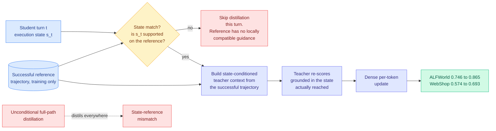

# SMRC-SD: State-Matched Routing and Contextualized Self-Distillation for Multi-Turn Agents

**Source:** HuggingFace Daily Papers 2026-08-10 · [arXiv 2608.05219](https://arxiv.org/abs/2608.05219) · [raw](../../raw/huggingface/2026-08-10-when-privileged-guidance-misaligns-state-matched-routing-and.md)
**Authors:** Junzhuo Liu, Weiwei Li, Jun Ling, Peng Wang (University of Electronic Science and Technology of China)
**Topic:** routing, on-policy distillation, multi-turn agents
**Enrichment:** alphaxiv overview available and used

## TL;DR

Privileged on-policy distillation gives a multi-turn agent dense supervision by letting a synchronized teacher, which can see training-only references like a successful trajectory, re-score the student at every turn. In an interactive environment that breaks, because the student's own earlier actions keep changing the execution state. Once the student takes a different action or completes subgoals in a different order, its rollout reaches states the reference never visited, and the reference stops being valid guidance for the state actually reached. SMRC-SD makes this a **routing decision**: at each turn, verify whether the student's current execution state matches a supported state on the reference trajectory, distil only at matched states, and at those states build teacher context conditioned on the state actually reached rather than on the reference's global path. Task success on ALFWorld goes from 0.746 to 0.865 and on WebShop from 0.574 to 0.693 with Qwen3-1.7B.

## Key findings

- **The named failure is state-reference mismatch.** A reference trajectory is globally correct for the task and only **locally valid** at the pre-action states it was recorded from. Applying it at any other state supplies guidance for a situation the student is not in.
- **Two separable contributions, both ablated.** Routing (distil only at matched states) and contextualization (build state-conditioned teacher context at those states) each contribute; the paper's ablations support both rather than one carrying the result.
- **The gain is large for the model size.** +11.9 points on ALFWorld and +11.9 on WebShop over unconditional successful-full-path distillation, at Qwen3-1.7B.
- **It is an upstream intervention.** Prior work regulates *how much* or *when* a privileged signal counts. This verifies *whether the reference contains a state-compatible continuation at all* before any weighting question arises.

## How this relates to prior wiki pages

**This is the paper [TurnSight (08-05)](../inference-efficiency/2026-08-05-turnsight-turn-level-hindsight-distillation.md) argued for, and it lands five days later.** TurnSight's dissent, which [knowledge-distillation.md](../inference-efficiency/knowledge-distillation.md) called "the most important claim in the cluster," was that the standard privileged context is the wrong context because it derives from the ground-truth answer or a retrieved skill library and **neither describes the state the agent actually reached**, so the teacher's confidence is about the answer rather than about the agent's situation. SMRC-SD implements exactly that objection: it conditions on realized execution state and drops turns where the reference cannot speak to it. **The concept page's standing dissent now has a method, and the method works.**

**It is a genuine routing result, not a distillation paper with a routing word in the title.** [llm-routing.md](llm-routing.md) has been tracking routing decisions by what they select on: [TRACER (04-17)](2026-04-17-tracer-llm-routing.md) picks a model per query, [CaRE (05-11)](2026-05-11-care-bi-level-routing-moe-continual-learning.md) picks a task-axis expert, [Raven (08-04)](../llms-foundation-models/2026-08-04-raven-sparse-memory-routing.md) routes a *write into memory* per incoming token, and [VI-MoLE (08-05)](2026-08-05-vi-mole-value-of-information-routing.md) allocates adapter budget by certified value of information. SMRC-SD adds a new object to that list: **routing a supervision signal, per turn, on a state-compatibility test.** The gate is not cost and not uncertainty. It is validity.

**It is the missing per-step router the routing page predicted on 08-06.** That page, reading [Skill Entropy (08-06)](../llms-foundation-models/2026-08-06-skill-entropy-rl.md), argued that "the interesting router is one that detects an imminent skill switch and escalates only across the boundary, which is a per-step decision inside one query rather than a per-query decision," and noted "nobody is building that." SMRC-SD is a per-step decision inside one task episode. It gates supervision rather than compute, so it is not the predicted router, but it is the first thing on this page with the right temporal granularity.

**It sits in direct tension with [Privileged, but Biased (08-10)](../inference-efficiency/2026-08-10-privileged-but-biased-self-distillation.md), published five days earlier and surfacing on the same day.** That paper finds privileged self-distillation as a lone objective teaches nothing on hard tasks, because conditioning on one reference solution biases the per-token target toward that trajectory. SMRC-SD's fix addresses a *sibling* of that bias, mismatch between reference state and student state, but not the bias itself: at matched states it still takes its target from one particular reference. Whether state matching is sufficient to defuse PI bias, or whether SMRC-SD's ALFWorld and WebShop gains simply sit in the "easy setting" regime where the other paper reproduces gains too, **is the single most important open question in this cluster and neither paper can answer it.**

**Cross-source note.** The rising-author signal on today's Kurate board names **Junlin Liu** at score 17.0, whose top papers include "Contrastive Reinforced Policy Optimization via Privileged Self-Distillation," the CRPO line this wiki has tracked since 08-04. That is a *different* researcher from SMRC-SD's Junzhuo Liu. The name collision is worth flagging so future entries do not merge two author groups working the same problem.

## Gaps

Two environments (ALFWorld, WebShop) at one model size (Qwen3-1.7B). No scaling study, so it is unknown whether the matched-state fraction shrinks as a stronger student diverges further from the reference, which would shrink the usable supervision to nothing. The state-matching test itself is not stress-tested: how it behaves when two states are superficially similar but functionally different is the obvious failure mode and is not reported. And there is no comparison against any of the seven other filtering axes on the concept page.

## Industrial implication

For anyone training a production agent from logged successful trajectories, this says the cheap default is wrong: do not distil against the whole recorded path. Add a state-compatibility gate and drop the turns that fail it. The gate is cheap relative to a teacher forward pass, and dropping turns is a token saving rather than a token cost, so this is the rare correctness fix that is also cheaper.

## Links

- [LLM Routing concept page](llm-routing.md)
- [Knowledge Distillation concept page](../inference-efficiency/knowledge-distillation.md)
- [Privileged, but Biased (08-10)](../inference-efficiency/2026-08-10-privileged-but-biased-self-distillation.md)
- [TurnSight (08-05)](../inference-efficiency/2026-08-05-turnsight-turn-level-hindsight-distillation.md)
- [VI-MoLE (08-05)](2026-08-05-vi-mole-value-of-information-routing.md)
- [Daily digest 2026-08-10](../daily-digest/2026-08/2026-08-10.md)
