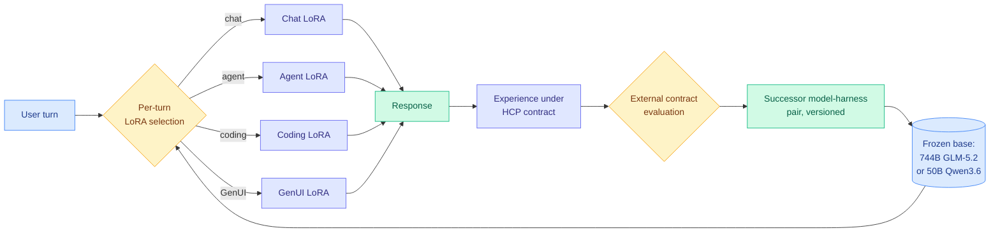

# Macaron-V1: Mixture-of-LoRA and Recursive Model-Harness Co-Design

**TL;DR.** An open agent-model family whose central architectural claim is a routing claim. Macaron-V1 freezes a very large base model and attaches a set of specialist LoRA adapters (small low-rank weight patches that adapt a frozen model without retraining it), then **selects exactly one LoRA per user turn**. The flagship, Macaron-V1-Venti, is a 744B GLM-5.2 base with four adapters covering chat, agent, coding, and generated UI; Macaron-V1-Tall is the same design on a 50B Qwen3.6 base for local deployment. The second half of the system is a recursive loop in which versioned model-harness pairs are evaluated under an external contract and used to build their successor. The authors are explicit that compounding gains from continual learning remain an open question, which is unusually honest for a flagship model report.

## What it is

Two system goals, each with its own mechanism.

**Collaboration is handled by Mixture-of-LoRA (MoL).** The base model never moves. Specialist adapters compose on top of it, and one adapter is chosen per user turn. This is a routing architecture wearing an adapter costume: the routed unit is a set of weights rather than a whole model, and the routing granularity is the conversational turn rather than the token.

**Adaptation is handled by recursive improvement of versioned model-harness pairs.** Experience gathered under one configuration is evaluated against an external contract (the versioned HCP contract) and used to construct the next configuration. Supporting pieces named in the report: the UI4A component-native GenUI harness, a stateful action substrate, the agentic RL framework MindForge, the post-training platform MinT, the long-context RL method LongStraw, and stability techniques for sparse mixture-of-experts and DSA base models.

## Why it matters for routing

**MoL sits at a routing granularity nothing else in this wiki occupies.** The page has logged five axes: model-tier, task/expert, attention-head, trajectory, and latent-trajectory. MoL adds a sixth, **adapter-level routing over a shared frozen base**, and its cost profile is different in a way that matters. Routing across separate models means separate weights resident somewhere and, as this wiki has flagged repeatedly, a prefix-cache invalidation whenever the route changes mid-conversation. Routing across LoRAs on one frozen base keeps the base weights and, in principle, the base KV cache intact. The adapter swap is small. That is the cheapest route-switch mechanism anyone has proposed.

**It converges with the week's other finding that the routable unit is a pair, not a model.** [A²E (08-11)](../agentic-systems/2026-08-11-harness-evolution-cluster.md), the agent-harness auditing engine that found no model-harness combination wins across all task types, argued the unit of comparison is the model-harness pair. Macaron-V1 versions exactly that pair as its unit of improvement. Two papers on the same day, from different directions, treating model and scaffold as one object.

**Role-based assignment gets a sixth datapoint, and this one is productized.** The llm-routing concept page calls role-based model assignment settled at five independent datapoints: [Kilo's plan-strong/implement-cheap split (06-16)](2026-06-16-kilo-plan-implement-model-split.md) at 59% cheaper with identical 15/15 acceptance, [Disentangling Agent Self-Evolution (06-08)](../agentic-systems/2026-06-08-disentangling-agent-self-evolution.md) finding harness-editing ability flat across model tiers, [Sakana's Conductor (05-11)](2026-05-11-conductor-sakana-orchestrating-frontier-models.md) where a 7B orchestrator beat every frontier worker it directed, [DSPy/Shopify (07-25)](2026-07-25-dspy-task-model-separation-550x.md) at 550x from fixing the contract then searching for the cheapest passing model, and Cursor's planner/worker swarm plus Multi-Head Latent Control (07-27). Macaron-V1 is the sixth and it ships the assignment inside one served model rather than across an API boundary.

**It is also the cheap-substitution story from the LoRA-serving side.** [MinT-scale LoRA serving (05-14)](../inference-efficiency/2026-05-14-mint-million-scale-lora-serving.md) established that serving very large numbers of adapters against one base is tractable. Macaron uses four. The interesting question the report does not ask is what happens at four hundred, which is where MoL stops being a specialist-selection scheme and becomes a genuine router with a real decision problem.

## Relation to prior wiki pages

- **Against [When Is Routing Meaningful? (07-20)](2026-07-20-when-is-routing-meaningful.md)**, which found learned KNN-style routers collapse under paraphrase while prompted routing stays stable: MoL's per-turn selection over four coarse, semantically distinct roles (chat, agent, coding, GenUI) is close to the easy end of that spectrum, so paraphrase robustness is plausible here and would not generalize to finer adapter sets. Untested either way.
- **Continual learning is the claim to be skeptical of.** The report itself says compounding gains remain open. [Privileged, but Biased (08-10)](../inference-efficiency/2026-08-10-privileged-but-biased-self-distillation.md), which reproduced self-distillation's published gains on easy tasks and found nothing learned on hard ones, is the relevant prior: a self-improvement loop evaluated on the benchmarks it was tuned against is exactly the setup that produces easy-task gains and no hard-task transfer.
- **The harness-evolution cluster is the same week's context.** [Ouroboros (08-11)](../agentic-systems/2026-08-11-harness-evolution-cluster.md) runs reviewed self-modification of its own implementation; Macaron-V1 runs versioned successor construction under an external contract. The contract is the meaningful difference, because it is the one design in the cluster where improvement is scored by something the system does not control.

## Gaps

The selection mechanism is the least-specified part of a paper whose headline is selection. The abstract does not say what makes the per-turn LoRA choice, whether it is learned or prompted, what it costs, or how often it is wrong, and every one of those determines whether MoL is a routing contribution or a deployment convenience. No adapter-switch latency or KV-cache-behavior figure is reported, which is the number that would establish the cheap-route-switch advantage rather than merely suggesting it. Four adapters is too few to test whether the design scales to a real routing problem. And the evaluation is against frontier baselines on Personal Intelligence, GenUI, and general capability, with no ablation isolating MoL from the very large base it sits on, so how much of Venti's performance is the 744B GLM-5.2 and how much is the adapter scheme is unmeasured.

## Links

- [arXiv 2608.09819](https://arxiv.org/abs/2608.09819)
- [Raw source](../../raw/huggingface/2026-08-11-macaron-v1-towards-open-continual-learning-with-self-improve.md)
- [Daily digest 2026-08-11](../daily-digest/2026-08/2026-08-11.md)
- Related: [llm-routing concept page](llm-routing.md) · [Harness evolution cluster (08-11)](../agentic-systems/2026-08-11-harness-evolution-cluster.md) · [MinT LoRA serving (05-14)](../inference-efficiency/2026-05-14-mint-million-scale-lora-serving.md) · [When Is Routing Meaningful? (07-20)](2026-07-20-when-is-routing-meaningful.md)
