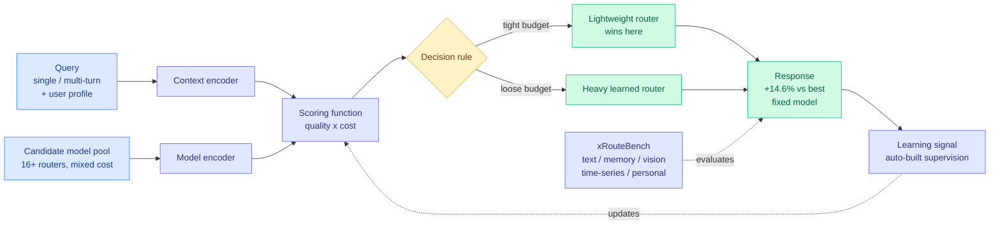

# LLMRouter: Unified Infrastructure for Developing, Evaluating, and Deploying LLM Routers

**Source:** [arXiv 2608.06867](https://arxiv.org/abs/2608.06867) · [HuggingFace](https://huggingface.co/papers/2608.06867) · [raw](../../raw/huggingface/2026-08-14-llmrouter-unified-infrastructure-for-developing-evaluating-a.md)

## TL;DR

This wiki has tracked more than thirty routing papers since April, and almost every one of them invented its own formalism, its own codebase, and its own evaluation. LLMRouter (UIUC, Maryland, NTU, Purdue, UIC) argues that fragmentation is the field's real bottleneck and does the unglamorous work of fixing it. It proposes a single formulation of LLM routing as a **sequential decision process with five components** (context encoders, model encoders, scoring functions, decision rules, learning signals), shows that single-turn, multi-turn, and personalized routing are all instances of it, then ships an automated pipeline that constructs routing supervision and evaluates routers jointly on **response quality and inference cost** rather than quality alone.

Three empirical results come out of the resulting benchmark, **xRouteBench**, which spans generic LLM, memory-augmented, vision, time-series, and personalized routing. Learned routers beat the strongest fixed-model baseline by **14.6% relative**. **Lightweight routers become more competitive as the cost constraint tightens**, which is the opposite of the usual "bigger router is better" intuition. And **user-conditioned routing consistently improves personalization**, meaning identity is a real routing feature, not a decoration.

---

---

## Key findings

- **Learned routers beat the strongest fixed-model baseline by 14.6% relative.** The baseline matters: not "beats a random model" but "beats the single best model you could have picked in advance," which is the honest comparison and the one most routing papers avoid.
- **Lightweight routers get *more* competitive under tight cost constraints.** When the budget is generous, an expensive router that reasons carefully about model choice earns its keep. When the budget is tight, the router's own cost eats the savings it produces. This is a real and underappreciated regime boundary.
- **User-conditioned routing consistently improves personalization.** Routing on who is asking, not just what is asked.
- **Five-component decomposition covers single-turn, multi-turn, and personalized routing** in one formalism. Multi-turn is the case prior benchmarks (RouterBench, RouterEval) largely skipped, and it is the case agentic workloads actually generate.
- **The evaluation pipeline is the contribution most likely to last.** Evaluating a router honestly requires running *every* candidate model on *every* query and scoring each response with task-specific metrics while recording cost. That is expensive enough that most papers precompute responses for one fixed pool and never revisit. LLMRouter automates supervision construction so a new benchmark or a new candidate pool does not require starting over.

## How this relates to prior wiki pages

**This is the infrastructure the routing corpus has been missing, and it arrives two weeks after the market priced the same gap at $10 billion.** The [OpenRouter/Stripe story (08-11)](../ai-industry/2026-08-11-openrouter-stripe-router-frenzy.md) reported Stripe in advanced talks to acquire OpenRouter for around $10B, with Meta building an internal rival specifically to cut its own coding costs and a five-person UK startup approached by 25 companies in two weeks. That is the deployment layer being valued. LLMRouter is the measurement layer for the same thing, and the gap between them is the story: the market is buying routers faster than the field can compare them.

**It directly answers the question [When Is Routing Meaningful? (07-20)](2026-07-20-when-is-routing-meaningful.md) posed** — that paper asked under what conditions routing actually pays rather than adding overhead. LLMRouter's cost-constraint result is a partial answer with a mechanism: routing pays when the price spread across acceptable models is large, and *which* router pays depends on where you sit on the budget curve. The lightweight-router-wins-under-tight-budget finding is new to the wiki and sharpens the 07-20 framing from "does routing pay" to "which router pays at which budget."

**It also gives the wiki's scattered routing axes a common vocabulary.** [MISA (05-11)](../inference-efficiency/2026-05-11-misa-mixture-of-indexer-sparse-attention.md) routes on the attention-head axis, [CaRE (05-11)](2026-05-11-care-bi-level-routing-moe-continual-learning.md) routes on the task axis, [Conductor (05-11)](2026-05-11-conductor-sakana-orchestrating-frontier-models.md) treats orchestration across frontier models as an RL policy, and [VI-MoLE (08-05)](2026-08-05-vi-mole-value-of-information-routing.md) routes on expected value of information. Under LLMRouter's decomposition these are all different *scoring functions* over different *context encoders*, which is the first time the wiki has had a frame that makes them commensurable rather than merely adjacent.

**Where it does not reach:** the five-component formulation covers routing *between* models. It does not cover routing *inside* one model, which is where [DLR (05-15)](2026-05-15-dlr-dynamic-latent-routing-post-training.md) and MISA live. Two genuinely different problems that share a word.

## Gaps

The paper reports a 14.6% relative gain over the best fixed model but the abstract does not state how that number varies across the five xRouteBench domains. Routing gains are usually very unevenly distributed, large where the candidate pool is heterogeneous and near-zero where one model dominates, so a single average can hide the interesting structure. The cost model also appears to be per-token API pricing, which is exactly the metric that [the AlphaSense study (08-14)](../ai-industry/2026-08-14-alphasense-token-price-vs-task-cost.md) argues is misleading, since a smarter model can finish a task in fewer tokens and end up cheaper at a higher unit price. A routing benchmark that scores cost per query rather than cost per token would rank routers differently.

## Industrial implication

The open-source release of 16+ representative routers under one interface is the practically consequential part. Every company currently building an internal router (Meta, Snowflake, and the 25 firms that called Requesty) is reimplementing baselines before it can evaluate its own. A shared harness collapses that duplicated work. Expect the first wave of citations to be industrial rather than academic, and expect xRouteBench to become the number quoted in router vendor marketing within a quarter.

## Related pages

- [LLM Routing](llm-routing.md)
- [OpenRouter / Stripe and the router frenzy](../ai-industry/2026-08-11-openrouter-stripe-router-frenzy.md)
- [Token price is not task cost (AlphaSense, 08-14)](../ai-industry/2026-08-14-alphasense-token-price-vs-task-cost.md)
- [When Is Routing Meaningful? (07-20)](2026-07-20-when-is-routing-meaningful.md)
