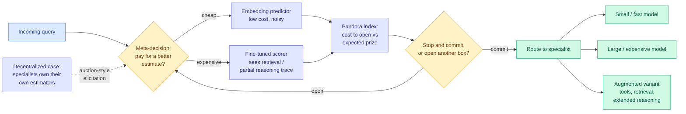

# Pandora's AI Model Routing Box: Efficient Allocation with Costly Value Estimation

**Source:** Kurate weekly cs.AI leaderboard **#19**, ai_rating 6.5/10, tier 1 · [arXiv 2608.20316](https://arxiv.org/abs/2608.20316) · published 2026-08-20 · raw: [`raw/kurate/2026-08-25-cs-ai.md`](../../raw/kurate/2026-08-25-cs-ai.md)

**Authors:** Adam Fisch, Shubhendu Trivedi, Fantine Huot, William W. Cohen, Michael Kaisers, Mirella Lapata, Kate Larson, Jacob Eisenstein (Google DeepMind)

**Not on HuggingFace Daily Papers. LLM-rated, and the only tier-1 routing entry on this week's cs.AI board.**

## TL;DR

Essentially every LLM router in the literature works the same way: estimate each candidate model's expected return on the query, then send the query to the argmax. Pandora's Routing Box points out that this whole framing quietly assumes **value estimation is free**. It is not. A cheap embedding-based predictor is fast and noisy. A fine-tuned scorer that gets to see retrieval results or a partial reasoning trace is accurate and expensive, sometimes expensive enough that you could have just run the cheap model and been done.

So the real question is not "which model should handle this query" but **"when is it worth paying for a better estimate of which model should handle this query"** — a decision that has to be made before you know the answer. The paper recognizes this as an instance of Weitzman's 1979 **Pandora's Box** problem from search theory: you face a set of boxes, each with a known cost to open and an unknown prize inside, and you must decide which to open and when to stop and take the best prize you have already seen. Weitzman's classical result gives an index-based optimal policy, and mapping routing onto it makes the meta-decision tractable rather than heuristic.

The paper then extends the frame to **decentralized settings**, where each specialist model controls its own value-estimation process, connecting to auction-based mechanisms for costly preference elicitation.

---

---

## Why this reframing is the right one

Router papers usually report accuracy-versus-cost curves where cost means *the cost of the model that was selected*. The router itself is treated as free overhead. That accounting is fine when the router is a small classifier over embeddings. It stops being fine the moment the router does anything interesting.

And routers have been getting more interesting. Every recent gain in routing quality has come from giving the router more information: partial reasoning traces, retrieval results, a short rollout from a candidate. Each of those is a forward pass. A router that peeks at a partial chain-of-thought before deciding has spent real tokens, and if it peeks at three candidates it has spent three times as many. At some point the peeking costs more than the difference between the models being chosen among. Nobody was measuring where that point is, because the standard framing has no place to put the number.

Pandora's Box is the correct classical fit because it is precisely the problem of **sequential costly information acquisition with an option to stop**. The index policy tells you the value of opening one more box given what you have seen, which is exactly the router's meta-decision. Borrowing a 1979 result rather than inventing a heuristic also means the optimality claim is inherited rather than argued.

## Relation to prior wiki state

**Direct extension of VI-MoLE.** [VI-MoLE (08-05)](2026-08-05-vi-mole-value-of-information-routing.md), also a Kurate find never picked up by HuggingFace, argued that **uncertainty is not enough** for routing: uncertainty tells you the model does not know, but says nothing about whether activating a given adapter would help, and only the second is a routing question. It reformulated routing as certified value-of-information allocation over LoRA adapters with statistical guarantees. Pandora takes the same value-of-information frame and asks the next question down: VI-MoLE assumes the value estimates arrive, Pandora prices the act of estimating. The two compose cleanly. VI-MoLE says *what* to estimate and how to trust it; Pandora says *whether to bother*.

That two independent groups reached value-of-information routing within three weeks, both surfaced by Kurate's LLM tournament and neither by HuggingFace's upvote signal, says something about where popularity ranking and quality ranking diverge.

**It answers the question "when is routing meaningful."** [When Is Routing Meaningful (07-20)](2026-07-20-when-is-routing-meaningful.md) asked when a router earns its keep at all. Pandora gives a sharper version: routing earns its keep when the certified gain from a better estimate exceeds the cost of producing it, and there is an index that computes this. That converts an empirical question into a decision rule.

**It intersects test-time compute allocation.** The wiki's [test-time compute allocation](../inference-efficiency/test-time-compute-allocation.md) page tracks papers that decide how much compute a query deserves. [Gambit (08-16)](../inference-efficiency/2026-08-16-gambit-thought-level-beam-search.md) allocated KV-cache budget across parallel reasoning traces by killing weak ones and re-branching from strong prefixes, cutting tokens 68.5%. [CARL (08-16)](../inference-efficiency/2026-08-16-carl-knowing-when-to-quit.md) decided when to stop. Pandora is the same species of decision one level up: it allocates budget to the *deciding*, not to the *doing*. A full stack would need all three, and nobody has composed them.

## Key takeaways

- Value estimation in routing has a **cost-accuracy tradeoff** that the standard router formulation cannot express, and the paper makes it first-class.
- The mapping to **Weitzman's Pandora's Box** brings an index-based optimal stopping policy rather than another heuristic score.
- Extends to **decentralized multi-agent settings** where specialists own their estimators, connecting routing to mechanism design and costly preference elicitation.
- Applies naturally to **augmented variants** (tool use, retrieval, extended reasoning), where deciding whether to invoke the augmentation is itself the costly estimate.

## Gaps

The available material is strongest on framing and weakest on numbers. What is not established from what has been read: the size of the win over a well-tuned cheap-estimator-always baseline, whether the Pandora index assumptions (independence across boxes, known cost and prize distributions) survive contact with real LLM value estimation, where the distributions come from in practice, and whether the decentralized extension is evaluated or only formulated.

The independence assumption is the one to watch. Weitzman's optimality requires the prizes in different boxes to be independent, and two models' expected returns on the same query are obviously correlated. How much the policy degrades under correlation is the question that decides whether this is a deployable algorithm or a clarifying frame.

## Industrial implication

Routing products are shipping fast: Google Cloud's LLM router went to public preview on 08-06, Microsoft's MAI production routing landed 07-25, and Ramp shipped a router on 08-20. None of them publish what their routing decision costs. Pandora gives the vocabulary to ask, and the first vendor to publish a router-overhead number alongside its savings number will reset the comparison. On the buyer side, the practical version of this result is unglamorous: if your router calls a model to decide which model to call, measure that, because it may be most of your savings.

**Research angle.** The unexplored direction is **routing under a shared budget across a batch**, not per query. Pandora's index is per-decision. A serving system decides thousands of routes per second against one compute pool, which is a knapsack over indices with a shadow price, not independent stopping problems. That composition, plus dropping the independence assumption between correlated model returns, is where the real serving win is.

## Related

- [LLM routing](llm-routing.md) — concept page
- [VI-MoLE: value-of-information routing](2026-08-05-vi-mole-value-of-information-routing.md) — the immediate predecessor
- [When is routing meaningful](2026-07-20-when-is-routing-meaningful.md)
- [Test-time compute allocation](../inference-efficiency/test-time-compute-allocation.md) · [Gambit](../inference-efficiency/2026-08-16-gambit-thought-level-beam-search.md)
