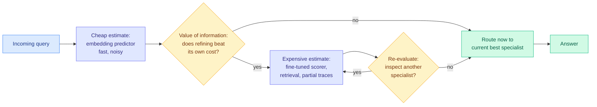

# Pandora's AI Model Routing Box: Efficient Allocation with Costly Value Estimation

**Date:** 2026-08-25
**Source:** Kurate cs.AI weekly leaderboard #19 (ai_rating 6.5/10) · [arXiv 2608.20316](https://arxiv.org/abs/2608.20316)
**Authors:** Adam Fisch, Shubhendu Trivedi, Fantine Huot, William W. Cohen, Michael Kaisers, Mirella Lapata, Kate Larson, Jacob Eisenstein (all Google DeepMind)
**Raw:** [raw/kurate/2026-08-25-cs-ai.md](../../raw/kurate/2026-08-25-cs-ai.md)

## TL;DR

Every routing paper in this wiki assumes you can estimate each candidate model's expected quality on a query for free. Pandora's Router prices that assumption and derives when paying it is worth it. It maps LLM routing onto the classical **Pandora's Box problem** (optimal search when inspecting an option costs money, Weitzman 1979) combined with **information value theory** (Howard 1966). Under a Gaussian signal model the optimal policy has a **closed form**: for each specialist and each input, a value-of-information expression says whether refining your estimate of that specialist beats the cost of refining it. A decentralized variant, **Pandora's Bidder**, lets each model decide independently whether to invest in self-assessment before accepting a price.

## The problem it names

Model providers now ship families that span small-and-fast to large-and-expensive, plus augmented variants using tools, retrieval, or extended reasoning. Routing decides which specialist answers a given query. Prior routing work (the paper cites Feng et al. 2026, Hu et al. 2024, Shnitzer et al. 2023, and the same family this wiki has tracked all year) estimates each model's expected return and picks the maximizer.

The unexamined step is the estimate itself. **Estimation has a cost-accuracy tradeoff of its own:**

- Cheap estimators (embedding-based predictors) are fast but noisy.
- Accurate estimators (fine-tuned scorers with retrieval results or partial reasoning traces) cost real compute, sometimes approaching the cost of just running the model.

Treating estimation as free is fine when it is cheap. It becomes actively wrong in exactly the regime the field is moving toward, **agentic routing over partial reasoning traces**, where forming a good estimate means running part of the task.

## Core novelty

Pandora's Box is the canonical formulation of "search where looking costs money." Weitzman's 1979 result gives each box a reservation value computable in isolation, and the optimal policy is a simple index rule over those values. Fisch et al. observe that routing with costly value estimation is an instance of this, then derive the corresponding closed-form policy under a Gaussian signal model.

What this buys, concretely:

- **Interpretability.** The decision is a closed-form expression, not a learned black box. You can see why a query got routed and tune it by cost.
- **One objective for two questions.** "Which model should answer?" and "how hard should I think about which model should answer?" become terms in the same optimization instead of separate engineering concerns.
- **A decentralized variant that matches real markets.** Pandora's Bidder has each specialist decide for itself whether to pay for self-assessment before accepting a price. That maps directly onto multi-vendor serving, where no central authority can measure every model.

## Where this sits against prior wiki knowledge

**It supplies the missing cost term for essentially every routing result on the [LLM routing page](llm-routing.md).** That page records six routing axes and a long list of empirical results, and its 08-14 section already flagged that the field's cost accounting was wrong in a different way: the [AlphaSense study (08-14)](../ai-industry/2026-08-14-alphasense-token-price-vs-task-cost.md) found GPT-5.6 Sol and Opus 4.8 delivered better answers at lower *total* cost than nominally cheaper models, because a stronger model finishes in fewer tokens and fewer retries. Pandora adds a second correction from the other side: even before you pay for the answer, you paid for the decision. Both say the same meta-thing, **the field has been measuring routing cost with an incomplete ledger.**

**It directly explains an empirical finding the wiki already recorded.** [LLMRouter (08-14)](2026-08-14-llmrouter-unified-routing-infrastructure.md), which unified routing as a sequential decision process with five components and shipped xRouteBench, found that **lightweight routers become more competitive as the cost constraint tightens, because a heavy router's own cost eats the savings it produces**. That is Pandora's thesis as an experimental observation, published five days earlier by a different group without the theory. Pandora gives the closed form that predicts it. This is a clean theory-meets-measurement pairing, and it is worth naming: the empirical result came first.

**It is the second value-of-information routing paper on this board.** See [VoI routing for Mixtures of LoRA Experts (08-25)](2026-08-25-voi-routing-mixture-of-lora-experts.md), which applies the same principle *inside* one model, choosing which LoRA adapters to query. Two independent groups formalizing routing as value-of-information allocation, at two different levels of the stack, surfacing on the same leaderboard week.

## Gaps

- **The Gaussian signal assumption is clean but convenient.** Real value distributions over model quality are heavy-tailed, and the interesting routing failures are tail events (the query where the cheap model confidently produces garbage). Robustness under misspecification is the open question, and Weitzman-style index policies are known to be sensitive to the distributional assumption.
- **Empirical scale against production routers is not the paper's focus.** This is a formulation-and-theory contribution; it does not claim to beat a tuned production router on a large benchmark.
- **Estimation cost is treated as known.** In practice you often do not know what a better estimate will cost until you have computed it.

## Research angle

The framing generalizes past models. **Choosing a harness is also a costly-inspection routing problem**, and the [agent harness engineering page](../agentic-systems/agent-harness-engineering.md) has carried "nobody routes over harnesses" as a standing gap for three months, now with four supporting results (A²E, Evo-Bench, DarwinX, AutoDesign all showed harnesses transfer across base models) and zero proposals. Pandora is the first formalism on this wiki that would make harness routing tractable, because harness evaluation is *exactly* the expensive-inspection regime the theory targets: you cannot know whether a harness suits a task without partially running it.

The concrete unpublished experiment: a Pandora-style policy where the boxes are model-harness pairs and the inspection cost is a partial rollout.

## Related pages

- [LLM Routing](llm-routing.md)
- [VoI routing for Mixtures of LoRA Experts (08-25)](2026-08-25-voi-routing-mixture-of-lora-experts.md)
- [LLMRouter (08-14)](2026-08-14-llmrouter-unified-routing-infrastructure.md)
- [Token price is not task cost, AlphaSense (08-14)](../ai-industry/2026-08-14-alphasense-token-price-vs-task-cost.md)
- [Agent harness engineering](../agentic-systems/agent-harness-engineering.md)
- [Daily digest 2026-08-25](../daily-digest/2026-08/2026-08-25.md)
