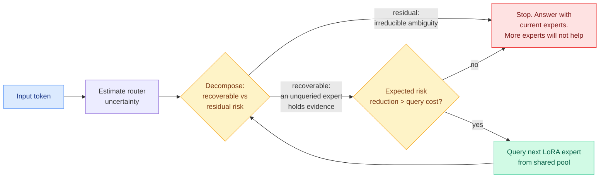

# Uncertainty Is Not Enough: Value-of-Information Routing for Mixtures of LoRA Experts

**Date:** 2026-08-25 (paper published 2026-08; surfaced via Kurate cs.LG weeks 32/33, #5 then #4)
**Source:** Kurate cs.LG leaderboard · [arXiv 2608.02528](https://arxiv.org/abs/2608.02528)
**Authors:** Tom Saliencro (UC Irvine), Rohan Desai (U. Washington), Priya Nair (UC Irvine), Maya Lindqvist (UC Irvine), Daniel Whitmore (U. Washington)
**Raw:** [raw/kurate/2026-08-25-rising-authors.md](../../raw/kurate/2026-08-25-rising-authors.md)
**Why this page exists:** LLM-rated but absent from HuggingFace. Surfaced because Daniel Whitmore crossed the Kurate rising-author threshold this week (3 top-10 appearances in 4 weeks, score 16.7), and because it is the second value-of-information routing paper to land in the same leaderboard window as [Pandora's Router](2026-08-25-pandoras-router-costly-value-estimation.md).

## TL;DR

Mixture-of-LoRA-Experts (MoLE) systems freeze a large base model and compose a pool of small low-rank adapters on top, with a router picking a subset per input. The dominant way to make that subset size adaptive is **uncertainty-aware routing**: when the router is unsure, query more experts. This paper's claim is that the whole approach confuses two different things. It calls the error **confounding uncertainty magnitude with uncertainty reducibility**. High uncertainty can mean an unqueried expert holds complementary evidence (**recoverable risk**, worth spending on) or that the input is inherently ambiguous and will stay ambiguous no matter how many experts you consult (**residual risk**, where spending is pure waste). Existing routers spend the same either way. The fix is to route by **value of information**: estimate how much querying an expert would actually reduce risk, and query only when that expected reduction exceeds its cost.

## The problem it names

LoRA (Low-Rank Adaptation, training a small low-rank weight update while the backbone stays frozen) makes specializing a large model cheap. MoLE extends it: keep a pool of adapters, and have an input-dependent router send each input through a subset, so you get task capacity without evaluating every adapter.

How many adapters per input is the live question, and the paper situates itself against a specific lineage:

- **Fixed top-k routing** gives every input the same constant number of experts. Obviously wasteful on easy inputs and starved on hard ones.
- **Dynamic cardinality methods** learn the count: AdaMoLE learns activation thresholds, LD-MoLE uses entropy objectives, DynMoLE predicts per-token and per-layer expert counts, ProbMoE and Variational Routing use probabilistic frameworks.
- **Uncertainty-aware routers** such as CARE adjust the expert count from router concentration and expert disagreement, tying routing uncertainty to cardinality and calibration.

The last family is the strongest prior art and the paper's actual target. Its shared assumption is that **high uncertainty implies more computation will help**. That is a non-sequitur, and the paper's contribution is naming it precisely and then building the router that does not make it.

## Core novelty

Reformulate routing as **certified value-of-information allocation** rather than a mapping from uncertainty scores to expert counts. The decisive enabling detail is a supervision trick: because all the adapters live in a shared pool over one frozen backbone, you can observe during training **what the unqueried experts would have contributed**. That gives *counterfactual supervision* for learning reducibility, which is not available when you are choosing among entirely separate models (you would have to run them all).

This is worth stating plainly because it is the sharpest technical point in the paper: **within-model expert acquisition has a supervision signal that across-model routing does not.** You can cheaply build the ground truth for "would another expert have helped," so you can learn the reducibility estimator directly instead of proxying it with a calibration heuristic.

## Where this sits against prior wiki knowledge

**Same principle as [Pandora's Router (08-25)](2026-08-25-pandoras-router-costly-value-estimation.md), one level down, and derived independently.** Pandora (Google DeepMind) prices *value estimation* across separate specialist models and derives a closed-form value-of-information policy under a Gaussian signal model. This paper prices *expert acquisition* inside one model and learns the value-of-information policy from counterfactual supervision. Two groups, two levels of the stack, same formalism, same leaderboard window. Neither cites the other.

Set the two beside [TileMix (08-25)](../inference-efficiency/2026-08-25-tilemix-tile-centric-mixed-precision-attention.md), which routes numerical precision across tiles of the attention score matrix, and **the same day carries a routing decision at three distinct levels of the stack: across models, across adapters within a model, and across regions of a matrix inside a kernel.** That is the pattern the [LLM routing page](llm-routing.md) should be organized around, and it is now three-for-three on one day.

**It extends the sixth routing axis this wiki opened on 08-11.** [Macaron-V1 (08-11)](2026-08-11-macaron-v1-mixture-of-lora.md) added adapter-level routing over a frozen base as a distinct axis, pairing a 744B GLM-5.2 base with four coarse adapters (chat, agent, coding, GenUI) and selecting exactly one per turn. The wiki's recorded critique of Macaron was that its selection mechanism was unspecified: whether the choice was learned or prompted, what it cost, and how often it was wrong were all unstated in a paper whose headline was selection. This paper is the missing mechanism, and it also answers the threshold question that page raised. Macaron at four semantically distinct adapters is specialist selection; the wiki noted that "somewhere past a few dozen it becomes a genuine router with a real decision problem." A pool large enough to need value-of-information reasoning about *which* to query is that regime.

**And it sharpens the routing-by-cache-state gap.** [LLM routing](llm-routing.md) has flagged since May that no router decides by cache state, and Macaron was the first candidate answer because only a small adapter patch swaps while base weights and in principle the base KV cache stay put. Adapter-level VoI routing inherits that cheap-switch property, which makes it a better home for the cache-state question than any cross-model router.

## Gaps

- **Kurate ai_rating is 5.0/10 and it never appeared on HuggingFace.** This is a modestly-rated paper from non-frontier labs; treat the empirical claims as unvalidated by the wider community. Its value here is conceptual, and the concept is confirmed by an independent DeepMind paper.
- **The reducibility estimator is itself a model** with its own failure modes, and this is the same structural weakness as [R2-OPD (08-25)](../inference-efficiency/2026-08-25-r2-opd-reasoning-progress-filtering.md), whose independently-estimated progress reward is also an unvalidated learned component.
- **Counterfactual supervision costs training-time compute** proportional to the pool size, which is the cost the method saves at inference. The training/inference cost balance is the number that would decide whether this is worth it, and it is not the paper's headline.

## Research angle

The three-level routing convergence suggests a question nobody has asked: **is there a single value-of-information objective that spans the levels?** A serving stack currently makes an independent decision about which model, which adapter, and which precision, each with its own cost model and none aware of the others. They are all "should I spend more compute to reduce risk on this input," and jointly they are one constrained allocation problem. Nobody has written that down.

## Related pages

- [LLM Routing](llm-routing.md)
- [Pandora's Router (08-25)](2026-08-25-pandoras-router-costly-value-estimation.md)
- [Macaron-V1: Mixture-of-LoRA (08-11)](2026-08-11-macaron-v1-mixture-of-lora.md)
- [TileMix (08-25)](../inference-efficiency/2026-08-25-tilemix-tile-centric-mixed-precision-attention.md)
- [Daily digest 2026-08-25](../daily-digest/2026-08/2026-08-25.md)
