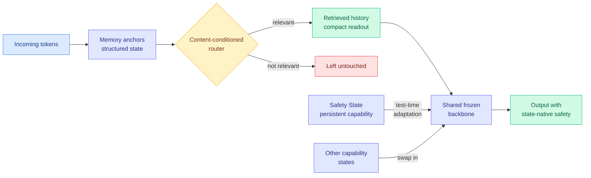

# Safin-1: Safety from Within through Memory-Native State Evolution (MARCH routing)

**Source:** HuggingFace Daily Papers, 2026-09-02
**Paper:** [arXiv 2609.00092](https://arxiv.org/abs/2609.00092)
**Raw:** [raw/huggingface/2026-09-02-safin-1-safety-from-within-through-memory-native-state-evolu.md](../../raw/huggingface/2026-09-02-safin-1-safety-from-within-through-memory-native-state-evolu.md)

## TL;DR

Safin-1 is a family of foundation models built on **MARCH** (Memory-Anchor Routing across Context History), an architecture that maintains structured memory states inside the model and retrieves relevant history through **content-conditioned routing** rather than positional attention over the whole prefix. The framing claim is about safety: instead of bolting guardrails on the outside or fine-tuning alignment in after the fact, safety becomes a **persistent capability state** the model routes to at test time. The routed-state interface supports test-time adaptation of these states without repeatedly modifying the backbone, so one shared foundation can carry several controlled specializations. The authors are explicit that this is an initial architectural exploration rather than a finished safety story.

## What is routed, and why it is new here

[llm-routing.md](llm-routing.md) tracks a taxonomy of what gets routed: a **model** per query (TRACER, 04-17, which picks a model per query from a learned score), a **task-axis expert** (CaRE, 05-11, bi-level routing for continual learning), **per-head KV** (MISA, 05-11, mixture-of-indexer sparse attention), a **write into memory** per incoming token (Raven, 08-04, which decays and updates only a selected subset of fixed memory slots), an **adapter budget** by certified value of information (VI-MoLE, 08-05), and **whether a supervision signal is admissible at all** (SMRC-SD, 08-10, which distils only at states the reference trajectory actually covers).

Safin-1 adds a distinct object: it routes over **persistent capability states**. The Safety State is not an expert selected for this token and not a model selected for this query. It is a durable, separately-adapted piece of model state that the routed interface can invoke, and it survives across queries. That places it closest to Raven on the taxonomy (both route inside the model's own parameters, not across models) but the retrieved object has a different lifetime: Raven's memory slots are working state within a sequence, Safin-1's capability states are meant to persist and be independently maintained.

## Why the safety framing is the interesting part, and also the weakest part

The strong version of the argument is architectural rather than moral. If safety is enforced by an external monitor or a post-hoc alignment pass, then it is a separate system with its own cost, its own failure modes, and its own bypass surface. If it is a routed state inside the model's native computation, it costs what a retrieval costs and it cannot be detached. That is the same instinct as [LMSM (08-31)](../responsible-ai/2026-08-31-lmsm-llm-security-modules.md), which put a sparse-autoencoder safety monitor **inside** the vLLM forward pass and retained **98.14% of unmonitored throughput** because the monitor rides a pass that was already running, rather than costing a second model in front of it. Safin-1 goes one level deeper: LMSM makes enforcement cheap by co-locating it with the serving path, Safin-1 makes it cheap by making it a state the model already routes to.

The weakness is that the reported evidence is "substantial safety improvements" and validation "across general capabilities, long-context understanding, retrieval, and efficiency," without the numbers in the abstract. LMSM published HarmBench attack success falling from 39.20% to 3.32% against a false-refusal rise from 2.40% to 4.40%, which is the honest shape of a safety claim. Safin-1's abstract does not offer the equivalent, and its own closing sentence concedes that substantial further work is needed.

## How this relates to prior wiki pages

**It is a candidate answer to the routing question [llm-routing.md](llm-routing.md) has been unable to close for two months, arriving from an unexpected direction.** That page's standing gap is that nothing in production routes over **harnesses**, though five separate results have shown the routable unit is the model-harness pair. Safin-1 does not route over harnesses. But it does something the page said no method did: it makes a **non-model, non-expert, persistent artifact** the routable object, and it shows that artifact can be adapted at test time without touching the backbone. If capability states are separately maintainable and swappable, that is structurally much closer to routing over harnesses than anything in the model-selection family, because a harness is also a persistent artifact adapted separately from the weights.

**It composes with, and slightly undercuts, the memory-routing thread.** [Raven (08-04)](../llms-foundation-models/2026-08-04-raven-sparse-memory-routing.md) was the first architecture in the wiki whose routing decision fires per incoming token, before any query exists, making it admission control against a fixed budget rather than dispatch. [llm-routing.md](llm-routing.md) recorded that as the right causal structure for the problem [InMind (07-29)](../agentic-systems/2026-07-29-inmind-implicit-association-blind-spot.md) identified, where retrieval-based memory only surfaces a fact when the fact resembles the query, so six vector, graph and agentic systems reached at most 14.4% on indirect queries against 84.0% when the memory was simply in context. Safin-1's routing is **content-conditioned**, which means it is closer to Raven than to a query-conditioned retriever, but the abstract does not claim it addresses the implicit-association failure and there is no reason to assume content-conditioning alone does.

**Held against the day's other memory result.** [EM²Mem (09-02)](../agentic-systems/2026-09-02-em2mem-event-centric-multimodal-memory.md) attacks the same generation-readiness problem from outside the model, binding heterogeneous evidence to event anchors at memory-construction time so the language model does not have to reconstruct alignments at inference. Safin-1 attacks it from inside, with memory anchors in the architecture. **Two papers on the same day, both concluding that the fix is to anchor memory at write time rather than reconstruct it at read time, one in the harness and one in the weights.** Neither cites the other.

## Gaps

No numbers in the abstract for the safety improvement, which is the headline claim. No comparison against external-monitor baselines such as LMSM, so the cost argument for state-native safety over serving-path-native safety is asserted rather than measured. The claim that test-time state adaptation avoids "repeatedly modifying the backbone" needs a cost figure per adaptation to be evaluable, and there is none. And a routed capability state is a new attack surface as well as a new safety mechanism: if the router can be induced to not retrieve the Safety State, the safety property is conditional on router robustness, which the abstract does not discuss.

## Related

- [llm-routing](llm-routing.md) — the routing taxonomy this extends
- [Raven: sparse memory routing (08-04)](../llms-foundation-models/2026-08-04-raven-sparse-memory-routing.md) — the closest prior routing object
- [LMSM: LLM security modules (08-31)](../responsible-ai/2026-08-31-lmsm-llm-security-modules.md) — the competing in-the-serving-path answer
- [EM²Mem (09-02)](../agentic-systems/2026-09-02-em2mem-event-centric-multimodal-memory.md) — the same anchor-at-write-time move, outside the model
- [agent-memory](../agentic-systems/agent-memory.md)
