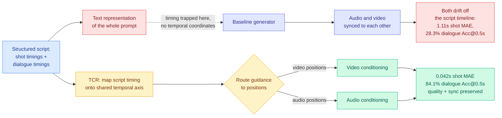

# The Missing Temporal Link: Temporal Context Routing for Script-Driven Audio-Video Generation

**Source:** HuggingFace Daily Papers · [arxiv 2609.02367](https://arxiv.org/abs/2609.02367) · PKU, Qwen Applications, HKUST, CUHK, SJTU
**Raw:** [raw/huggingface/2026-09-04-the-missing-temporal-link-temporal-context-routing-for.md](../../raw/huggingface/2026-09-04-the-missing-temporal-link-temporal-context-routing-for.md)

## TL;DR

Joint audio-video generators have gotten good at keeping audio and video synchronized **with each other**. They are bad at following a script's stated timing, and this paper diagnoses why in one clean sentence: the models align video and audio on a shared temporal axis, but the timing written in a structured prompt ("shot 2 begins at 4.0s, this line is spoken at 6.5s") exists only inside the prompt's **text** representation, which is not aligned to either modality's temporal coordinates. So the two streams stay locked to each other while drifting together away from the script timeline, and the failure is invisible to any audio-visual synchronization metric. **Temporal Context Routing (TCR)** fixes it by extending temporal alignment to a third participant, the script: it maps script timing onto the same shared temporal axis the generator already uses, then **routes each prompt's guidance to the corresponding positions in both modalities**. On 200 test scripts against the baseline, **Shot Boundary mean absolute error falls 96%, from 1.11s to 0.042s**, and **Dialogue Accuracy at a 0.5s tolerance rises from 28.3% to 84.1%**. Visual quality and audio-visual synchronization stay comparable to the baselines, and a user study prefers TCR on all five evaluated dimensions.

## Why this belongs on the routing page and not only in multimodal

The generative-video result is not the reason to file this here. **The routed object is new.** This page's taxonomy of what gets routed currently reads: TRACER (04-17) routes a query to a model; CaRE (05-11) routes to a task-axis expert; MISA (05-11) routes per-head KV; [Raven (08-04)](../llms-foundation-models/2026-08-04-raven-sparse-memory-routing.md) routes a write into a memory slot per incoming token; [VI-MoLE (08-05)](2026-08-05-vi-mole-value-of-information-routing.md) routes adapter budget by certified value of information; [SMRC-SD (08-10)](2026-08-10-smrc-sd-state-matched-routing.md) routes on whether a supervision signal is admissible at all; [Safin-1 (09-02)](2026-09-02-safin-1-march-memory-anchor-routing.md) routes retrieval over persistent capability states.

Every one of those routes **content to a computational destination**. TCR routes **a conditioning signal to a temporal position**. The destination is not a model, an expert, a head, or a memory slot. It is a coordinate on a time axis, and the same guidance goes to two modalities at once at matched coordinates. That is a genuinely different shape of routing decision, and it is the first entry on this page where the routing key is *when* rather than *what* or *which*.

**The generalization is not speculative and it is where the Tier 1 interest lies.** Any generation process with an explicit timeline and a structured specification has the same defect: the spec's timing lives in a text encoder while the generation lives on a positional axis, and the two are never introduced. That describes script-driven video, and it also describes a long-horizon agent plan with deadlines, a streaming pipeline with staged budgets, and any decode process whose instructions include "by step N, have done X." The paper's framing of temporal control has three prior families (access-based, using masks to expose tokens; representation-based, encoding temporal structure into query-key interactions via rotary position embeddings; score-based, steering attention or latent states), and TCR's contribution is doing it as an **explicit routing of prompt-local guidance rather than a global bias**.

## Relation to prior wiki state

**It answers, in a different domain, the question [Agents Are Not Time-Aware (08-30)](../agentic-systems/2026-08-30-agents-not-time-aware.md) raised and did not resolve.** That paper found agents systematically fail at reasoning about time: they mishandle deadlines, relative durations and ordering, because time enters the model as text like everything else and carries no privileged structure. TCR is a constructive answer to the same complaint one layer down. **Do not encode time as text and hope the model recovers it. Route the timed instruction to the position on the axis where it applies.** The two papers are in unrelated subfields, neither cites the other, and together they make a stronger claim than either: **temporal specifications need a dedicated channel, and giving them one produces a 96% error reduction on the one task where somebody built it.** For agentic systems, where nobody has built it, that number is the reason to try.

**It is the second result in three days where the fix is "stop making the model recover structure it was handed."** [Declarative Attention (09-03)](../inference-efficiency/2026-09-03-declarative-attention.md) had the model declare its own attention scope inside its chain of thought, which the inference engine then parses like a tool call, cutting attended tokens by 52.0% on Gemma-4-31B for a 1.27pp accuracy drop. That converts an implicit decision into an explicit protocol at the engine boundary. TCR converts an implicit temporal correspondence into an explicit routing table. **Both are protocol design rather than modeling: the win comes from giving structure a machine-readable channel instead of leaving it embedded in text for the network to re-derive.** That is a cheap and repeatable pattern, and this page should watch for the third instance.

**It also sits alonga thread this page has been unable to close, from an unexpected angle.** The page's standing gap since 08-06 is a router operating at **per-step** rather than per-query granularity, and the reason nothing ships is the prefill penalty on mid-session switching, which [cross-model KV sharing (09-02)](../inference-efficiency/2026-09-02-cross-model-kv-sharing.md) is the first mechanism to remove rather than price (Llama3.1-70B to Qwen2.5-7B at 44.0% accuracy against 45.7% native, latency 899ms to 138ms). TCR is not a compute router and does not claim to be. But it demonstrates that **a plan's timeline can be turned into a routing schedule computed up front**, which is the missing half of a per-step compute router: you need both a cheap switch and a schedule that says when to switch. **Portable KV state supplies the first. A timeline-to-position routing map is a candidate for the second.**

## Gaps

**Baseline comparison is thin as reported.** The gains are enormous, from 1.11s to 0.042s and from 28.3% to 84.1%, and the abstract compares against "the baseline" singular on 200 scripts. The paper's own related-work survey lists several structured and local prompting methods (Presto associating latent segments with subcaptions, ShotAdapter using transition tokens with local attention masks, MultiShotMaster, KeyVID, and MTSS which introduced a schema for structured audio-visual descriptions with explicit temporal links). **MTSS is the closest prior and the natural comparison, because it supplies temporal links without a dedicated routing mechanism.** Whether TCR beats it, or beats a naive baseline that lacked temporal links entirely, is the difference between a large result and an enormous one.

**Two hundred scripts, one generator.** The mechanism is a modification to a conditioning pathway, so its portability across joint audio-video architectures is the practical question and is untested.

**No cost.** Routing per-prompt guidance to positions in two modalities is extra conditioning work at every step, and neither training nor inference overhead is reported. This is the same omission the routing literature has carried all year.

**Structured input is assumed, and that assumption is load-bearing.** TCR needs a script with explicit timings. Real production workflows frequently start from an unstructured brief, so somebody has to write the timeline, and the paper's contribution begins after that step. The harder version of the problem, infer the timeline then route to it, is not attempted.

## Related

- [llm-routing.md](llm-routing.md) — concept page, and the taxonomy this extends
- [Agents Are Not Time-Aware (08-30)](../agentic-systems/2026-08-30-agents-not-time-aware.md) — the same complaint, no mechanism
- [Declarative Attention (09-03)](../inference-efficiency/2026-09-03-declarative-attention.md) — explicit protocol beats implicit recovery
- [Safin-1 (09-02)](2026-09-02-safin-1-march-memory-anchor-routing.md) · [Raven (08-04)](../llms-foundation-models/2026-08-04-raven-sparse-memory-routing.md)
- [Cross-model KV sharing (09-02)](../inference-efficiency/2026-09-02-cross-model-kv-sharing.md) — the other half of a per-step router
