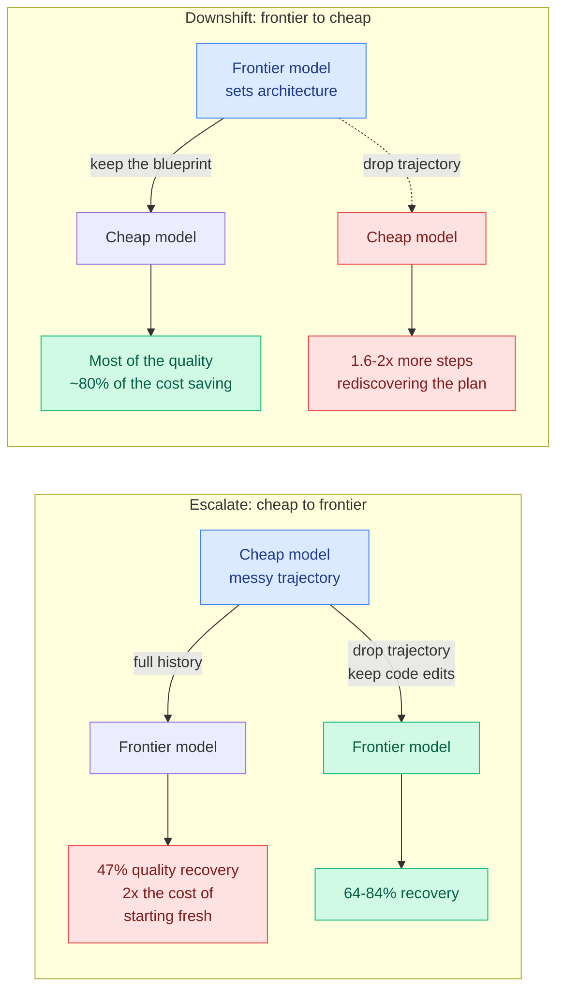

# The Handoff Tax: what it actually costs to switch models mid-task

**Source:** X home feed, thread by @IntuitMachine summarizing new work from AWS Agentic AI · [thread](https://x.com/IntuitMachine/status/2096374501999100392)

**TL;DR.** Everybody escalates. You start a coding agent on the cheap model, it struggles, you switch to the frontier model and expect to keep the progress. This study measures what that switch actually costs across **58,000 agent runs, 2 million API calls and 36 billion tokens on SWE-bench Verified**, with Claude (Haiku to Opus) and GPT model families. The result is that **escalation is close to the worst move available**: passing the full chat history to the stronger model recovers less than half the quality gap (47% for Claude, 36% for GPT) and, for Claude, **costs more than twice what starting with the expensive model from scratch would have cost**. Even after you have already paid for the cheap model's work, **throwing the run away and restarting fresh on the expensive model is both cheaper and more accurate than continuing.** The reverse direction, starting expensive and downshifting once the plan is set, is the actual arbitrage.

## The finding that makes it a design rule

**The optimal interface reverses with the direction of the switch.** This is the part worth memorizing, because it is counterintuitive and it is actionable.

- **Escalating (cheap to expensive): delete the context.** The cheap model's trajectory is full of dead ends and hypotheses the expensive model is then anchored to. Dropping the trajectory and passing only the code edits already written to disk raises quality recovery from **47% to 64% for Claude and from 36% to 84% for GPT**.
- **Downshifting (expensive to cheap): keep the context.** The cheap model needs the blueprint. Delete the strong model's trajectory and the cheap model takes **1.6 to 2x more steps** rediscovering the architecture it was handed.

Stated in one line: **strong-model trajectories guide weak receivers; weak-model trajectories burden strong receivers.** Context is not universally good, it is directional.

The mechanism behind the escalation cost is compounding rather than additive. Raw escalation does not only add steps, it makes **every remaining expensive step 1.6 to 2.2x more costly**, because the inherited context window is now bloated and is being billed at premium input rates on every subsequent turn.

## Relation to prior wiki state

**This closes the wiki's most concrete unpriced item.** The [KV cache](../inference-efficiency/kv-cache.md) page recorded on 08-29 that provider cache entries are **keyed to a model**, so a mid-session route to a cheaper model pays a full cold prefill on the entire accumulated history, and that on the 140K-token median agentic prefix this plausibly exceeds the per-token saving the route was chosen for. The page called that "the most concrete unpriced item where this page meets routing." **It now has a price, and the price is larger than the cache argument predicted, because the cache penalty was only the prefill. The Handoff Tax adds a quality penalty and a per-step context-inflation multiplier on top of it.**

**And it puts [cross-model KV sharing (09-02)](../inference-efficiency/2026-09-02-cross-model-kv-sharing.md) in an awkward position.** That paper trains a translation layer converting one model's KV state into a representation another model can consume, and the [KV cache](../inference-efficiency/kv-cache.md) page called it the first mechanism that *removes* the mid-session switch penalty rather than pricing it. The Handoff Tax says the penalty is not mainly a prefill cost, it is that **carrying the weak model's reasoning into the strong model is actively harmful.** A mechanism that makes it cheap to transport the trajectory across the boundary is optimizing the direction where you should be deleting the trajectory. The two results are not contradictory, they are complementary in exactly one direction: **KV portability is worth a lot on downshift, where you want to keep the context, and worth little or negative on escalation, where you want to throw it away.** Nobody has said this, and it is the sharpest thing to carry off both papers.

**It is the empirical counterpart to the [llm-routing](llm-routing.md) page's standing gap since 08-06**, which is a router operating at per-step rather than per-query granularity. That gap has been framed as needing two things, a cheap switch and a schedule saying when to switch. The Handoff Tax supplies a third requirement the framing missed: **a switch-direction-dependent context policy.** A per-step router that switches cheaply on a good schedule and passes the full history every time will still pay this tax on every escalation.

**Industry shipped the enforcement half the same weekend.** Spotify's engineering team cut Claude Code token usage by **90%** with a two-model routing layer called Portal, where two cheaper assistant models handle file opening, boilerplate and repetitive code, and files over 350 lines are **hard-blocked** from reaching the expensive model. Their reported finding is that rules expressed as instructions did not hold, because both engineers and the model found ways around soft guidance, and only hard blocks at the routing layer worked. Read next to the Handoff Tax, the two say the same thing from opposite ends: **capability-level routing is a real architecture pattern, and the expensive part is not choosing the model, it is controlling what crosses the boundary.**

## Gaps

This reached the wiki through a thread rather than the paper, so the exact experimental protocol, the model versions, and the definition of "quality recovery" are secondhand. **SWE-bench Verified is one task distribution**, and it is one where the code on disk is a genuinely sufficient handoff artifact; on tasks whose state is not externalized in files, trajectory-drop has nothing to fall back on and the escalation result may not hold. No result is reported for more than one switch in a single session, which is the actual shape of a long agentic run. And no interaction with provider prompt caching is measured, which is the term the KV cache page cares about most.

## Related

- [LLM routing](llm-routing.md) · [KV cache](../inference-efficiency/kv-cache.md) · [Cross-model KV sharing (09-02)](../inference-efficiency/2026-09-02-cross-model-kv-sharing.md) · [Agent harness engineering](../agentic-systems/agent-harness-engineering.md)
- [Daily digest 2026-09-07](../daily-digest/2026-09/2026-09-07.md)
