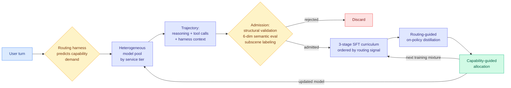

# NeoHorse-1: Recursive Self-Improvement via Agentic Post-Training with a Routing Harness

**Source:** HuggingFace Daily Papers · [arXiv 2609.08183](https://arxiv.org/abs/2609.08183) · NeoHorse Team (TokenRhythm Technologies, Infinigence AI, Tsinghua, Peking University, CUHK, Alibaba Group)
**Raw:** [`raw/huggingface/2026-09-09-neohorse-1-towards-recursive-self-improvement-via-agentic-po.md`](../../raw/huggingface/2026-09-09-neohorse-1-towards-recursive-self-improvement-via-agentic-po.md)

## TL;DR

This is the first paper on this wiki to argue that **a deployed router is already a self-improvement instrument, and nobody was reading it as one**. The argument is simple once stated. A routing harness, the layer that decides which model in a pool should take each turn, necessarily records three things per turn: the capability it *predicted* the turn would demand, the service tier it *selected*, and what actually *happened* next. That triple is a labelled capability measurement generated for free by production traffic. NeoHorse-1 converts those records into training data, uses the routing signal to order a curriculum, and then uses evaluation feedback to decide the next training mixture, closing an evaluation-to-selection-to-update loop.

Results across eleven benchmarks covering harness-based agents, tool use, coding and instruction following: macro-average **58.94 → 64.87 at 4B** and **65.60 → 69.04 at 9B**. The framing number is that **the post-trained 4B substantially narrows the gap to the 9B base model**, which is the cost claim: routing telemetry buys you roughly a model-size step.

## Mechanism

Three design choices are load-bearing:

1. **The trajectory preserves harness context, not just the answer.** Interleaved reasoning, tool calls and the surrounding harness state are all retained, so the student learns to operate inside a loop rather than to emit a final string.
2. **Routing signal replaces a difficulty label.** Curriculum learning normally needs someone to annotate how hard each example is. The router's predicted capability demand and selected tier already encode that, so the curriculum is free.
3. **The loop closes on allocation, not on weights.** Evaluation feedback does not directly edit the model; it changes **what the next training mixture contains**. That is the "what the system learns to do shapes what it learns from next" claim, and it is a mild form of recursion rather than a strong one.

## How this relates to prior wiki pages

**It flips the [LLM routing page](llm-routing.md)'s entire framing of what a router is for.** That page defines routing as deciding which model handles a query in order to minimize cost at a quality bar. Every result on it, up to and including [the Handoff Tax (09-07)](2026-09-07-handoff-tax-model-switching.md) with its 58,000 agent runs and 36 billion tokens, treats the routing decision as a *cost-control* action whose output is a served response. NeoHorse-1 treats the routing decision as a *measurement* whose output is a training example. **That is a second, entirely separate return on having built a router, and it has not appeared on this page before.**

**It also raises an uncomfortable question about the Handoff Tax result.** That paper found escalation with full history recovers under half the quality gap while costing more than twice a fresh start, and that dropping the trajectory and passing only the artifacts lifts recovery from 47% to 64% (Claude) and 36% to 84% (GPT). If the optimal serving policy is to **discard** the cheap model's trajectory at the boundary, and NeoHorse-1's training policy is to **retain** the full interleaved trajectory including harness context, then the trajectory is worthless for the next turn and valuable for the next model. Both can be true, and stating it that way is the useful form: **a trajectory is bad context and good training data.** Nobody has said this and it is a clean claim.

**It is the research-side twin of the day's industry story, which is what makes it worth a full page.** [Ben Lorica's "the loop is an asset" essay (09-08)](../agentic-systems/2026-09-09-loop-as-asset-bounded-self-improvement.md) argues that for application teams the harness is the owned asset and the accumulating production trace is the compounding one, and that the first payoff from self-improvement is **cheaper AI, not smarter AI**. NeoHorse-1 is that thesis executed at the model-training layer with a number attached: a 4B model closing most of the gap to a 9B base. Same claim, opposite ends of the stack.

**Against the [self-evolving agents page](../agentic-systems/self-evolving-agents.md)'s two-lever split.** That page separates harness updates (scaffold rewritten, weights frozen) from weight updates (weights updated, scaffold fixed) and notes the frontier is combining them. NeoHorse-1 is a genuine third position: **the harness is left alone and used as the sensor that drives the weight updates.** The harness is neither the thing being changed nor held fixed as a control, it is the instrument.

## Gaps

- **The recursion is asserted, not demonstrated.** The paper describes one closed loop and calls it "an initial prototype" and "a path toward" harness-mediated RSI. There is no second iteration showing the improvement rate itself improving, which is the actual RSI claim. Read it as bounded self-improvement.
- **No routing-signal ablation.** The obvious control is a curriculum ordered by a cheap difficulty heuristic, or randomly, at matched data volume. If random ordering matches, the routing telemetry contributed data volume rather than curriculum structure.
- **The admission gate is elaborate and unvalidated as a whole.** Structural validation, six-dimensional semantic evaluation and subscene labeling are three filters stacked; no per-filter contribution is reported. This wiki's standing warning about selective-supervision papers applies directly: the [distillation page](../inference-efficiency/knowledge-distillation.md) now tracks seven selective-supervision axes and none has published the random-gate control at matched admission rate.
- 4B and 9B only. Whether routing telemetry still buys a size step when the base is already strong is untested.

## Related

- [LLM Routing](llm-routing.md) (concept page)
- [The Handoff Tax: model switching mid-session (09-07)](2026-09-07-handoff-tax-model-switching.md)
- [Self-Evolving Agents](../agentic-systems/self-evolving-agents.md) (concept page)
- [Agent Harness Engineering](../agentic-systems/agent-harness-engineering.md) (concept page)
- [Your AI model is a rental, but the loop is an asset (09-09)](../agentic-systems/2026-09-09-loop-as-asset-bounded-self-improvement.md)
