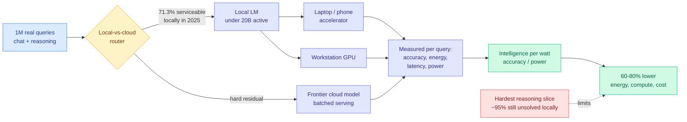

# Intelligence per Watt: Measuring Intelligence Efficiency of Local AI

**Source:** arXiv 2511.07885 (Stanford University + Together AI), resurfaced across the X home feed on 2026-09-11 in a widely-shared breakdown by @rohanpaul_ai
**Raw:** [raw/twitter/feed/2026-09-11-evening-211116.json](../../raw/twitter/feed/)
**Links:** [arXiv](https://arxiv.org/abs/2511.07885) · [Post](https://x.com/rohanpaul_ai/status/2098301299032990059)

## TL;DR

Almost every routing result in this wiki optimizes tokens or dollars. This paper proposes a different denominator: **watts**. It defines intelligence per watt (IPW) as task accuracy per unit of power, then measures it across 20+ local language models under 20B active parameters, 8 accelerators including both laptops and datacenter GPUs, and one million real single-turn chat and reasoning queries. The headline result is that hybrid local-cloud routing, sending each query to a local model when a local model can handle it and to the cloud otherwise, cuts energy, compute and cost by **60% to 80%** against a batched-cloud baseline. The second result is a trend line: from 2023 to 2025 local intelligence-per-watt improved **5.3x**, and the fraction of real queries a local model could service went from **23.2% to 71.3%**.

## What it measures and why the metric is the contribution

The framing question is whether local inference can viably redistribute demand away from centralized cloud infrastructure. Answering it requires two things at once, and the literature usually measures only one. You need to know whether a local model can actually answer a real query correctly, and you need to know what that costs in power on a device with a battery and a thermal envelope. IPW puts both in one number: task accuracy per unit of power, measured per query, across a model-accelerator pair rather than across a model alone. That last detail is what makes it a routing metric rather than a benchmark score. The same model on two accelerators is two different routing targets.

Accuracy is scored as the local model's win rate against frontier models on the query, so the metric is relative rather than absolute, which is the right call for a redistribution question: what matters is whether the local answer is good enough to not send the query onward.

## Key results

- **Hybrid local-cloud routing cuts energy, compute and cost 60% to 80%** against a batched-cloud baseline. Note the baseline is *batched* cloud, which is the efficient case, not a naive single-request one.
- **Local serviceable coverage moved from 23.2% to 71.3% between 2023 and 2025**, and intelligence per watt improved 5.3x over the same window. Two separate exponentials, capability and efficiency, moving together.
- **An iPhone 16 Pro achieved roughly 7x higher intelligence-per-watt than workstation GPUs** running the same model at the same precision. Mobile silicon is not merely adequate for small models, it is dramatically more power-efficient per unit of correct answer for lightweight queries.
- **A diverse pool of 20+ local models beat the 3 frontier cloud models on 3 of 4 benchmarks** when each query was routed to the best model in the pool. Model diversity substitutes for model size, which is the strongest version of the routing thesis this wiki has recorded.
- **Dropping precision from FP16 to FP4 cut inference energy 3x to 3.5x** at a cost of roughly 2.5 accuracy points per precision step, and in one configuration a **larger FP4 model beat a smaller FP16 model**. Precision is a routing axis with a favourable exchange rate.
- **The residual is concentrated, not diffuse.** On the hardest reasoning slice, about 95% of problems remain unsolved by local models even as easy and medium tiers improve quickly. The cloud's remaining job is narrow and hard.

## How this relates to prior wiki pages

**It adds a fourth level to the routing stack this page named on 08-25.** That entry recorded the same decision structure appearing at three levels on one day: across models ([Pandora's Router](2026-08-25-pandoras-router-costly-value-estimation.md), which prices the cost of *estimating* which model to use and derives a closed-form value-of-information policy), across adapters inside one model ([VoI-MoLE](2026-08-05-vi-mole-value-of-information-routing.md), which separates uncertainty that more experts can reduce from uncertainty that they cannot), and across regions of a matrix inside a kernel ([TileMix](../inference-efficiency/2026-08-25-tilemix-tile-centric-mixed-precision-attention.md), which dispatches FP16 or INT8 per tile of the attention score matrix). Intelligence per Watt routes **across devices**, and it is the first of the four where the cost being optimized is physical rather than financial. The page's open problem stands and gets harder: a serving stack makes the model choice, the adapter choice and the precision choice independently, and now the device choice too, each with its own cost model, none aware of the others.

**It gives an empirical anchor to the page's long-running suspicion that unit price is the wrong objective.** The [AlphaSense study (08-14)](../ai-industry/2026-08-14-alphasense-token-price-vs-task-cost.md) showed that token price and task cost can point in opposite directions because a stronger model finishes in fewer tokens and fewer retries. Watts are immune to that particular confusion: a retry costs energy whether or not it costs a marked-up token. Energy is the one denominator that cannot be repriced by a vendor, which makes IPW a more durable routing objective than anything price-based on this page.

**It intersects hard with [compute economics](../hardware/compute-economics.md).** The wiki recorded three simultaneous physical shortages on 09-10: HBM, grid power and CPUs. A result showing that 71% of real queries can be served on a laptop at 5.3x better efficiency than two years ago is the demand-side relief valve for exactly those shortages, and the FP4 energy finding connects directly to [extreme quantization on Blackwell (09-10)](../inference-efficiency/2026-09-10-extreme-quantization-blackwell-fp4-native-fp8.md), where native 4-bit tensor cores were presented as a throughput story. Here the same format is an energy story on battery-powered silicon.

## Gaps

The measurement is **single-turn**. Real local deployment is agentic and multi-turn, where the KV cache grows, the prefill dominates and the device's thermal budget starts to bind across a session rather than a query. None of that is in the metric. The router itself is idealized: coverage numbers assume you know which queries are locally serviceable, and the [Pandora's Router](2026-08-25-pandoras-router-costly-value-estimation.md) result says the estimation is not free, so a deployed hybrid router will not realize the full 60-80%. The win-rate-against-frontier accuracy proxy also flatters local models on queries where both answers are adequate and nobody cares. And the paper is a v6 revision of a 2025 preprint resurfacing on social rather than a new arrival, so the 2025 endpoint of its trend line is already stale relative to what shipped in 2026.

## Research angle

The missing number is **intelligence per watt for an agent loop**, not a query. Everything this wiki has learned about agent serving says the cost is dominated by repeated prefill over a growing context, which is precisely the regime where a laptop's memory bandwidth, not its FLOPs, becomes the binding constraint. The second open item is a joint objective: [DeepSeek V4.1 Flash (09-10)](../llms-foundation-models/2026-09-10-deepseek-v41-flash-architecture.md) puts 26% of its parameters on SSD rather than HBM, which is a memory-hierarchy routing decision, and IPW is a device routing decision, and both are answering "where should this computation physically live." Writing those two as one allocation problem under a power budget is unpublished and directly buildable.

## Related

- [LLM Routing](llm-routing.md)
- [Pandora's Router: costly value estimation (08-25)](2026-08-25-pandoras-router-costly-value-estimation.md)
- [Compute economics](../hardware/compute-economics.md)
- [Extreme quantization on Blackwell (09-10)](../inference-efficiency/2026-09-10-extreme-quantization-blackwell-fp4-native-fp8.md)
