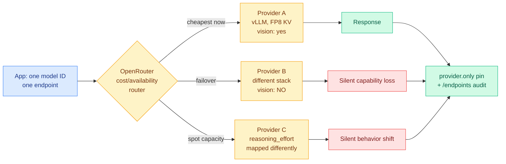

# So you want to use OpenRouter? Provider variance as a routing hazard

**Source:** [Mohamed Moustafa, "So you want to use OpenRouter?"](https://mmoustafa.com/blog/so-you-want-to-use-openrouter/), surfaced by [Simon Willison (09-11)](https://simonwillison.net/2026/Sep/11/so-you-want-to-use-openrouter/)
**Raw:** [RSS capture](../../raw/rss/2026-09-11-simon-willison-so-you-want-to-use-openrouter.md)

## TL;DR

OpenRouter's pitch is that it "handles fallbacks automatically and picks the most cost-effective option for each request," so you call one endpoint for a model and get routed to whichever backend provider is cheapest and available. The problem is that **the same model ID served by different providers is not the same system**. Providers run different serving software with different optimizations and settings. Some lack vision capability on models that nominally have it. Reasoning-effort parameters are interpreted differently. So the routing layer that saves you money silently changes your system's behavior between requests. The mitigation is to pin providers with `provider.only`, and to query `/endpoints` for which providers actually serve a given model ID.

## Why this belongs on the routing page and not in a footnote

Almost every result on the [LLM routing page](llm-routing.md) assumes the routing decision is between *models with different capability*, and prices the decision in accuracy against cost. This post describes a routing layer whose decision is between **nominally identical models**, and shows that the identity does not hold. That is a failure mode the research literature does not model at all: the router is choosing among things it has been told are interchangeable, and the interchangeability is an unenforced claim.

The practical severity is higher than it sounds because the failures are silent. A provider without vision support on a vision model does not return "unsupported"; a differently-mapped reasoning-effort parameter does not error. **Your evaluation ran against provider A and your production traffic is being served by provider B**, and nothing in the response tells you. This is the same structural problem as an unversioned dependency, applied to the part of the stack whose whole value proposition is that you do not have to think about it.

## How this relates to the rest of the wiki

**It is the infrastructure-layer instance of the [Handoff Tax (09-07)](2026-09-07-handoff-tax-model-switching.md) finding, one level down.** That paper found the dominant penalty when escalating between models is not transport cost but that carrying the weak model's reasoning into the strong model is actively harmful, with trajectory-dropping lifting recovery from 47% to 64% on Claude and 36% to 84% on GPT. Its scope was *model* boundaries. This post says there is a **provider boundary underneath the model boundary** that the application cannot see and that the Handoff Tax literature has not priced. If a mid-session provider switch changes serving-stack behavior, an agent's trajectory is crossing a boundary nobody registered as a boundary.

**It sharpens a cost problem the [KV cache page](../inference-efficiency/kv-cache.md) has carried since 08-29.** That page recorded that prompt-cache entries are keyed to a model, so routing mid-session voids the cache and re-prefills the whole context at full price, and it noted that a provider bills cache hits at roughly 10% of base input rate. **Provider-level routing makes this worse in a way the page has not stated: the cache is keyed not just to the model but to the serving instance.** OpenRouter routing you to a different provider for turn two of a conversation means a cold prefill even though the model ID never changed. On a long agentic prefix that is a large and invisible bill.

**It is a concrete counterexample to the assumption underlying [LLMRouter (08-14)](2026-08-14-llmrouter-unified-routing-infrastructure.md) and [Google Cloud's LLM router (08-06)](2026-08-06-google-cloud-llm-router-public-preview.md).** Both treat the model catalog as a set of well-defined options with measurable characteristics. In a multi-provider aggregator the option set is not well-defined, and the router's own measurements of cost and latency are the only things it can actually observe. **Capability is assumed from the model card, and the model card describes the weights, not the deployment.**

## The actionable part

`provider.only` pins the provider set. The `/endpoints` method lists which providers serve a specific model ID. Together they convert an implicit dependency into an explicit one. The discipline that follows: **evaluate against a pinned provider set, deploy against the same pinned set, and treat adding a provider as a version bump requiring re-evaluation.** Cheapest-available routing is a reasonable default for stateless, low-stakes, text-only calls and a bad default for anything with vision, reasoning-effort control, or a cached multi-turn prefix.

## Gaps

This is a practitioner post, not a study. There are no measurements: no quantification of how often routing crosses providers in practice, no benchmark showing the output-quality delta between two providers on one model ID, and no cache-hit-rate data. **Those measurements are cheap and nobody has published them**, which is itself the most useful thing to note. A benchmark that runs one fixed eval across every provider serving a single popular model ID would settle how large this effect actually is, and would be a genuinely valuable artifact.

**Related:** [LLM routing](llm-routing.md) · [Handoff Tax (09-07)](2026-09-07-handoff-tax-model-switching.md) · [KV cache](../inference-efficiency/kv-cache.md) · [LLMRouter (08-14)](2026-08-14-llmrouter-unified-routing-infrastructure.md)
