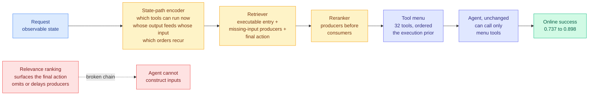

# The Menu Is an Execution Prior: State-Path Tool Menus for Online Agents

**Source:** arXiv [2609.09395](http://arxiv.org/abs/2609.09395), Bo Yan, Weikai Lin, Song Wang, published 2026-09-08. Kurate cs.AI #19, ai_rating 6.5/10. Absent from HuggingFace Daily Papers. Raw: [`raw/kurate/2026-09-13-cs-ai.md`](../../raw/kurate/2026-09-13-cs-ai.md).

**TL;DR.** When an agent has thousands of tools available, something has to pick the short list it actually sees, and every existing constructor picks by relevance to the request. This paper's claim is that relevance is the wrong objective, because a multi-step task needs the final action **and the prerequisite tools that produce its inputs, in a usable order**, and the producers are exactly the tools that do not look relevant to the request. The fix is to route on a **state path**, a pre-execution route from the observable request state to the desired outcome, and to treat the menu as a prior over those routes. On ToolBench this lifts online success from 0.737 to 0.898 **without changing the agent at all**, and a 32-tool state-path menu covers more complete execution chains than the official 128-tool list.

---

---

## What it claims

**The object being defined is the tool menu**: the short, ordered subset of available tools shown to an agent before execution, from which alone it may call. That is already a routing decision and the literature has mostly not treated it as one.

**The failure mode is specific and diagnosable.** Rank by request relevance and you reliably surface the tool that performs the user's stated goal. The tools that create that tool's inputs are described in terms the request never mentions, so they rank low, get omitted, or get placed after the consumer. The agent then either cannot construct the inputs or wastes turns discovering it needs something not on the menu.

**The state path is the proposed unit of routing.** A route from the observable request state to the desired outcome. The encoder represents three things: which tools can run from the current state, how each tool's outputs satisfy later tools' inputs, and which orderings recur in training paths. The retriever is then required to cover three roles rather than one, an executable entry point, the missing-input producers, and the final action. The reranker enforces producers before consumers.

**Results.** ToolBench online success 0.737 to 0.898, beating retrieval, reranking, generation and routing baselines, **with no change to the agent**. The coverage result is the more interesting one: a 32-tool state-path menu covers more complete chains than the official 128-tool list, which is a 4x reduction in menu size with better coverage. The gain persists across executor families of different model capacities.

---

## How this relates to prior wiki pages

**It is a routing result that routes over a dependency graph rather than over a capability or cost axis, which is new for the [LLM routing page](llm-routing.md).** Everything that page records routes an input to a *destination*: a query to a model, a token to an expert, a request to a precision tier. This routes to an **ordered set whose internal ordering is the product**. The menu is not a selection, it is a plan sketch handed to the agent as a constraint, which is why the authors call it an execution prior. The clean formulation: **relevance ranking optimizes the marginal utility of each item, and a multi-step task needs the joint feasibility of the set.**

**The 4x menu reduction at better coverage is a token-cost result that the paper does not frame as one.** Tool definitions sit in the prompt prefix on every turn. Going from 128 tool schemas to 32 is a direct cut to the per-turn context, and it lands in exactly the region that [Ken Huang's prefix-stability argument (09-13)](../inference-efficiency/2026-09-13-prefix-stable-kv-caching-claude-md.md) says is cached: the system-and-tool-definitions block at the head of the prompt. **A smaller menu is cheaper twice, once in tokens and once because a shorter stable prefix is easier to keep byte-identical.** Neither paper mentions the other's axis.

**It is the retrieval-side complement to a result the [harness page](../agentic-systems/agent-harness-engineering.md) recorded on 09-06.** That entry described the harness getting a query optimizer: [ContextPipe (09-06)](../inference-efficiency/2026-09-06-contextpipe-database-context-assembly.md) treated context assembly as a database query plan and cut token volume 31% while deliberately lowering the cache-hit ratio. State-Path Tool Menu does the same structural thing for the tool surface: **plan the retrieval against the execution, not against the request.** Two papers a week apart, two different parts of the prompt, one idea.

**And it sharpens an open problem on [tool calling](../agentic-systems/tool-calling.md).** That page has recorded repeatedly that tool-selection accuracy degrades with library size and that the usual mitigation is better embeddings. This says the embedding was never the bottleneck for multi-step tasks, because the missing tools were semantically distant from the request **by construction**, and no amount of better semantic matching recovers them. That is a mechanism, not a benchmark improvement, and it predicts where embedding-based retrieval will and will not help: single-step tool use, fine; chains, never.

## Gaps

ToolBench only. The state path has to be learned from training paths, so the method inherits whatever coverage bias the training traces have, and the paper does not test a tool library whose dependency structure is unseen. There is no cost accounting for the encoder and reranker themselves, which run before every execution, and no latency figure, so the 4x menu reduction's net token saving is unquantified. Nothing addresses tools whose output-to-input compatibility is conditional on runtime values rather than on types.

## Industrial implication

Every MCP-style tool registry that has grown past a few dozen entries has this problem and is currently treating it as a retrieval-quality problem. The practical move is small: instrument which failed runs failed because a producer was missing from the menu rather than because the model chose wrong. That single diagnostic separates "we need better embeddings" from "we need dependency-aware menus," and almost nobody currently distinguishes them in their traces.

## Related pages

- [LLM routing](llm-routing.md)
- [Tool calling](../agentic-systems/tool-calling.md)
- [Agent harness engineering](../agentic-systems/agent-harness-engineering.md)
- [Harness search gets a budget: COBRA-Skills and RobustSGPO (09-13)](../agentic-systems/2026-09-13-cobra-skills-robustsgpo-harness-search.md)
