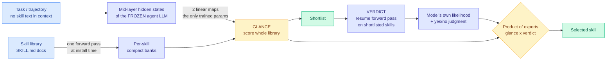

# The Router Within: Eliciting Native Skill Routing from a Frozen LLM (Gavel)

**Date ingested:** 2026-09-16
**Source:** HuggingFace Daily Papers · [arXiv 2609.15982](https://arxiv.org/abs/2609.15982)
**Raw:** [raw/huggingface/2026-09-16-the-router-within-eliciting-native-skill-routing-from-a.md](../../raw/huggingface/2026-09-16-the-router-within-eliciting-native-skill-routing-from-a.md)
**Authors:** Ruishuo Chen, Xun Wang, Yu Chen, Zhuoran Li, Longbo Huang (Tsinghua IIIS)

## TL;DR

An agent "skill" is a document, usually a `SKILL.md`, holding instructions and scripts for a specialized task. Picking the right one is the whole game, and today there are two ways to do it: put every skill's metadata in the agent's context and let it choose (progressive disclosure, what Claude Code and Codex do), or hand selection to an external retriever and reranker. The first burns context and caps library size; the second moves selection outside the agent's own capability. Gavel argues both are unnecessary because **the frozen agent model already carries the routing signal in its own forward passes**, and two linear maps are enough to read it out with zero skill text in the context. On Qwen3-32B it beats retrieve-and-rerank pipelines carrying 1.2B to 16B extra parameters by up to 13.4 points, and by up to 21.9 points when the need for a skill only becomes apparent mid-rollout.

## Architecture

## What it does

Gavel stands for Glance And Verdict from a frozen LLM, and the two words are the two stages.

**Glance.** The task's mid-layer hidden states and each skill's mid-layer hidden states are projected through two learned linear maps. Those maps are the only trained parameters in the system. Each skill's representation is a compact bank built by a single forward pass at installation time, so adding a skill costs one indexing pass and no retraining. The glance scores the entire library at once, which is what makes libraries of tens of thousands of documents tractable.

**Verdict.** The shortlisted skills get their forward passes resumed, and the model's own next-token likelihood plus an explicit yes/no judgment are read out. Glance and verdict are fused as a product of experts, which is the standard way to combine two independently-trained scorers that each capture a different slice of the evidence.

The three design constraints the authors set, and this is the useful part to carry forward:

1. **Task-only context.** No skill metadata enters the context before selection completes.
2. **No standalone routing model.** The router inherits the agent's own reasoning rather than depending on a separate embedding model whose training distribution is fixed.
3. **Installation-time indexing.** A new skill needs one forward pass, not a retraining run.

## Results

- On **Qwen3-32B**, Gavel beats progressive disclosure and retrieve-and-rerank pipelines that add **1.2B to 16B external parameters**, by up to **13.4 points** on written tasks.
- The margin widens to **21.9 points** when the need for a skill arises **mid-rollout** rather than being stated in the opening request. That is the case retrieval handles worst, because the request vocabulary never mentions the skill.
- Trained once, it transfers **zero-shot** to three public benchmarks plus **SkillTraj**, a new benchmark of 372 simulated agent trajectories released with the paper.
- **Routing accuracy improves as the backbone improves.** This is the structural claim: the router is not a fixed-capability component bolted on, it rides the base model's curve.
- In a bash-agent harness the same 32B model triggers the correct skill on Skill-Use **more often than far larger frontier models running inside Codex**.

## How this relates to prior wiki pages

**It is the first routing result in this wiki where the router has no parameters of its own worth naming.** Every entry on the [LLM routing page](llm-routing.md) so far routes with something: a trained scorer, a value-of-information estimator, a learned policy. [VoI-MoLE (08-05)](2026-08-05-vi-mole-value-of-information-routing.md), which separates uncertainty that querying more experts can reduce from uncertainty it cannot, and [Pandora's Router (08-25)](2026-08-25-pandoras-router-costly-value-estimation.md), which prices the cost of estimating which model to use and derives a closed-form value-of-information policy, both add machinery. Gavel subtracts it. Two linear maps is close to the floor.

**It extends the routing-levels taxonomy that page has been building.** The page recorded on 08-25 that the same allocation decision recurs across models, across adapters, and across regions of a matrix inside a kernel, then added a fourth level on 09-11 with [Intelligence per Watt](2026-09-11-intelligence-per-watt-local-cloud-routing.md) routing across physical devices. Gavel adds a fifth: **routing across the agent's own skill library**, where the option set is documents rather than compute.

**It sits directly on the standing harness gap.** The routing page has flagged since May that nothing in production routes over harnesses, and that the routable unit should be the model-harness pair. A skill library is a component of a harness. Gavel does not route over harnesses, but it is the first mechanism that routes over a harness *component* using the agent's own internals, and the "routing accuracy improves as the backbone does" result is exactly the property a harness router would need.

**It is the mechanism-level answer to a problem [The Menu Is an Execution Prior (09-13)](2026-09-13-state-path-tool-menus.md) named at the set level.** That paper showed a 32-tool state-path menu covers more complete execution chains than the official 128-tool list, because relevance ranking optimizes the marginal utility of each item while a multi-step task needs joint feasibility of the set. Both papers attack the same cost: schemas and metadata sitting in the prompt prefix on every turn. The menu paper shrinks the set; Gavel removes it from the context entirely. **Nobody has composed them**, and the composition is coherent: use Gavel's glance to score the library, then a state-path reranker to order the shortlist by producer-before-consumer dependency.

**It compounds with prefix stability.** [Ken Huang's argument (09-13)](../inference-efficiency/2026-09-13-prefix-stable-kv-caching-claude-md.md) is that one changed byte at token N invalidates the KV cache for everything after N, so the cached head of the prompt should be held byte-identical. Skill metadata in the context is exactly the volatile region: it changes as the library changes. Taking it out of the context does not just save tokens, **it removes a source of prefix churn**, which is a second saving neither paper prices.

## Gaps

- The two linear maps are trained, so there is a training set, and the paper does not report how selection degrades on skill libraries whose domain is far from that set. "Trained once, transfers zero-shot" is demonstrated across four benchmarks, not across an adversarial distribution shift.
- The verdict stage resumes forward passes on the shortlist, which is real compute per query. The paper reports accuracy gains against pipelines with 1.2B to 16B extra parameters, but a clean latency and FLOPs accounting against progressive disclosure, which costs only context tokens, is not in the abstract.
- Results are on Qwen3-32B. The claim that routing accuracy improves with the backbone is a scaling claim and needs more than one backbone family to hold.
- Skill libraries of "tens of thousands of documents" are the stated design target, but the reported benchmarks are much smaller. The per-skill bank build cost and glance latency at that scale are unmeasured.

## Industrial implication

Every agent framework shipping a skills system today is paying for selection either in context tokens or in an external retriever. Gavel says both bills are optional. The near-term form is an SDK-level change rather than a model change: a harness reads the mid-layer states it is already computing, scores the library, and never writes skill metadata into the prompt. That makes the library size limit disappear and makes the cached prefix more stable at the same time. The prediction worth checking is whether any named framework exposes hidden-state-based skill selection, since it requires access to intermediate activations that hosted API models do not expose. **This technique is available to self-hosted and open-weight deployments and structurally unavailable to anyone routing through a closed API**, which is a new and specific advantage for open weights.
