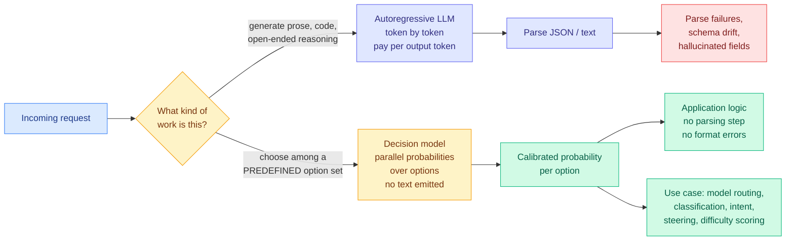

# Jev: a decision-only model that never writes a sentence

**Date ingested:** 2026-09-16
**Source:** X home feed (dominant launch story of the day, roughly a dozen accounts) · TypeSafe AI
**Raw:** [raw/twitter/feed/2026-09-16-afternoon-ranked.json](../../raw/twitter/feed/2026-09-16-afternoon-ranked.json)
**Principals:** Diogo Almeida (co-author on InstructGPT and the RLHF work at OpenAI, previously Google Brain), founder of TypeSafe AI

## TL;DR

Every time a language model makes a decision inside software (is this fraud, which queue does this ticket go to, which model should handle this request, how hard is this prompt), it produces that decision by writing a sentence or a JSON object one token at a time, and the calling code then parses it back out. Jev deletes that layer. It takes a question plus a **predefined set of options** and emits **structured decisions and probabilities directly**, with no natural language in between. Reported figures from the launch: **20-200x faster, 40-400x cheaper, $0.042 per million input tokens, and output tokens free**, because there are almost no output tokens to charge for. The company calls it a "System One Model," and the honest one-line description from a skeptic in the feed is the better one: **a really smart switch statement.**

## Where it sits

## What is actually claimed

The launch claims, all vendor-reported and none independently verified at time of ingest:

- **20-200x faster** and **40-400x cheaper** than generating the same decision through an LLM.
- **$0.042 per million input tokens**, with **output tokens priced at zero**.
- Trained with something the founder calls **RLCD**, described only as "a new way to train models" over two years in stealth.
- Explicitly **cannot** write code, generate natural language, or produce free-form output. It requires a predefined option set and returns which one to take.
- The framing claim: hallucination is impossible in the usual sense because the model never asserts anything in words.

One independent data point in the feed carries more weight than the marketing. A developer reported running **roughly 5,000 requests for about $2** across classification, **model routing**, intent detection and steering, and described it as "a new intelligent decision-making primitive, separate from deterministic code and LLM calls." That is a first-hand cost observation on the exact workload this wiki cares about.

## Why this matters to the routing thread

**A router is a decision model with a small option set. That is the entire job.** The [LLM routing page](llm-routing.md) has catalogued routing at five levels: across models, across adapters inside a model, across regions of a matrix inside a kernel, across physical devices, and now across an agent's skill library. Every one of those routers must be cheaper than the decision it is making, or it eats its own saving. That constraint has quietly shaped the whole literature:

- [Pandora's Router (08-25)](2026-08-25-pandoras-router-costly-value-estimation.md) exists specifically because **estimating** which model to use is itself expensive, and it derives a closed-form value-of-information policy to decide how much to spend on estimation.
- [VoI-MoLE (08-05)](2026-08-05-vi-mole-value-of-information-routing.md) separates uncertainty that querying more experts can reduce from uncertainty that it cannot, again because querying costs.
- The [handoff tax (09-07)](2026-09-07-handoff-tax-model-switching.md) result, that carrying a weak model's reasoning into a strong one is actively harmful, only matters because escalation decisions are made under a latency and cost budget.

**A decision primitive at $0.042 per million input tokens with free output makes the router's own cost effectively zero.** If the numbers survive scrutiny, the entire value-of-information framing that Pandora's Router built changes shape: the interesting trade-off stops being "is it worth paying to estimate" and becomes "how good is a cheap estimate." Those are different papers.

**It is also a direct answer to a question this page raised on 09-14.** The batching problem: routing across many small models fragments the request stream, lowers per-model batch size, and erodes the weight-read amortization that makes a GPU bill competitive with a per-token bill. A router that is not itself a large model does not add to that fragmentation. It does not solve the downstream batching problem, but it removes the router from the list of things making it worse.

## Skepticism, stated plainly

The launch was amplified by roughly a dozen accounts in a single day, several of them with the tone and structure of paid or engagement-farmed promotion ("babe wake up," "the guy who co-invented ChatGPT," identical talking points in four languages). The reach-normalized ranking of the day's feed floated this cluster to the top almost entirely on volume. The technical core is credible and the founder's credentials are real, but:

- **Nothing is independently benchmarked.** No accuracy comparison against an LLM classifier on a named dataset appeared anywhere in the day's signal.
- **"Rebranded" is a fair charge.** As one skeptical post put it, this is what 2016 ML classifiers would be if they had 2026-level intelligence. Discriminative models with calibrated probabilities over a fixed label set are not new. The claim that must be true for the launch to matter is that this one carries frontier-level *understanding* into that old form factor, and that claim is exactly the unverified one.
- **The predefined-option-set requirement is a real constraint**, not a footnote. Agent routing decisions frequently have open option sets that change at runtime.
- **RLCD is a name, not a method.** No paper accompanied the launch.

## Open question this creates

If a decision primitive really is 40-400x cheaper than an LLM call, the natural composition is obvious and nobody has published it: **use it as the glance stage of a two-stage router.** Today's [Gavel paper (09-16)](2026-09-16-gavel-native-skill-routing-frozen-llm.md) does exactly this shape internally, reading routing signal from the frozen agent model's own mid-layer states and then resuming forward passes only on a shortlist. Gavel's argument is that the routing signal is free because the model already computed it. Jev's argument is that the routing signal should come from a separate, tiny, purpose-built model. **Those are opposite answers to the same question, they arrived on the same day, and the experiment that settles it is a head-to-head on one skill-selection benchmark.**
