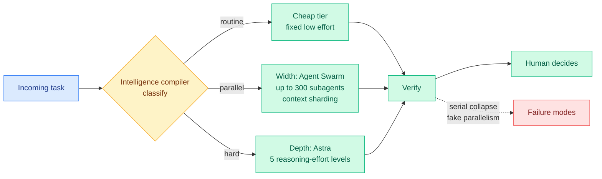

# Route depth and width before you pay frontier rates (Ken Huang)

**Source:** Agentic AI newsletter (RSS) · [Ken Huang, 2026-09-17](https://kenhuangus.substack.com/p/gpt-6-astra-plus-kimi-k3-swarm-route) · [raw](../../raw/rss/2026-09-17-agentic-ai-gpt-6-astra-plus-kimi-k3-swarm-route-depth-and-width-be.md)
**Note:** the post is partially paywalled. This summary covers the published section and the stated outline; the detailed cost sheets sit behind the paywall.

## TL;DR

Ken Huang's argument is that the routing decision in a production agent stack has **two independent coordinates**, not one, and that most practitioners only tune one of them. **Depth** is how much reasoning a task gets: GPT-6 Astra exposes five discrete `reasoning.effort` levels, so depth is now a dial on a single model rather than a choice between models. **Width** is how much parallelism a task gets: Kimi K3's Agent Swarm runs up to **300 subagents** over a 2.8T-parameter / 104B-active mixture-of-experts backbone (a model where each token activates only a small slice of the total parameters) with a **1,048,576-token** context and explicit context sharding. His claim is that routing routine work one way, batch work another, and heavy reasoning to the top tier brings a planning workload that would cost roughly **$500/day all-frontier down to around $66/day routed**, which he explicitly labels an estimate rather than an audited figure. The design he proposes for the router is called an **intelligence compiler**: classify a task as routine, parallel, or hard, dispatch accordingly, verify, and only then hand a human the decision.

## The two coordinates

## Key claims

- **Depth is now a per-request parameter, not a model choice.** Five reasoning-effort levels on one model means the classic router (cheap model versus expensive model) is a coarser instrument than the API already offers. Huang also names async tool calls and mid-turn steering as the other two things Astra actually ships.
- **Width has a distinct price board and distinct failure modes.** The named failures are **serial collapse** (a nominally parallel plan that executes sequentially), **fake parallelism** (subagents that duplicate rather than divide work), and the trap of filling a 1M-token window because it exists.
- **The metric he insists on is cost-per-success**, not cost-per-token. That is the same correction this wiki has recorded from three other directions this month.
- **One prompt to one answer fails in production** for two named reasons: session amnesia, and the absence of a routing layer, which together turn a frontier model into "an expensive notepad."

## How this relates to what the wiki already knows

**The depth/width split gives the routing page a coordinate it has been circling for three weeks without naming.** The page's taxonomy has grown through what is routed (a query, a task axis, a per-head KV slice, a memory write, an adapter budget, a temporal position, a skill document) and when (per query, per step, mid-session). [Elo-per-token (09-15)](../inference-efficiency/2026-09-15-elo-per-token-agent-test-time-scaling.md), which measured the token budget at which an agent's marginal token stops beating an independent sample, showed that re-slicing a fixed 100M-token budget across parallel sessions bought **+264 Elo over one long session and +355 over ten short ones**. That is exactly the width axis, measured. Huang supplies the vocabulary and the production framing; Elo-per-token supplies the number and the threshold. **Neither cites the other, and together they say the same thing: parallelism is a routing decision with a measurable optimum, and it is orthogonal to which model you pick.**

**The $66-versus-$500 estimate is the third routing cost claim this month with the same shape and no shared method.** Spotify's Portal layer reported cutting Claude Code token usage **90%** by hard-blocking files over 350 lines from the expensive model ([09-07](2026-09-07-handoff-tax-model-switching.md)). The unverified "End of Model Loyalty" post reported an 84/16 cheap-to-ceiling production split costing **$256 against a $4,318 all-frontier bill**, and the [09-15 digest](../daily-digest/2026-09/2026-09-15.md) set a 30-day deadline for a paper to surface behind those figures. Huang's ratio is about 7.6x, Spotify's is about 10x, the unverified post's is about 17x. **Three independent production routing claims clustering between 7x and 17x is a pattern, and the honest statement is that nobody has published the methodology behind any of them.** The wiki should stop treating each new ratio as news and start asking for the workload mix that produced it.

**It also sharpens the disagreement with the practitioner counterweight the routing page already records.** The "LLM Routing Can Cost More Than Not Routing" article argued the canonical classifier-router breaks in production. Huang's intelligence compiler is a classifier-router, but it classifies into three **structural** buckets (routine, parallel, hard) rather than into models, and it puts a verification step between the dispatch and the human. That is a meaningfully different design and it is the first proposal in the wiki that answers the classifier-router critique rather than restating it.

## Gaps

The cost arithmetic is behind the paywall and self-labelled as illustrative, so the 7.6x ratio is a hypothesis, not a measurement. There is no workload description (what fraction of tasks are routine versus hard), and every routing saving is dominated by that mix rather than by the router. The Kimi K3 numbers are vendor-published capability claims (300 subagents, 1M context) rather than measured throughput, and "up to 300 subagents" without a reported speedup curve is precisely the fake-parallelism trap the post itself warns about.

## Related

- [llm-routing.md](llm-routing.md) · [test-time-compute-allocation.md](../inference-efficiency/test-time-compute-allocation.md)
- [Elo-per-token (09-15)](../inference-efficiency/2026-09-15-elo-per-token-agent-test-time-scaling.md)
- [The Handoff Tax (09-07)](2026-09-07-handoff-tax-model-switching.md)
- [Kimi K3 in C: NVMe expert streaming (09-12)](../inference-efficiency/2026-09-12-kimi-k3-in-c-nvme-expert-streaming.md)
- [Multi-agent design patterns (08-29)](../agentic-systems/2026-08-29-multi-agent-design-patterns-production-hardening.md)
