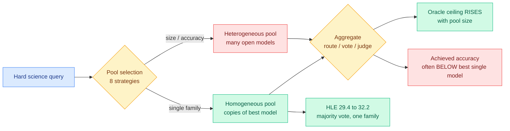

# Mo' Models, Mo' Problems: how to select model pools for multi-agent systems

**Source:** surfaced via saved reading (X bookmark) · [arXiv 2609.17306](https://arxiv.org/abs/2609.17306) · [DAIR.AI summary](https://academy.dair.ai/papers/mo-models-mo-problems-how-to-best-select-model-pools-when-designing-multi-agent-2609.17306)
**Authors:** Sara Vera Marjanović, Jiacheng Xu, Aleksandr Laptev, Grigor Nalbandyan, Erik Arakelyan, Evelina Bakhaturina (NVIDIA)

## TL;DR

A multi-agent system (several model calls whose outputs get combined, by routing before generation or by majority vote or LLM-as-judge after it) is usually assembled by throwing together whichever strong open models are available, on the intuition that diversity helps. NVIDIA tested that intuition properly: eight selection strategies (by model size, by accuracy, by answer diversity, by error diversity, and combinations) across before-generation routing and after-generation aggregation, on hard scientific benchmarks including Humanity's Last Exam. The result is a clean negative. **Expanding the candidate pool raises the oracle ceiling and lowers the achieved accuracy, often below the single best model in the pool.** The strategy that actually works is the one nobody advertises: pick candidates **within a single model family**. Majority vote over several copies of the best single model took HLE from **29.4% to 32.2%**, while nearly every heterogeneous mix went down. The conclusion the authors draw is that model-pool composition is a first-class design decision with an instability cost, not a free diversity dividend.

## Mechanism

## Key findings

- **The oracle gap widens as you add models.** The theoretical best-case accuracy (an oracle that always picks the right answer from the pool) climbs with pool size. Achieved accuracy does not follow it and frequently falls below the strongest base model, so the added capability is real but unreachable by any of the aggregation mechanisms tested.
- **Within-family selection is the only strategy that reliably beats a standalone model** among the eight evaluated. Diversity metrics based on answer disagreement or error disagreement, which are the theoretically motivated choices, do not rescue heterogeneous pools.
- **Homogeneous systems improve, heterogeneous ones decline.** Majority vote over multiple samples from the single best model lifted HLE from 29.4% to 32.2%. Nearly every mixed-model group went the other way.
- **The failure is framed as instability rather than weakness.** Adding an arbitrary model injects variance into the aggregation step, and the aggregators tested (routing, majority vote, LLM-as-judge) have no mechanism for discounting a systematically off-distribution member.

## How this relates to what the wiki already knows

**This is the first result on the routing page that says adding a routable option can be strictly negative.** Every routing result here so far has treated the model pool as given and optimized the decision over it: [TRACER](../ai-routing/llm-routing.md) routes a query to a model, [Route-by-task open vs frontier (09-14)](2026-09-14-route-by-task-open-vs-frontier.md) routes by task type, [the Handoff Tax (09-07)](2026-09-07-handoff-tax-model-switching.md) prices what it costs to change your mind mid-run. The pool itself has never been the variable. NVIDIA's result says the pool is a variable with a **cost** attached, and that the cost is not the obvious one (more models, more spend) but a quality cost that appears even when the aggregation step is free.

**It complicates the single most-cited justification for heterogeneous routing.** The economic case for a router, stated most cleanly in [the AlphaSense token-price analysis (08-14)](../ai-industry/2026-08-14-alphasense-token-price-vs-task-cost.md), is that different models are good at different things, so a mixture beats any one of them at a given budget. That case survives for **before-generation routing with a good router**, because a correct route never invokes the weak member. It does not survive for after-generation aggregation, which is where most production "multi-agent" systems actually live. The distinction the paper implicitly draws and does not name: **heterogeneity is an asset when a router decides, and a liability when a vote decides.**

**It lands directly on the failure mode [Multi-Agent Design Patterns (08-29)](../agentic-systems/2026-08-29-multi-agent-design-patterns-production-hardening.md) catalogued without measuring.** Ken Huang's topology guide named cascading token explosion and unauthorized mutation as the headline multi-agent failures and recommended starting with orchestrator-worker before adding complexity, but it had no benchmark numbers behind its matrix. This supplies one of the missing numbers, and it argues for an even more conservative prior than that guide: before you decide the topology, check whether you should have more than one distinct model at all.

**And it collides usefully with [Emergence World (09-16)](../agentic-systems/2026-09-16-emergence-world-multiagent-stress-test.md).** That study ran eight ten-agent worlds for sixteen days and found that the same model-persona pairing behaved **differently in mixed versus homogeneous populations**, concluding that model-level alignment is not compositional. NVIDIA now reports that model-level **capability** is not compositional either, on a much shorter horizon and a much cleaner task. Two independent results, one safety-framed and one accuracy-framed, saying the same structural thing: **mixing model families changes system behaviour in ways that neither member's own evaluation predicts.** Neither cites the other. That is a two-of-a-kind; a third would make it a pattern worth naming.

## Gaps

The benchmarks are hard scientific QA with a verifiable answer, which is exactly the regime where majority vote is strongest and where a single-family pool's correlated errors are least punished. On open-ended or long-horizon agentic tasks the correlated-error weakness of a homogeneous pool is the thing diversity is supposed to fix, and that case is untested here. The routing arm is also only as good as its router, and the paper does not report how close its before-generation router came to the oracle, so "routing did not help" may be a statement about the router rather than about heterogeneity. And the practical recommendation (stay within one family) is the recommendation that most favours a vendor with a full model family, which is worth noting given the authors' affiliation even though the experiments look fair.

## Research angle

The open question is whether the instability is a property of the pool or a property of the aggregator. An aggregator that estimated each member's reliability online (a per-member weight updated from its agreement history, which is standard in ensemble learning and absent from every LLM aggregation scheme in this wiki) would convert the oracle gap into recoverable accuracy if the problem is aggregation. If a reliability-weighted vote still loses to the single best model, the problem really is the pool and the field should stop building mixed-model juries.

## Related

- [llm-routing.md](llm-routing.md) · [multi-agent-systems.md](../agentic-systems/multi-agent-systems.md)
- [The Handoff Tax (09-07)](2026-09-07-handoff-tax-model-switching.md)
- [Route by task: open vs frontier (09-14)](2026-09-14-route-by-task-open-vs-frontier.md)
- [Emergence World (09-16)](../agentic-systems/2026-09-16-emergence-world-multiagent-stress-test.md)
