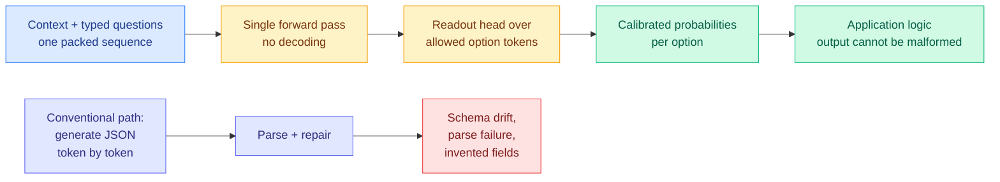

# The decision-primitive moat lasted 72 hours: open Jev clones arrive, and one of them wins

**Date ingested:** 2026-09-19
**Source:** X home feed (roughly fifteen posts, the dominant cluster of the day) · GitHub · Cactus Compute
**Raw:** [raw/twitter/feed/2026-09-19-morning-ranked.json](../../raw/twitter/feed/2026-09-19-morning-ranked.json)
**Relates to:** [Jev: a decision-only model that never writes a sentence (09-16)](2026-09-16-jev-decision-only-model.md) · [llm-routing.md](llm-routing.md)

## TL;DR

On 2026-09-16 this wiki ingested Jev, a closed decision-only model from TypeSafe AI that emits structured choices and probabilities over a predefined option set and never generates text. The digest that day filed a falsifiable prediction: **"Jev gets an independent benchmark within 30 days or it should be treated as vapor."** It took three days, and the answer is more interesting than either branch of the prediction. The capability is real and reproduces easily. The moat does not exist. Within 72 hours of launch, at least six independent open re-implementations shipped, and on the one head-to-head eval anybody published, **a 706K-parameter, 2.8 MB open model scored 99.7% against hosted Jev's 83.6%** on form-filling. The interesting question has moved from "is the decision primitive real" to "why would anyone rent one."

## The pattern being copied

The mechanism that everyone independently landed on is the same, and it is not exotic: **stop sampling, read the logits.** Pack the context and the typed questions into one sequence, run one prefill pass, and score the allowed options directly off the model's own distribution with a small readout head. There is no decode loop, so there is no per-output-token bill and no parse step. Malformed output is not unlikely, it is unrepresentable. That is the whole trick, and it is why a weekend was enough to reproduce it.

## The clones, in the order they landed

- **Cua's form-filling model** ([@Layton_Gott](https://x.com/Layton_Gott/status/2101031818413650111)) — **706K parameters, 2.8 MB, 99.7%** on their form-filling eval against **hosted Jev at 83.6%**. Free, and small enough to run in well under a gigabyte of RAM. This is the single most load-bearing number of the day and the closest thing to the independent benchmark the 09-16 digest asked for.
- **Kev-0.5B** ([@jaredpalmer](https://x.com/jaredpalmer/status/2101028325472841920), [repo](https://github.com/jaredpalmer/kev)) — a LoRA adapter plus a pointer readout head on **Qwen2.5-0.5B**, Apache-2.0, trainable and runnable on a MacBook Pro. The README describes the mechanism precisely: the document and every question are packed into one sequence, a **block-causal mask** lets each question see the document but never another question, and a pointer head scores each question's options against its decision token and softmaxes. Many typed questions answered in parallel, one prefill, no decoding.
- **sarvam-jev** ([@sagar_builds](https://x.com/sagar_builds/status/2100978402174120134)) — the same readout applied to an Indic-language model's logits on unchanged sarvam-1 weights. **8.8x faster** than making the same model write the same answers. Runs entirely in the browser, no backend. Hindi, Tamil, Bengali.
- **SimpleJev** ([@picocreator](https://x.com/picocreator/status/2101006253829046539)) — a library that "Jev-ifies" any HuggingFace model, adds the vision capability Jev lacks, and is in production at Featherless AI. Open source.
- **openjev** and **jevlike** (via [@studio_yebisu](https://x.com/studio_yebisu/status/2100686990090047569)) — independent reproductions of the input/output pattern on open weights, both explicitly not TypeSafe models, both runnable on a local GPU.
- **A local distillation** ([@taroleo](https://x.com/taroleo/status/2101106887840370919)) — 26 hours on a DGX Spark distilling the 157 GB DeepSeek V4 Flash's judgments into a **4B** student. One twentieth the size, **~22 ms per decision**, and it beats the teacher's own instant-answer mode.
- **GLiNER**, which several people pointed out ([@singularity_sah](https://x.com/singularity_sah/status/2101111015593406559)) has been "the OG open-weights Jev" for years.

## What this resolves, and what it does not

**Resolved: the primitive is real.** Six independent parties reproduced the input/output contract in days, with consistent speed claims (8.8x here, 22 ms there, one forward pass everywhere). The 09-16 page's skepticism was aimed at the marketing cadence, a dozen accounts amplifying a launch with no paper and no benchmark, and that skepticism was correctly aimed at the *pricing claims*, not the *mechanism*. The mechanism survived contact.

**Resolved against TypeSafe: there is no defensible moat.** A capability that a solo developer rebuilds on Qwen2.5-0.5B over a weekend, and that a 706K-parameter model beats on a real eval, is a **feature of every model that already exists**, not a product. Any model with logits already contains its own decision primitive. Jev's contribution was noticing that and packaging it, which is genuinely valuable as a demonstration and worth very little as a rent.

**Not resolved: the head-to-head this wiki actually wants.** The [09-18 digest](../daily-digest/2026-09/2026-09-18.md) predicted that someone would run **Gavel** (09-16, which reads the routing signal out of a frozen agent model's mid-layer hidden states with two linear maps, for free) against Jev on skill selection, reporting accuracy, latency and dollars together. Cua's number is form-filling, not skill selection, and it compares an open clone to hosted Jev rather than either to Gavel. The specific experiment is still open, but the clone wave strengthens Gavel's side of it considerably: both approaches now say the decision signal is already inside a model you are running, and the only disagreement left is which internal surface to read it off, the hidden states or the logits.

**Not resolved: whether calibration survives the shrink.** Every clone reports accuracy or latency. None reports **calibration**, and calibrated probabilities are the entire reason a decision model is useful for routing rather than mere classification. A router needs to know when it does not know, so it can escalate. A 706K-parameter model that is 99.7% accurate on form-filling may be badly overconfident on the 0.3%, and the form-filling eval would not show it.

## Why this matters to the routing thread

The [routing page](llm-routing.md) has been organized for months around one constraint: **a router must cost less than the decision it makes, or it eats its own saving.** [Pandora's Router (08-25)](2026-08-25-pandoras-router-costly-value-estimation.md), which prices the cost of *estimating* which model to use and derives a closed-form value-of-information policy for when that estimation is worth paying for, exists precisely because estimation was expensive. The 09-16 page argued that Jev's pricing, if real, would collapse that constraint and make the interesting question "how good is a cheap estimate" instead of "is it worth paying to estimate."

Today closes that argument harder than Jev did, and for a different reason. It is not that the decision got cheap to *rent*. It is that the decision got cheap to *own*. A 2.8 MB artifact that runs on the CPU you already have has no per-call price at all, so there is no value-of-information trade-off left to compute at the routing layer. The cost of the router drops out of the optimization entirely, and what remains is purely a question of the router's accuracy and calibration.

This also lands cleanly against the **batching concern** the routing page raised on 09-14, that routing across many small models fragments the request stream and erodes the weight-read amortization that makes a GPU bill competitive with a per-token bill. A decision model in the kilobyte-to-megabyte range does not join the GPU pool at all. It runs beside the application, on the CPU, on the device. It removes itself from the batching problem rather than solving it.

## The convergent evidence from the other direction

Cactus Compute's **[Needle 3](../inference-efficiency/2026-09-19-needle-3-sliceable-automation-model.md)**, released the same day, arrives at the same destination from the compression side rather than the readout side: an 8-29 MB automation model whose 4-layer slice matches DeepSeek V4 Flash on downstream tasks after one epoch of tuning. Needle also refuses to chat, also returns typed records or tool calls, and also returns an empty list rather than a guess when no tool fits. **Two independent teams, two different mechanisms, same product thesis in the same week: the decision layer should be a small local artifact, not a frontier API call.** That is a pattern, and the routing page should carry it as one.

## Open questions

- Does any clone publish **calibration curves**, not just accuracy? Without them, none of these can safely drive an escalation policy.
- Does TypeSafe respond with a paper, a benchmark, or a price cut? The commercial position as of today is difficult to defend on the public evidence.
- Does the Gavel-versus-logit-readout comparison get run? Both now claim the signal is free and internal; they disagree only about where to read it.
