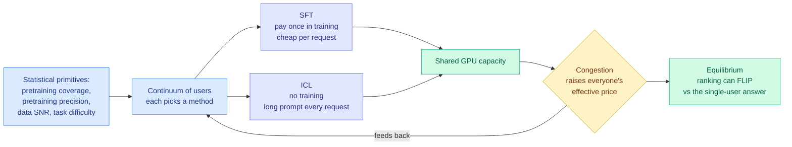

# When your GPU is shared, the right personalization method depends on what everyone else picked

**Date ingested:** 2026-09-19
**Source:** X home feed via [@fnruji316625](https://x.com/fnruji316625/status/2101100503740432548)
**Links:** [arXiv 2607.14371](https://arxiv.org/abs/2607.14371)
**Authors:** Fengzhuo Zhang, Zhuoran Yang, Dirk Bergemann (Yale)
**Raw:** [raw/twitter/feed/2026-09-19-morning-ranked.json](../../raw/twitter/feed/2026-09-19-morning-ranked.json)

## TL;DR

There are two ways to make a model do your specific job: **supervised fine-tuning (SFT)**, where you pay once to train weights on your data, and **in-context learning (ICL)**, where you pay every request to stuff examples into the prompt. The usual framing treats the choice as a per-user quality-versus-cost calculation. This paper points out that on a shared serving platform it is nothing of the sort. It is a **congestion game**: your fine-tuning job competes for the same GPUs as everyone else's long prompts, so the correct choice depends on what other users are choosing at the same time. They build a continuum-user mean-field model, solve for equilibrium, and get three results that are not obvious.

## The structure

**Three findings.**

1. **SFT and ICL each dominate in a regime set by two statistical primitives**, how well pretraining already covers your task and the signal-to-noise ratio of your personalization data. **Congestion can flip the ranking.** The method that is better for you in isolation can be the wrong choice once you price the queue.
2. **Equilibrium resource consumption is non-monotonic in model quality.** Improving pretraining **precision** reduces congestion, which is intuitive. But broadening pretraining **coverage**, and harder tasks, can *increase* it. Making the base model better at more things can make the shared system more contended, not less.
3. **Offering both methods never reduces the platform's maximum profit**, even though it can raise total compute load. A menu dominates a single option.

They validate the theory with GPT-2 on linear-regression tasks, and add a documentation survey of 21 major AI platforms showing the share offering **both** SFT and ICL rose from **9.5% in 2021 to 71.4% in 2025**, which is the market having already arrived at finding 3 empirically.

## How this relates to prior wiki state

**This is the missing demand-side half of a supply-side result the wiki recorded on 09-14.** That thread established that routing across many small models fragments the request stream, lowers per-model batch size, and erodes the weight-read amortization that makes a GPU bill competitive with a per-token bill. That is an argument about what the *serving system* does when requests scatter. This paper is the argument about what *users* do when the serving system is contended, and the two compose: fragmentation raises effective congestion, congestion changes which personalization method users pick, and their picks change the shape of the request stream again.

**It gives the routing page a vocabulary it has been missing.** Every routing result this wiki has catalogued optimizes a **single request in isolation** against a cost model that treats capacity as exogenous. [Pandora's Router (08-25)](2026-08-25-pandoras-router-costly-value-estimation.md) prices the cost of estimating which model to use and derives when that estimation is worth paying for, but the prices are given. [VoI-MoLE (08-05)](2026-08-05-vi-mole-value-of-information-routing.md) separates reducible from irreducible uncertainty, again at fixed prices. **If capacity is shared and prices are endogenous, the optimal routing policy is a fixed point, not an argmax.** No result on the routing page is currently stated as an equilibrium, and this paper is the argument that several of them should be.

**And it sharpens the 09-17 depth-and-width framing.** Ken Huang's essay, which named *depth* (how much reasoning a request gets, now a per-request dial like GPT-6 Astra's five `reasoning.effort` levels) and *width* (how much parallelism, like Kimi K3's Agent Swarm running up to 300 subagents), estimated a planning workload dropping from roughly $500/day all-frontier to about $66/day routed. Both dials consume the same shared pool. This paper's finding 2 implies the routed price is not stable if everyone routes: a width dial that many tenants turn at once is a congestion externality, and the $66 is a price taken from an uncontended world.

## Gaps

- **GPT-2 on linear regression** is the entire experimental validation. The theory is the contribution; the experiment is a sanity check, not evidence at deployment scale.
- The model treats SFT and ICL as the only two options. The interesting modern menu also contains LoRA serving, prefix caching, and [parametric context internalization](../inference-efficiency/parametric-context-internalization.md), where a hypernetwork predicts an adapter from context in one pass, whose cost curve is neither SFT's nor ICL's.
- Congestion is modelled as a scalar. Real serving contention is prefill-versus-decode structured, and SFT and ICL load those two phases very differently. ICL is prefill-heavy in exactly the way that a KV cache makes cheap on a second call, which the model does not represent.
- The 21-platform survey is consistent with finding 3 but is not a test of it. Platforms offer both for many reasons.
