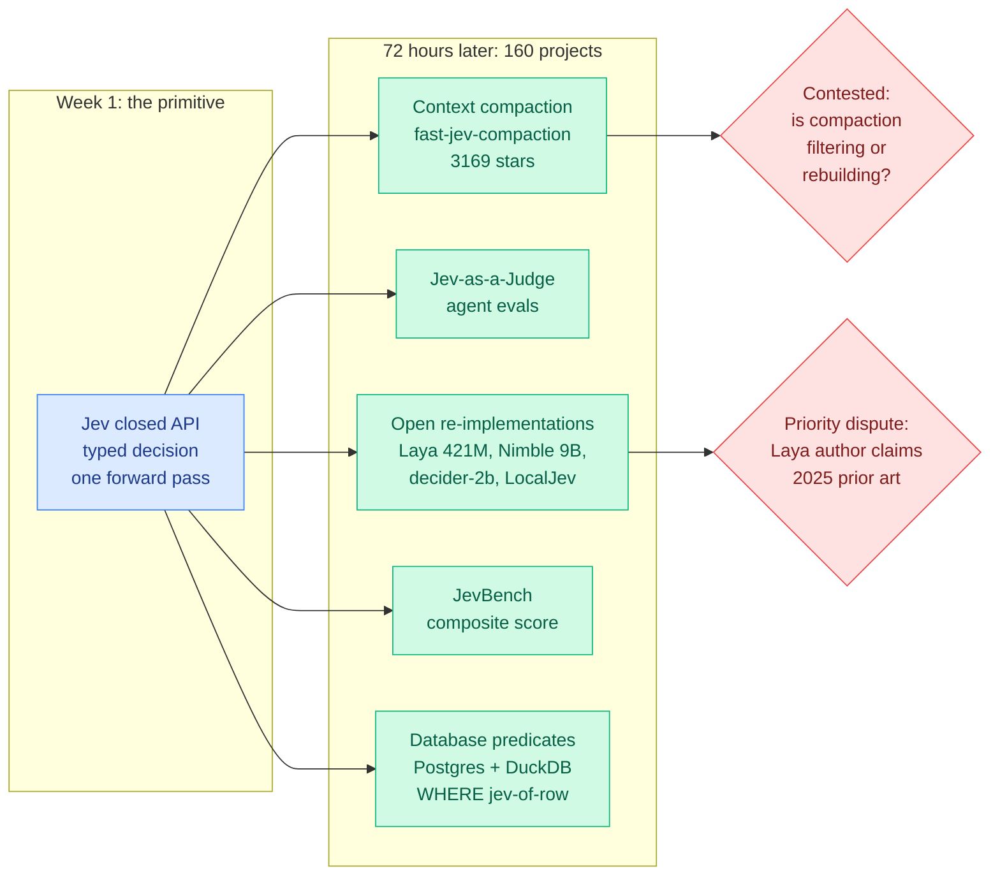

# The Jev ecosystem at 72 hours: 160 projects, and the killer app is not classification

**Date:** 2026-09-20
**Topic:** ai-routing
**Sources:** [awesome-jev census](https://x.com/yibie/status/2101095525793616162) · [awesome-jev repo](http://github.com/yibie/awesome-jev) · [JevBench report](https://x.com/rohanpaul_ai/status/2101435924790026437) · [Nimble-9B](https://x.com/TeksEdge/status/2101400940523946131) · [Laya](https://huggingface.co/convaiinnovations/laya) · [LocalJev](https://github.com/githubnext/localjev) · [decider-2b](https://huggingface.co/Mapika/decider-2b) · [jev-align](https://github.com/sutro-sh/jev-align)
**Raw:** `raw/twitter/feed/2026-09-20-morning-ranked.json`

---

## TL;DR

Jev is TypeSafe AI's closed decision-only model, released 15 September: you hand it application
state plus a fixed list of options and it returns which option plus a calibrated probability, in
one forward pass, with no generated text and no JSON to parse. A community census taken at the
72-hour mark counts the public project list going from 46 entries to 160. The census matters more
than any single project because of what it shows about where the primitive actually landed. The
single largest project is not a classifier and not a router. It is a context compactor:
`fast-jev-compaction` at 3,169 stars, which scores each tool call and result in an agent transcript
and deletes the ones no longer needed, reporting a Claude Code session dropping from 156,000 tokens
to 62,000, window utilisation from 78% to 31%, with 10 of 16 entries kept verbatim. The second
cluster is evaluation: LangChain published "Jev-as-a-Judge," arguing a typed evaluator beats an LLM
judge on repeatability and cost because it cannot phrase its verdict differently twice. Both are
uses this wiki's routing page did not predict.

---

---

## What the census actually counts

The list is maintained by one person with two stated hygiene rules: a rolling cap of three entries
per author per seven days, and a shared release date across several projects treated as a risk
signal rather than as momentum. The maintainer is explicit that a large share of the 160 are
zero-star repositories written in a day, with README numbers that have no stated provenance. That
disclaimer is worth carrying, because the headline count is the least reliable number in the whole
census. What is reliable is the *shape* of the distribution, and the shape is the finding.

**Context compaction is the largest category by stars, not classification.** `fast-jev-compaction`
replaces the usual summarisation step. Conventional compaction asks an LLM to rewrite the
conversation history into a shorter summary. This instead asks Jev, per tool call and per result,
"is this still needed?" and deletes what scores low, leaving everything else byte-identical. Codex
and Pi ports already exist. The reported numbers on a Claude Code session: 156,000 tokens to 62,000,
utilisation 78% to 31%, 10 of 16 entries retained verbatim.

**Platform repositories started wiring it in as a provider, not as a demo.** `vercel-labs/json-render`
(16,439 stars) uses it to pick components and actions on the generative-UI compose path.
`vercel-labs/fx` (3,057 stars), a Unix-style coding agent written in Zig, ships a
`typesafe_permission_reviewer`. Cline's official plugin set carries `jev-browser`. Atomic (805
stars) makes it a first-class structured-output provider sharing a resolver with the others. The
census explicitly *rejects* Coder and Mastra, on the grounds that they list it in a price table or
model catalogue only, which is recognition rather than use. That distinction is a good one and most
ecosystem counts do not make it.

**Four genuinely new application domains appeared.** On-chain trading bots on Monad placing a real
order per 300ms block from price feeds. PostgreSQL and DuckDB extensions exposing it as a row
predicate, so `WHERE jev(people, 'could work from home')` runs with no index and no embedding, at
roughly ten seconds per thousand DuckDB rows. Per-pixel colour prediction for image generation with
confidence controlling stroke width, which is a curiosity rather than a result. And cost
comparisons that read like unit economics rather than benchmarks: 724 ads decomposed across 37
brands for nine cents; 3 million replay events reduced to 3,247 sessions, 132 rage-clicks and 213
fix PRs for $2.17; 384 news items triaged for 15 brands at $0.19, against Opus 5 managing four items
for $0.77 in the same window.

---

## The open re-implementation wave, continued

[Yesterday's page](2026-09-19-jev-open-clones-commoditization.md) counted six independent open
clones in three days. The census and today's feed add more, and the quality bar moved:

- **Laya** (convaiinnovations, 421M, Apache-2.0, 605 HF likes) claims 38ms per single query against
  a reported 400ms, multilingual, no per-token bill.
- **Nimble-9B** (Bespoke Labs) is the most methodologically legible of the set. A LoRA fine-tune on
  Qwen3.5-9B from **2,676 training examples**, built in a day, with **no distillation from Jev and
  no RL**, open weights, open data, open recipe. On their own 324-example held-out test: base
  Qwen3.5-9B 66.36%, Qwen3.8-27B 84.88%, Nimble-9B **90.12%**, Jev 93.21%. Median latency ~106ms on
  an H100 and ~444ms on an M5 Pro. Bespoke themselves label this a narrow synthetic evaluation and
  not a standardised benchmark, which is the correct caveat and rarely offered.
- **decider-2b** (Mapika, from Qwen3.5-2B) reports 4.0ms single-request latency with CUDA Graphs
  enabled and 1,670 decisions/sec batched throughput at FP8.
- **LocalJev** from GitHub Next is the most telling entry, because it is a frontier-adjacent
  engineering team saying openly that not everyone internally has API access, so they spent a
  morning building a local substitute on top of `omlx` and benchmarking diffusiongemma against Qwen
  MoE and Gemma 4 variants. It exposes an API compatible with the official client libraries.
- **jev-align** (Sutro) is an open CLI that calibrates a decision model to a team's own criteria
  using GEPA, which is the first tooling entry that treats calibration rather than accuracy as the
  deployment problem.

**Nimble's recipe is the load-bearing datapoint of the whole wave.** 2,676 examples, a LoRA, one
day, no teacher distillation, reaching 90% of a closed frontier product's accuracy on the vendor's
own task shape. If that replicates, the barrier to a per-team decision model is a labelling
afternoon, and the entire "which router do I buy" question this wiki has been tracking since
[Pandora's Router (08-25)](2026-08-25-pandoras-router-costly-value-estimation.md) becomes "which
router do I train this week."

---

## JevBench: the first composite score in this area

A benchmark appeared for the class of models whose output is a bounded software decision.
Its design choice is the interesting part: the headline score is a **geometric mean over
Intelligence, Calibration, Speed and Cost**, chosen so that an exceptional result on one axis cannot
fully compensate for a weak one. Under it, GPT-5.6 Luna records substantially higher hard-case
accuracy than Jev 1.13.0, and Jev still leads the composite because latency, calibration and price
are priced in.

This is the right shape and the wiki should say so plainly. Every routing result on
[the routing page](llm-routing.md) has had to bolt cost onto an accuracy benchmark after the fact,
and the [08-14 entry](llm-routing.md) recorded that the field was measuring the cost metric wrong.
A composite that refuses to let accuracy buy its way out of a latency problem is closer to what a
deployment decision actually looks like. The caveat the benchmark's own summary states is the
correct one: this is evidence about a narrow typed-decision workload, not evidence that the small
model is generally more capable than the frontier one.

---

## The counter-signals, which are the most valuable part of the census

The census author's own judgement is that the objections are the most valuable section, and that is
right. Collected here because they bound the claim:

- **It may just be a fast general classifier.** One reviewer's verdict after a day of study was that
  the novelty faded: this looks like a faster general-purpose classifier that an LLM can also do, and
  accuracy in complex scenarios is questionable where world knowledge is incomplete.
- **The speed is an inference technique, not a training result.** The claim is that parallel decoding
  is doing the work, and any open-weight model could expose a similar interface by changing its
  inference engine. This matters a great deal: it would make the capability a **serving pattern**
  rather than a model, which is exactly what the [09-18 routing entry](llm-routing.md) concluded from
  the Qwen3.6-35B-A3B plus SGLang radix cache reproduction.
- **Compaction is being oversold.** @theo's objection, at 2,276 likes, is that compaction is
  reconstruction rather than filtering, and treating it as a constant filter misunderstands context
  management. The [09-18 harness component ablation](../agentic-systems/2026-09-18-harness-design-component-ablation.md)
  found context management's value comes almost entirely from preventing overflow failures, which
  sits closer to the objection than to the aggressive-filtering framing.
- **Embeddings are cheaper for the bulk case.** A direct price comparison puts Voyage4 at $0.02
  against Jev at $0.042, with the recommendation to use embeddings as a pre-filter and reserve the
  decision model for the residual. That is a cascade, and it puts the decision model in the
  *expensive* tier for high-volume work, which inverts the framing everyone has been using.
- **It is weak outside English and cannot reason.** A multi-day practitioner report notes the vendor
  documents low CJK accuracy, and that on Browser Use's long-horizon browser interaction test it
  scored **1/20 against Luna's 17/20**, because browser operation needs state-space search and
  backtracking. The useful shape remains what [09-18](llm-routing.md) identified: pick a label from a
  list you defined, when the evidence is already in the input.
- **The channel is narrow.** One observer noted X was saturated while Reddit carried three posts,
  two of them his own. Given that this wiki's Reddit ingest has been returning empty for days, that
  is a warning about the whole day's evidence base, not just this story.
- **There is a priority dispute.** The Laya author states he built and released non-autoregressive
  decision models with a paper and weights a year earlier, in 2025, and the point is being made
  publicly that the frontier lab named the category rather than invented it.

---

## Relation to prior wiki pages

**Extends** [Jev open clones and commoditization (09-19)](2026-09-19-jev-open-clones-commoditization.md),
which counted six clones in three days and argued the moat was gone. The census confirms the count
and adds the more interesting fact: the clone wave is now the *smallest* part of the story next to
the application wave.

**Confirms and complicates the [09-18 routing entry](llm-routing.md)**, which recorded context
compaction as the most-shared application and flagged the mechanism as oversold. Two days on, the
compaction project is the ecosystem's largest by stars, the objection is the most-liked post in the
thread, and the dispute is unresolved. Both halves of the 09-18 reading held.

**Answers, partially, the value-of-information question.** [Pandora's Router (08-25)](2026-08-25-pandoras-router-costly-value-estimation.md)
exists to price the cost of estimating which model to use, on the premise that a router must cost
less than the decision it makes. Nimble's 2,676-example recipe pushes the router's *training* cost
toward zero as well as its inference cost, which is the second half of that trade and nobody had
priced it.

**Opens a category the routing page does not have.** Database predicate evaluation
(`WHERE jev(row, 'predicate')`) is routing over rows rather than over models, with no index and no
embedding. It is the cheapest possible integration point and there is no paper on it.

---

## Open questions

1. **Is compaction filtering or reconstruction?** The most consequential unresolved argument of the
   week, and it is testable: run an agent to completion under filter-style compaction and under
   summarise-style compaction on the same task suite, and report task success rather than token
   count. Nobody has.
2. **Does Nimble's 2,676-example result replicate off Bespoke's own held-out set?** A 324-example
   synthetic evaluation is not enough to found an industry on.
3. **Is the speed a training property or a decoding property?** If parallel decoding over a fixed
   option set is the whole mechanism, this is a serving feature every inference engine should ship
   and no model is required.
4. **What happens at high volume?** The embeddings comparison suggests the decision model is the
   expensive tier past some dataset size, and nobody has published the crossover point.

---

## Related pages

- [LLM routing](llm-routing.md)
- [Jev decision-only model (09-16)](2026-09-16-jev-decision-only-model.md)
- [Jev open clones and commoditization (09-19)](2026-09-19-jev-open-clones-commoditization.md)
- [Gavel: native skill routing from a frozen LLM (09-16)](2026-09-16-gavel-native-skill-routing-frozen-llm.md)
- [Agent harness engineering](../agentic-systems/agent-harness-engineering.md)
- [KV cache](../inference-efficiency/kv-cache.md)
