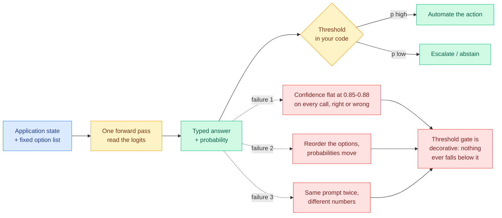

# Day six of the decision-model boom: the probability is the product, and the probability is broken

**Date:** 2026-09-21
**Topic:** ai-routing
**Sources:** [jev-trader live run](https://x.com/adriancortexbt/status/2101750066801414250) · [non-determinism report](https://x.com/neural_avb/status/2101736546391244854) · [eight-project taxonomy](https://x.com/0xLogicrw/status/2101545266507551141) · [Kev family](https://x.com/jaredpalmer/status/2101715352258232539) · [Open-Jev](https://x.com/Zefan_Cai/status/2101782158658695388) · [Ken Huang's SOC implementation](https://kenhuangus.substack.com/p/jev-returns-typed-probabilities-at) · [calibrated-judge argument](https://x.com/RajeswarSai/status/2101713364606939614) · [classifier objection](https://x.com/HamelHusain/status/2101778270434021625)
**Raw:** `raw/twitter/feed/2026-09-21-morning-ranked.json` · `raw/rss/2026-09-21-agentic-ai-what-is-jev-from-typesafe-ai-how-we-implemented-agentic.md`

---

## TL;DR

Jev is TypeSafe AI's closed decision-only model, released 15 September: hand it application state
plus a fixed list of options and it returns which option plus a probability, in one forward pass,
with no generated text. For five days the conversation was about speed and price. On day six it
turned, and it turned on the one number everybody had been quoting and nobody had been checking:
**the probability**. A live trading run put Jev on a real order book and reported it at **85 to 88
percent confidence on nearly every call**, 1,838 decisions in under ten minutes, ending **down 5.2
percent**, with the confidence flat and high the entire way down. A separate report found Jev is
**not deterministic**, the same prompt returning different probabilities across runs, and that
**reordering the options changes the probabilities substantially**. A taxonomy of eight open
re-implementations concludes with the same finding from the other direction: the surface form is
easy to copy, and what actually separates the projects is accuracy, generalization and
**probability calibration**. This is the 09-19 prediction landing 58 days early and landing on the
pessimistic branch.

---

---

## The live failure, in detail

The most load-bearing datapoint of the day is not a benchmark. It is somebody running the thing
against money. `jev-trader` places a buy or sell on a MON/USDC pair on Kuru every block, with no
option to abstain, at roughly 90ms per decision. The reported run: **1,838 decisions in under ten
minutes, roughly three per second, ending down 5.2 percent, with the model reporting 85 to 88
percent confidence on nearly every call.**

The important part is not the loss. A random strategy paying spread loses money too. The important
part is that **the confidence never moved.** A calibrated 86 percent means that of the calls made
at 86 percent, roughly 86 percent are right. A model that reports 86 percent on essentially every
call in a near-random domain is not reporting a probability at all, it is reporting a constant.
The operator's own fix is the tell: adding a single rule, **flatten under confidence 0.55**, turned
the same pair and the same latency into a run that ended up 4.3 percent over 2,758 calls. That
rule only helps if *some* of the distribution sits below 0.55, which means the constant is not
quite a constant, but it is flat enough that the natural threshold most people would pick sits
entirely above the model's operating range.

This is the precise failure mode that makes a decision model useless as a **router**, as opposed to
useful as a classifier. A classifier needs to be right. A router needs to know when it is not, so
it can escalate to the expensive model. An uncalibrated router escalates never or always.

---

## Non-determinism and option-order sensitivity

Two independent defects were reported the same day, both of which would corrupt a calibration curve
before anyone could draw one:

- **Non-determinism.** The same prompt run repeatedly returns different probabilities. There are
  benign explanations (non-deterministic reduction order in batched GPU kernels, continuous batching
  changing the batch composition per request) and the effect is often small, but it is fatal to a
  threshold gate set near a decision boundary. It also quietly undermines the reproducibility claim
  that "typed output" is supposed to buy.
- **Option-order sensitivity.** Permuting the option list changes the output probabilities
  substantially. This is the classic position-bias defect of multiple-choice scoring, well
  documented in the LLM-as-judge literature, and it is exactly what you would expect if the
  mechanism really is "prefill once, read the option logits." The options occupy different positions
  in the sequence, so they get different positional treatment.

One of the eight open clones, **Verdict** at roughly 150M parameters, is built specifically around
these two problems: overconfident wrong answers, and answers that flip when A and B swap places.
That a clone author independently identified the same two defects as the thing worth engineering
against is stronger evidence than either report alone.

---

## The eight-project taxonomy, and what it concludes

A census of eight representative open re-implementations sorts them into four architectural schools,
which is the cleanest structural read anyone has produced on this wave:

1. **Read the logits of an existing model.** `SemIf` intercepts a stock Qwen as it is about to emit
   A/B/C, reads the per-option scores and converts them to probabilities. No retraining at all.
   `simple-jev` (Featherless) does the same but caches the document prefill so several questions
   share one read. Its author is explicit that it reproduces the *interface*, not the accuracy,
   speed or calibration.
2. **Train a purpose-built decision model from scratch.** `Laya` (421M, Apache-2.0) drops the
   generative model entirely for an encoder plus decision heads. `Von` (~400M) similar. Both are
   very fast and both degrade on hard tasks: on a 77-option choice, **Laya scores 42.5 percent
   against Jev's 87.0 percent.** `Verdict` (~150M) is the calibration-focused entry above.
3. **Convert an existing LLM.** `Kev` bolts a decision structure onto Qwen. `Nimble` post-trains
   Qwen3.5-9B on counterfactual pairs where flipping one fact flips the answer.
4. **Fill the answers with a diffusion model.** `OpenJev` uses DiffusionGemma to blank out the
   answer slots and in-paint all of them at once rather than decoding left to right. Reported median
   single-request latency ~94ms on an RTX PRO 6000.

The census author's closing line is the finding: *not emitting tokens and returning probabilities
instead is not hard to copy; what actually separates these projects is accuracy, generalization and
probability calibration. When a model says 90 percent, how trustworthy that 90 percent is, is the
hard part.*

---

## The clone wave scales up, and reports its gap honestly

Two significant releases today, both notable for reporting the number that hurts:

- **Kev-0.6B / 4B / 8B** (Apache-2.0, Qwen3 base, LoRA plus a small pointer head). **Out of domain,
  on data Kev never trained on: Kev-8B 79.6 percent against Jev's 85.7 percent.** Kev-4B serves on
  a 32 GB Mac in bf16 at roughly 300ms for five questions, ~40ms on an H100, with repeated documents
  hitting a KV cache for a further 2 to 2.5x. Training cost is the striking number: **Kev-4B trains
  in 40 minutes on one H100, Kev-8B in 83 minutes.** It ships a drop-in TypeSafe System One API, so
  switching is a `base_url` change.
- **Open-Jev 2B / 9B** (LoRA adapters plus decision heads, code, data and both checkpoints public).

Both report a persistent **out-of-domain gap** to the hosted product. Yesterday's census recorded
Nimble at 90.12 percent against Jev's 93.21 percent on a held-out set. Today Kev records 79.6
against 85.7 on out-of-domain data. The gap is real, it is roughly six points, and it is on
*generalization*, not on the mechanism. This refines [the 09-19 commoditization
claim](2026-09-19-jev-open-clones-commoditization.md), which argued from a 706K-parameter model
beating hosted Jev 99.7 to 83.6 on form-filling that the moat was gone. That number was on a narrow
in-domain task. On out-of-domain data the hosted model is still ahead, and the honest version of
the commoditization claim is narrower: **the mechanism is commoditized; the training data is not.**

---

## The naming fight is a measurement fight

A running argument today, started by Hamel Husain: what is wrong with calling this a classifier? It
is an established term that describes exactly this, and it comes with a literature on how to verify,
tune and measure the thing. The OpenCode founding team said the same in blunter terms: *"Jev is a
classifier. At its truest being, that's what it is."*

This is not pedantry, and it is the most useful thread of the day. Calling it a new category
detaches it from fifty years of work on exactly the failures being rediscovered above: reliability
diagrams, expected calibration error, temperature scaling, Platt scaling, abstention thresholds,
position-bias correction in multiple-choice scoring. Every problem reported today has a standard
name and a standard fix. A separate technical explainer makes the mechanistic version of the point:
this is a representation model rather than a generative one, the latency is trivially achieved by
prefilling once and decoding one token per question in parallel, and **RLHF-induced distribution
collapse is precisely why a normal instruction-tuned LLM's logprobs cannot be used as confidence** —
which is the reason TypeSafe trains with a contrastive-distillation objective rather than reading
the logits of a chat model, and the reason the "just read the logits" clones should be expected to
be worse calibrated, not equally calibrated.

---

## The practitioner implementation, and what it refuses to automate

Ken Huang published an implementation record: 30 decision runners against the API plus seven agentic
security-operations runners, with **27 Jev-only runners returning typed answers from `jev-1.13.0`**.
Three observations worth carrying, because they are what a careful deployment actually looks like:

- **He states plainly that the run checks the call shape, not whether the label is correct.** 27
  successful typed returns is an integration test, not an evaluation.
- **His action bands are 0.45 (below this, send to a human), 0.72 (auto floor), 0.88 (high-stakes
  floor), and he says explicitly that he has not fitted them to labelled traffic.** Given today's
  evidence that the model sits at 0.85 to 0.88 on nearly everything in at least one domain, an 0.88
  high-stakes floor may be admitting almost everything.
- **Money movement, host isolation and rejection stay in caller code.** On his committed fixture,
  the mitigation runner returned `hold:containment` and the pipeline **did not** publish
  `isolate_host`. The decision model advises; the branch decides.

He also names the limitation that the naming fight is circling: *a schema-valid key can still be the
wrong key.* Type safety prevents malformed output, not incorrect judgment. A schema-valid mistake
refunds the wrong customer just as fast as a malformed one.

---

## Why calibration is the routing question, not a detail

The [routing page](llm-routing.md) has been organised for months around the constraint that a router
must cost less than the decision it makes. The clone wave drove the router's price toward zero, and
[the 09-19 page](2026-09-19-jev-open-clones-commoditization.md) argued that this dissolves the
value-of-information trade-off that [Pandora's Router
(08-25)](2026-08-25-pandoras-router-costly-value-estimation.md) formalised, since Pandora's Router
prices the cost of *estimating* which model to use and derives when that estimate is worth paying
for. Today adds the correction. **Price was never the binding constraint. Calibration is.**

A free router that is confidently wrong is worse than an expensive one that abstains, because the
whole architecture of a cascade is "handle it cheaply if the cheap thing is sure, escalate if it is
not." One practitioner put the reinforcement-learning version of this sharply: what makes a
calibrated judge interesting is not that it is cheap, it is that it can say *I am not sure*. RL
drives straight into whatever the judge rewards, so a confidently wrong judge gets found and
exploited, and making that judge cheaper and faster only means you arrive at the exploit sooner.
Cheap makes RL scalable; calibration makes the signal trustworthy.

---

## Relation to prior wiki pages

**Resolves, early and pessimistically, the [09-19 digest](../daily-digest/2026-09/2026-09-19.md)
prediction** that "somebody reports a calibration curve for a sub-megabyte decision network within
60 days, and it will be worse than the accuracy numbers suggest." Nobody has drawn a reliability
diagram yet. But a live production run reporting flat 85-88 percent confidence through a losing
streak, plus independent reports of non-determinism and option-order sensitivity, plus a clone built
specifically to fix overconfidence and order flipping, is the same finding arriving through the
service entrance 58 days early. The formal curve is still owed.

**Corrects [Jev open clones and commoditization
(09-19)](2026-09-19-jev-open-clones-commoditization.md)**, which read a 706K-parameter model's 99.7
percent on form-filling as evidence the moat was gone. Today's out-of-domain numbers (Kev-8B 79.6
against Jev 85.7, Laya 42.5 against Jev 87.0 on a 77-option choice) say the in-domain result did not
generalise. The mechanism is free; the generalization is not.

**Extends [the 72-hour ecosystem census
(09-20)](2026-09-20-jev-ecosystem-census-72h.md)**, which counted 160 projects and found the largest
by stars was a context compactor rather than a classifier. Today's 20-project cookbook confirms the
same distribution and adds a second-order observation: a large fraction of the new entries are
**gates in someone else's loop** (a codex router that grades task difficulty before picking a model
tier, a context garbage collector for Claude Code, a pre-review risk filter, a completion-claim
checker that catches a coding agent asserting it is done). Every one of those depends on a threshold
that depends on a calibrated probability.

**Confirms [the 09-18 routing entry](llm-routing.md)'s** reading that the useful shape is "pick a
label from a list you defined, when the evidence is already in the input," and that the speed is a
serving pattern rather than a model property. The taxonomy's first school, reading the logits of a
stock Qwen with no retraining, is that claim made concrete.

---

## Open questions

1. **Will anyone publish a reliability diagram or an expected-calibration-error figure for any
   model in this class?** Six days, over 160 projects, zero calibration plots. This remains the
   single highest-value missing experiment in the area.
2. **Is the option-order sensitivity fixable by averaging over permutations, and what does that cost?**
   Scoring all orderings is combinatorial, but even two random permutations would bound the effect,
   and nobody has reported the variance.
3. **Where does the six-point out-of-domain gap come from?** If it is training-data breadth, it is
   purchasable. If it is the RLCD-style contrastive objective, the "read the logits of any model"
   school has a ceiling it has not measured.
4. **Does a calibrated small judge actually resist reward hacking in an RL loop?** The argument is
   clean and entirely untested.

---

## Related pages

- [LLM routing](llm-routing.md)
- [Jev: a decision-only model that never writes a sentence (09-16)](2026-09-16-jev-decision-only-model.md)
- [Jev open clones and commoditization (09-19)](2026-09-19-jev-open-clones-commoditization.md)
- [The Jev ecosystem at 72 hours (09-20)](2026-09-20-jev-ecosystem-census-72h.md)
- [Gavel: native skill routing from a frozen LLM (09-16)](2026-09-16-gavel-native-skill-routing-frozen-llm.md)
- [Pandora's Router: costly value estimation (08-25)](2026-08-25-pandoras-router-costly-value-estimation.md)
- [Agent harness engineering](../agentic-systems/agent-harness-engineering.md)
