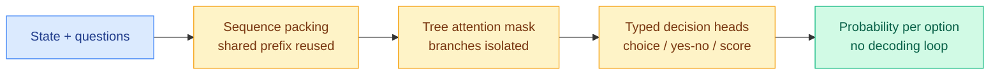

# The decision-model benchmark ladder, and the first number on the routing tax (2026-09-22)

**TL;DR.** Day seven of the decision-model wave produces the two measurements the wiki has been asking for, and both cut against the category's framing. First, an apples-to-apples ladder on JevBench's 231 public tasks puts **GPT-6 Astra at 100%** and **GPT-5.6 Luna at 89.18%**, both *above* hosted Jev's **86.58%**. A frontier generative model beats the purpose-built decision model on the decision benchmark. Second, an independent retrieval test gives the category its first quality-with-cost number in a real pipeline, and its first published false-negative rate. Separately, a widely-shared harness blueprint supplies the number the routing page has wanted for eight days: **routing between models can cost more than not routing**, because handing context back reprocesses it.

Gloss: a **decision model** (marketed as a "System One model") takes unstructured input and returns a typed choice plus a calibrated probability over a predefined option set in a single forward pass, never generating natural language. [Jev](2026-09-16-jev-decision-only-model.md) is the hosted original.

## 1. The ladder: the frontier model wins

Open-Jev completed five runs on **JevBench's 231 public tasks** (@Zefan_Cai):

| System | Score |
|---|---|
| Open-Jev 2B | 64.94% |
| Open-Jev 9B | 77.49% |
| Jev (hosted) | 86.58% |
| GPT-5.6 Luna | 89.18% |
| GPT-6 Astra | 100% |

Two readings, and both matter.

**The open-versus-hosted gap widened.** The [09-21 entry](2026-09-21-jev-calibration-reckoning.md) recorded the out-of-domain gap at roughly six points (Kev-8B 79.6 against 85.7; Nimble 90.12 against 93.21). At 9B against hosted here the gap is **9.1 points**, which is wider, not narrower. The [09-21 prediction](../daily-digest/2026-09/2026-09-21.md) that the gap holds near six points through October is under pressure from the wrong direction.

**A frontier LLM saturating the benchmark is the more damaging result.** GPT-6 Astra at 100% means the task suite is exhausted, so the accuracy column stops being informative and the whole comparison collapses onto latency and price. That is not a defeat for the decision model, whose entire pitch is latency and price. But it destroys the strong version of the claim, which was that a purpose-built discriminative head is *better at deciding*, not merely cheaper at it. On this benchmark it is not better; it is third.

## 2. The first quality-and-cost number in a real pipeline

Milvus tested the decision model as a **RAG reranker** (the stage that re-scores an initial candidate list for relevance) on 80 SciFact queries against the same shortlist:

- No reranking: baseline.
- `qwen3.7-text-rerank`: **+0.0446 nDCG@10**.
- Jev: **+0.0778 nDCG@10**, the best of the three.
- But: **P50 reranking latency 10.2x higher** than qwen, **estimated cost per run 6.7x higher**.

The setup explains the latency: the interface is state-plus-questions, so reranking holds the question fixed ("is this candidate relevant to the query?") and varies the state per candidate, meaning **30 candidates became 30 concurrent API requests**. The overhead is interface-shaped, not model-shaped, and Milvus says batching candidates into one request is the next experiment.

**The calibration number is the important one and nobody has framed it as such.** Using the returned probability directly as a filter at a 0.5 threshold, top-5 precision reached **49.4%**, but **18.8% of gold-relevant documents were filtered out**. That is a published false-negative rate at the natural threshold, on a public dataset, from an independent party. It is not a reliability diagram, so the [09-21 open problem](2026-09-21-jev-calibration-reckoning.md) stays open, but it is the first evidence of the *shape* of the miscalibration: the probability is usable for **ranking** and not usable for **gating**. Milvus's own conclusion says exactly this, recommending offline retrieval, data cleaning and evaluation, and warning it is hard to use as-is for latency-sensitive online RAG.

**This is consistent with the live trading failure from 09-21**, where the model reported 85 to 88 percent confidence on nearly every one of 1,838 calls and a threshold gate on a near-constant did nothing. Ranking survives a monotone distortion of the probability; gating does not. Two independent failures in two days, both at the gate rather than the ordering.

## 3. The routing tax gets a number

A 12-page harness blueprint circulated by the vendor's founder contains, at step 3, the number this page has been asking for since [09-14](llm-routing.md):

> **Opus → Sonnet → Opus costs 6.19 against 4.15 for pure Opus, because handing back reprocesses the whole context.**

**A three-hop route across a model pool costs roughly 1.5x what never routing at all costs.** The mechanism is prefix-cache destruction: each hand-off to a different model discards the KV cache built for the prior one, so the context is re-paid at every switch. [SemiAnalysis the same day](../hardware/2026-09-22-semianalysis-inference-data-movement.md) supplies the theory, that prefill and midfill differ precisely in whether prior context has to be re-read, and that decode's economics depend on sharing one tensor read across many queued tokens.

**This is the missing subtrahend.** Every router on this page reports accuracy gained per dollar of model price. None subtracts the cache it destroys by switching. If a naive three-hop cascade is already 49% more expensive than the frontier model it was trying to avoid, then a large share of published routing savings are measured against a baseline that does not exist in a cached serving stack. The blueprint's step 8 quietly concedes the point by recommending routing **by trust rather than by difficulty** (secrets and infrastructure stay on first-party frontier models, public documentation goes to the cheapest), which is a policy that switches rarely.

Two supporting numbers from the same blueprint, both novel to this wiki: **reading and searching account for 56.2% of tool turns and 46.5% of tokens**, while **writing code is under 10%**. If retrieval is where the tokens are, the highest-value routing decision in a coding agent is not which model writes the code.

## 4. Mechanism, finally explained

@di_zhang_fdu gives the clearest public account of why the forward pass is cheap: the "parallel sampler" is **sequence packing plus tree attention masks plus typed decision heads**. One forward pass scores every candidate, shared prefixes are reused, branches are isolated by the mask, and there is no token-by-token decoding loop.

**This confirms the serving-pattern hypothesis this page raised on 09-18** off the Qwen3.6-35B-A3B-plus-SGLang-radix-cache reproduction, and restated on 09-20 as "a decoding property rather than a training property." Every component named is a standard inference-engine feature. The capability is a serving configuration that any engine can ship, which is why four open schools reproduced it inside a week. It also explains the order-sensitivity defect recorded on 09-21: branches sharing a packed prefix under a tree mask is exactly the setup where option position leaks into the score.

## 5. Where the ecosystem actually went

- **`jev-ultrafast` at 15k stars** and **`fast-jev-compaction` at 5.8k** (up from 3,169 on 09-20) keep compaction and browser control as the two largest categories. **The [09-20 prediction](../daily-digest/2026-09/2026-09-20.md) that stars would keep rising while production adoption stalls at evaluation and compaction is holding.**
- **`jimothy`** distills saved decision-model queries into **15-45 MB task-specific classifiers running 10-20x faster** in browser or server, with fallback to the hosted model. This is the category eating itself: the decision model becomes a labelling teacher for a classifier that replaces it. It is also the cleanest instance yet of the [distillation](../inference-efficiency/knowledge-distillation.md) thread meeting the routing thread.
- **`JevHarness`** has an LLM write a task-specific decision policy once, freezes it, then runs only code plus fast decisions at inference, with trajectory-based self-optimization. Reported: Pokémon win rate **25% → 75% over five iterations**. This is the decision primitive fused with [harness engineering](../agentic-systems/agent-harness-engineering.md), and it is a genuinely new category.
- **Laya ported to CoreML with 99.5% of ops on the Apple Neural Engine: 3.7 ms per decision on an M5 Pro.** The MLX build reports 7-14 ms under 1 GB of RAM. On a 16 GB MacBook Air, local Laya at ~45 ms beat cloud Jev at ~300 ms at Tetris, at zero marginal cost. **Latency parity with a network round trip was the hosted product's last structural advantage, and on-device inference removes it.**
- **`Kev` refactored onto Qwen3.5** with 0.8B, 4B and 9B checkpoints plus a fine-tuning script.

## Gaps

Still no reliability diagram or expected-calibration-error figure for any model in this class, seven days in. The Milvus false-negative rate is the closest anyone has come and it is a single operating point, not a curve. JevBench's composite has now been saturated at the top by a frontier model, so the benchmark needs harder tasks before its accuracy column means anything again. And the head-to-head this page has asked for three times, external decision model against internal-state readout ([Gavel](2026-09-16-gavel-native-skill-routing-frozen-llm.md)) on one benchmark with latency and dollars alongside accuracy, still does not exist.

## Source

Raw: [`raw/twitter/feed/2026-09-22-morning-ranked.json`](../../raw/twitter/feed/), [`raw/twitter/feed/2026-09-22-afternoon-ranked.json`](../../raw/twitter/feed/) · Context: [Simon Willison on decision models](https://simonwillison.net/2026/Sep/21/jev/) · [JevBench](https://benchmarkheaven.com/jev-models) · [Open-Jev](https://zefan-cai.github.io/open-jev/#jevbench)

## Related

- [`llm-routing.md`](llm-routing.md)
- [`2026-09-21-jev-calibration-reckoning.md`](2026-09-21-jev-calibration-reckoning.md)
- [`2026-09-20-jev-ecosystem-census-72h.md`](2026-09-20-jev-ecosystem-census-72h.md)
- [`../hardware/2026-09-22-semianalysis-inference-data-movement.md`](../hardware/2026-09-22-semianalysis-inference-data-movement.md)
