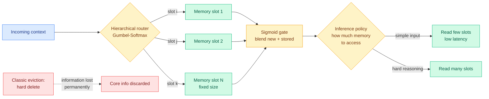

# ARM: Attention with Routed-Memory for Learnable Sparse Control

**Source:** Kurate cs.LG weekly leaderboard **#1** (2026-09-23 scrape, ai_rating 4.0/10) · [arxiv 2609.24417](https://arxiv.org/abs/2609.24417)
**Raw:** [raw/kurate/2026-09-23-cs-lg.md](../../raw/kurate/2026-09-23-cs-lg.md)
**Note:** top of the Kurate cs.LG board, absent from today's HuggingFace list.

## TL;DR

KV cache eviction works by deciding which past tokens to delete. Every eviction policy on this wiki, from attention-score heuristics to learned scorers, shares one property: the delete is **hard and permanent**, so whatever information the evicted token carried is gone. ARM replaces eviction with **routing into a fixed-size differentiable memory**. Instead of choosing which tokens to throw away, a hierarchical router chooses which of a fixed number of memory slots each new piece of context should be written into, and a sigmoid gate softly blends the new content with whatever that slot already holds. Because the routing is done with Gumbel-Softmax (a trick that makes a discrete pick differentiable so it can be trained by gradient descent), the whole memory system trains end to end. A separate policy learns to vary *how much* memory to read at inference time, spending less on simple context and more on inputs that need deeper reasoning.

## Why this belongs on the routing page, not only the cache page

ARM is filed here deliberately. The mechanism is a **router whose option set is memory slots**, and that is a genuinely new level in the routing stack this page has been assembling. The [llm-routing](llm-routing.md) page currently records routing at the query level (which model), the token level (which expert), the adapter level (which LoRA), the precision level (which bit-width, added 09-11), the skill-library level (added 09-16), and the dependency-graph level (added 09-13). **ARM adds a seventh: routing inside the attention state itself, where the destinations are memory slots and the policy is learned jointly with the model.**

The second routing decision in the paper is the more practically interesting one. A learned policy decides at inference how many memory slots to access per input. That is test-time compute allocation applied to *memory bandwidth* rather than to reasoning tokens, and it is the first instance on this wiki of an adaptive read-width policy. The [test-time-compute-allocation](../inference-efficiency/test-time-compute-allocation.md) page has been about how many tokens to think for; this is about how much state to look at.

## How this relates to what the wiki already knows

**It contradicts, softly, the premise of every eviction paper the wiki carries.** The eviction literature's implicit bet is that most cached tokens are genuinely worthless, so deleting them is close to free if you pick well. ARM's bet is the opposite: that the information is worth keeping in compressed form, and the reason eviction methods "vastly mitigate" the problem while "often discarding core information" is that the delete operation is the wrong primitive. This is a real tension and neither side has run the decisive experiment, which would be matched-budget eviction versus routed-memory on the same model and the same long-context suite.

**It composes with, rather than competes against, [KV-COBRA](../inference-efficiency/2026-09-23-kv-cobra-bit-rank-allocation.md) from the same Kurate board.** KV-COBRA compresses the cache you keep; ARM changes what "keeping" means. A fixed-size routed memory still has to be stored at some precision, and KV-COBRA's per-head bit-rank allocator is the obvious thing to run on top of ARM's slots.

**It is the fourth result in a month arguing that the KV cache should be structured rather than flat.** [Depth-sharing retrofits (09-14)](../inference-efficiency/kv-cache.md) found adjacent layers share enough structure to substitute. [Cache-to-Cache (09-18)](../inference-efficiency/2026-09-18-c2c-cache-to-cache-communication.md) found two different models' caches can be fused. [KVMEM (today)](../inference-efficiency/2026-09-23-kvmem-paged-agent-memory.md) pages cache across a storage hierarchy. ARM makes the cache a learned addressable memory. **Four architectures, one direction of travel: the flat append-only KV cache is being replaced by something with an address space.**

## Gaps

The abstract reports "superior performance and efficiency compared to fixed KV-caching approaches" on commonsense and long-context reasoning benchmarks without naming the baselines, the models, or the memory budgets, which is exactly the information needed to know whether the comparison is fair. More seriously, ARM requires **training**: the router, the gates and the access policy are all learned parameters, so this is not a method you apply to an off-the-shelf checkpoint. Every eviction method it compares against is training-free. That is a large deployment asymmetry the abstract does not acknowledge, and it means ARM's realistic path is into new pretrained architectures rather than into existing serving stacks.

The Gumbel-Softmax routing also raises the standard concern from the mixture-of-experts literature: routers trained with straight-through estimators are prone to collapse, where a few slots absorb everything. Nothing in the abstract says how slot utilization is kept balanced.

## Industrial implication

If this generalizes, the interesting consequence is not the efficiency number, it is that **long-context capability becomes an architectural property you pretrain rather than a serving trick you bolt on.** Today's serving stacks treat context length as something to be managed at inference by eviction, quantization and paging, all of which are lossy patches applied after training. ARM's bet is that a model trained with a routed memory from the start does not need the patches. That bet is expensive to test and only frontier labs can run it, which makes the 60-to-90-day signal a pretraining paper, not a serving release.

## Related pages

- [llm-routing](llm-routing.md) · [kv-cache](../inference-efficiency/kv-cache.md) · [attention-mechanisms](../llms-foundation-models/attention-mechanisms.md)
- [test-time-compute-allocation](../inference-efficiency/test-time-compute-allocation.md) · [KVMEM](../inference-efficiency/2026-09-23-kvmem-paged-agent-memory.md)
