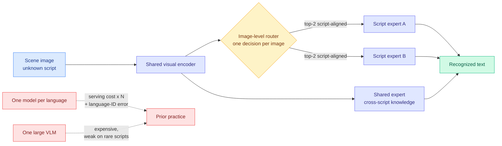

# ScriptMoE: routing at the image level to replace a rack of per-language models

**Source:** HuggingFace Daily Papers 2026-09-23 · [arxiv 2609.24058](https://arxiv.org/abs/2609.24058)
**Raw:** [raw/huggingface/2026-09-23-all-in-one-multilingual-scene-text-recognition-with-script-a.md](../../raw/huggingface/2026-09-23-all-in-one-multilingual-scene-text-recognition-with-script-a.md)

## TL;DR

The application is multilingual scene-text recognition, reading text out of photographs across many writing systems. The routing result is the transferable part. Existing practice is either **one recognizer per language**, which multiplies serving cost and accumulates errors across a language-detection stage, or **one large vision-language model**, which is expensive and still poor on most scripts. ScriptMoE shares a single visual encoder, replaces the dense decoder with a sparse mixture-of-experts block, and routes **once per image rather than once per token**: a router dispatches each image to its top-2 script-aligned experts, with a shared expert absorbing cross-script knowledge. It reaches **82.06% on a 10-script, 10,899-image benchmark**, 1.31 points over the strongest specialist baseline. Dropping it into PP-OCRv5 as a recognizer replacement lifts end-to-end F1 on CC-OCR from **65.71% to 80.89%**, slightly past the best vision-language model's 80.73% at a fraction of the parameter count. Training data is TextMuSS-10M, synthetic, 10 scripts, 229 languages.

## Why the routing granularity is the interesting variable

Standard mixture-of-experts routes **per token**, on the reasoning that different tokens need different specialists. ScriptMoE routes **per image**, on the reasoning that the specialist axis here is a property of the whole input: every character in a photograph of Devanagari signage is Devanagari. Coarser routing means one routing decision instead of hundreds, a stable expert assignment across the decode, and no load-balancing churn mid-sequence.

That choice is also what lets the model replace the per-language deployment. A per-language deployment is routing too, done outside the model by a language-identification stage, and its error compounds: misidentify the script and the whole recognition fails. **ScriptMoE folds that external router inside the model where it is trained jointly with the experts it dispatches to, which is the same argument [MISA (05-11)](2026-05-11-misa-mixture-of-indexer-sparse-attention.md) and [CaRE](llm-routing.md) made in their own domains.** The shared expert is the hedge: when the router is wrong or the script is mixed, there is still a path carrying cross-script knowledge.

## How this relates to what the wiki already knows

**It is the third instance this wiki has recorded of routing replacing a model-per-category deployment, and the pattern is worth naming.** The [llm-routing page](llm-routing.md) records routing across a **model pool** by query difficulty. [Colla-Q (09-23)](../inference-efficiency/2026-09-23-colla-q-moe-quantization.md) records precision allocation across **experts inside one MoE**, finding that uniform bit-width lets one damaged expert poison every token routed to it. ScriptMoE records routing across **experts selected by an input-level property** rather than a learned per-token score. **All three are the same move at different granularities: replace a fleet or a uniform allocation with a learned dispatcher plus specialists.**

**Read against Colla-Q, it also inherits a warning.** Colla-Q's finding is that an MoE is an *ensemble* of routed experts, so one badly-served expert contaminates every input that routes to it. ScriptMoE's experts are script-aligned, which means a weak expert maps cleanly onto a weak *language*, and the paper reports a single aggregate accuracy. **An 82.06% average across 10 scripts is compatible with one script being served badly and nobody noticing, and the per-script breakdown is the number that would settle it.**

**The cost framing is the honest one and the paper makes it.** This is not primarily an accuracy result, it is a serving-cost result: the same or better quality than a large vision-language model at a fraction of the parameters, and one deployment instead of N. That is the cost-optimization axis, and it is why a multilingual OCR paper earns space on a routing page.

## Gaps

TextMuSS-10M is **synthetic**, which is what makes 229 languages possible and is also the main caveat: the paper does not report how the router behaves on real-world distribution shift, degraded photographs, or scripts with heavy visual overlap. No per-script accuracy breakdown is reported in the abstract. Top-2 routing is fixed rather than ablated, so the value of the second expert is unquantified. And the CC-OCR improvement from 65.71% to 80.89% is a recognizer swap inside a larger pipeline, so part of the gain may be that the baseline recognizer was the weak link rather than that this one is strong.

## Related pages

- [llm-routing](llm-routing.md) · [Colla-Q (09-23)](../inference-efficiency/2026-09-23-colla-q-moe-quantization.md)
- [Daily digest 2026-09-23](../daily-digest/2026-09/2026-09-23.md)
