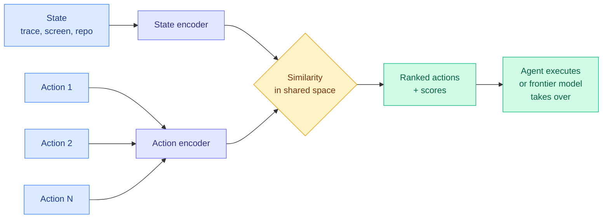

# CLM-8B: a contrastive System One model, and the decision-model category loses its monopoly

**Source:** X home feed, the day's most-shared research artifact ([@jackyk02](https://x.com/jackyk02/status/2102905335925424285), [@Azaliamirh](https://x.com/Azaliamirh/status/2102958024323428362), [@hangoo_kang](https://x.com/hangoo_kang/status/2102922230149837311)) · [GitHub](https://github.com/Contrastive-LM/CLM) · [HuggingFace](https://huggingface.co/Contrastive-LM) · Stanford / NVIDIA (Mirhoseini, Pavone, Hazy Research)
**Raw:** `raw/twitter/feed/2026-09-24-morning-ranked.json`, `raw/twitter/images/2026-09-24/2102958024323428362-0.jpg`

## TL;DR

A **System One model** (the category name TypeSafe AI coined for Jev on 09-15) answers bounded decisions inside software: given a state and a set of options, return a typed choice with a probability in one pass, generating no prose. Until today there was effectively one commercial reference, Jev, plus a crowd of fine-tuned imitations. CLM-8B is an **open (Apache 2.0) alternative trained with a contrastive objective** that embeds states and actions in a shared space, the same infoNCE recipe behind CLIP, rather than a generative or classification head. It is pre-trained on 60M Nemotron Q&A pairs, mid-trained on 30M synthetic hard negatives, and post-trained on 1M agentic trajectories, and serves behind a TypeSafe-compatible API. The team reports **comparable zero-shot performance to Jev on computer use, gaming and tool calling at up to 9x lower latency**, and with light fine-tuning **81.6% on DeepSWE and 87.6% on Terminal Bench 2.1**.

## What the chart actually says

The released comparison chart (read from the attached image) is a **best-of-N selection** result, not an end-to-end agent score. On DeepSWE with Bo4, the finetuned CLM (a Qwen3-8B base) selects a correct candidate **81.6%** of the time against Jev's **71.1%**, with a pass@1 baseline of **73.7%**; latency **79 ms against 449 ms (5.7x)**. On Terminal-Bench 2.1 with Bo5, CLM **87.6%** against Jev **83.1%**, pass@1 **84.0%**; latency **32 ms against 131 ms (4.1x)**. Two readings follow. First, the SOTA claim is a verifier/reranker claim: CLM is being used to pick among agent attempts. Second, and the chart does not remark on it, **Jev as a selector scores below the pass@1 baseline on both benchmarks**, meaning picking with Jev was worse than picking the first attempt. CLM is fine-tuned for these tasks and Jev is zero-shot, so this is not a fair head-to-head, but it is the first public number showing an untuned decision model can be a net negative as a verifier.

## Relation to prior wiki pages

- **Resolves the monopoly question from the [72-hour Jev census (09-20)](2026-09-20-jev-ecosystem-census-72h.md)**, which counted over 100 imitation projects and asked whether any would be an architectural alternative rather than a fine-tune. CLM is the first: a different training objective, open weights, and a latency advantage.
- **Tests the [09-23 calibration column](2026-09-23-decision-model-ece-numbers-arrive.md).** S1 Bench now reports expected calibration error (the gap between stated confidence and hit rate); CLM's contrastive similarity scores are not probabilities by construction, so its calibration is the number to watch. @ItsCuthulhu's same-day chart of 58 System One candidates on a DGX Spark shows accuracy falling as decisions per second rise, and almost nothing clearing the Jev anchor at ~77% macro accuracy, so a 9x speed claim needs that board.
- **Sits under the [routing tax (09-22)](2026-09-22-decision-model-benchmark-ladder-and-routing-tax.md)**, which showed routing between frontier models loses money when hand-offs destroy the prefix cache. A 30-80 ms selector changes the latency side of that trade but not the cache side.
- **Connects to [Self-Organizing Agent Teams (same day)](../agentic-systems/2026-09-24-self-organizing-agent-teams.md)**, which beat a *perfect* router over independent answers by 13.4 points on AIME. Selection has a ceiling that collaboration does not.

## Cheap competitors landed the same day

- **Together's tev1-4B-experimental**: a Jev-like classifier fine-tuned on Qwen3.5-4B for **$17**, served at **$0.042 per million input tokens and $0 output**, with data recipe and tutorial ([@togethercompute](https://x.com/togethercompute/status/2102882216950763814)).
- **distil labs' invoice pipeline**: Jev scored **200/200** sorting an inbox with no training, but only **0.79** deciding whether to pay, where a 4B model fine-tuned to reason first reached **0.98** ([@j_golebiowski](https://x.com/j_golebiowski/status/2102782627442819504)). The boundary of the category is *decisions that do not need reasoning*.
- **Applied Compute** uses Jev-class classifiers to catch **85% of failure modes** in billions of tokens of RL traces at a fraction of LLM-judge cost ([@appliedcompute](https://x.com/appliedcompute/status/2102861737817248102)), the category's most credible production use so far.

## Gaps

Fine-tuned CLM against zero-shot Jev is not a controlled comparison. No calibration numbers. The "9x faster" headline compares against Jev's hosted API latency, which includes network. The contrastive design encodes actions independently (as @hxiao noted), so it cannot model interactions between options the way a listwise reranker can.

**Related:** [llm-routing](llm-routing.md) · [agent-benchmarks](../agentic-systems/agent-benchmarks.md)
