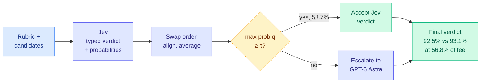

# JEV-as-a-Judge: Accept When Confident, Escalate When Unsure

**Source:** arXiv [2609.26550](https://arxiv.org/abs/2609.26550) (CMU: Yubo Li, Yidi Miao, Ramayya Krishnan, Rema Padman), submitted 2026-09-22. Surfaced on the X home feed via [@askalphaxiv](https://x.com/askalphaxiv/status/2103368968014848400), #13 on alphaxiv trending.
**Raw:** `raw/twitter/feed/2026-09-25-afternoon-ranked.json` (alphaxiv overview in `articles[].content`)

## TL;DR

The paper tests TypeSafe's Jev, a proprietary decision model that returns a typed verdict plus probabilities over the allowed labels, as a first-pass LLM judge. It compares Jev against sixteen generative and reward-model judges, with blinded human adjudication. On ordinary preference and evidence-grounded factuality, Jev lands within three points of the strongest judge (GPT-6 Astra) at **0.36% of its fee**. It falls far behind where judging means checking a derivation or resisting a well-written wrong answer. Jev's errors cluster in its low-confidence decisions, so a frozen cascade that accepts verdicts above a threshold and escalates the rest keeps **92.5% vs 93.1% accuracy (about 99%)** while paying **56.8% of GPT-6's fee**. It is a routing paper written as an evaluation paper.

## Key findings

- **Where the cheap judge is good enough.** RewardBench (400 pairs): Jev 92.2% vs GPT-6 Astra 93.5%, paired difference −1.25 points with a 95% interval of [−3.8, 1.5].
- **Where it is not.** JudgeBench (derivation checking): 78.6% vs 93.1%. RM-Bench hard pairs, where the rejected answer is the more elaborate one: 74.8% vs 94.6%. Style-adversarial inputs are exactly where a single forward pass loses.
- **Confidence is a ranking signal, not a certificate.** Across 990 base-order judgments, accuracy rises across confidence bins and GPT-6's advantage concentrates in Jev's low-confidence cases. On the style-adversarial RM-Bench pairs, confidence stops identifying errors, so the gate fails precisely on the hardest failure mode.
- **The cascade.** Threshold chosen on 96 pilot pairs (64 RewardBench, 32 JudgeBench) to maximize coverage within two points of the fallback, then frozen and tested on 510 held-out pairs. At τ = 0.9 it accepts 53.7% of pairs, scores 92.5% vs 93.1%, and pays 56.8% of GPT-6's fee (62.2% under a conservative bound). Pairwise items are judged in both orders and the probabilities averaged before gating, which also neutralizes position bias.
- **Thresholds do not transfer.** A frozen GPT-5.6-fallback policy accepts 81.0% at τ = 0.7 but loses 2.35 points. The threshold is a per-workload calibration, not a constant.

## How this relates to prior wiki pages

- **Confirms the 09-21 thesis on [llm-routing](llm-routing.md)** that calibration, not price, is the binding constraint on routing. The saving here is only as large as the region where confidence is trustworthy, and it collapses on style-adversarial inputs.
- **Extends [S1 Bench's ECE numbers (09-23)](2026-09-23-decision-model-ece-numbers-arrive.md)**, which reported Jev's expected calibration error at 0.076 in aggregate. This paper shows what that number means operationally: good enough to gate half the traffic on preference, not good enough on adversarial style.
- **Complicates [CLM-8B (09-24)](2026-09-24-clm-contrastive-system-one-model.md)**, where zero-shot Jev as a best-of-N *selector* scored below pass@1. Same model, two roles. As a gated first-pass judge it helps. As an ungated selector it can hurt. The difference is the escalation path.
- **Parallels Just Ask Jev (same day)**, which uses Jev as a zero-shot alignment-failure detector at 63x lower cost than LLM-judge scorers. See [Just Ask Jev](../responsible-ai/2026-09-25-just-ask-jev-alignment-detector.md).

## Gaps

Jev is proprietary and the comparison is between complete systems, not compute-matched architectures. Fees are list prices, not measured serving cost. Only 510 held-out pairs back the headline cascade number, and the threshold was fit on 96.

## Research angle

The obvious next step is a router that also detects *style-adversarial* inputs, because that is where confidence stops being informative. A cheap length-or-verbosity feature fed into the gate alongside q could recover most of the RM-Bench loss. The other open question is whether open decision models calibrated with post-hoc temperature scaling (the AnyJev L1 tier) reproduce the cascade at similar coverage.
