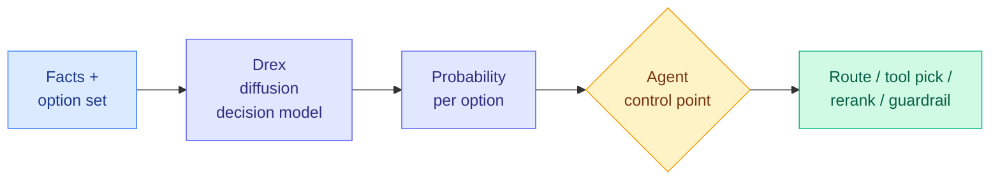

# Drex: a diffusion-based decision model takes the Decision Index lead

**Source:** [nace.ai/drex](http://www.nace.ai/drex) (Nace.AI), launch posts via [@rohanpaul_ai](https://x.com/rohanpaul_ai/status/2103523705603461145) and [@Hesamation](https://x.com/Hesamation/status/2103514749082140722).
**Raw:** `raw/twitter/feed/2026-09-26-morning-ranked.json` (product page and scoreboard in `articles[].content`; leaderboard chart image on the tweet)

## TL;DR

Drex is Nace.AI's decision model: facts in, one probability per allowed option out, in a single pass with no generated text to parse. Its distinguishing claim is architecture. It is described as a **diffusion model trained with RL**, not an autoregressive LM with a classification head, positioned for agent routing, tool selection, reranking and guardrails. Drex 1.0 (under 6B parameters) took first place on Decision Index 0.2, a 40-benchmark, chance-corrected leaderboard of "deciding rather than writing," at 51.73 vs Jev's 51.67. The product page now shows **Drex 1.1 at 52.82 with 10B total parameters**, winning 21 of 40 tests. Response time is quoted at 136 ms, about 1.5x faster than Jev, and the launch hands out 250M free tokens.

## What the per-benchmark table shows

The average hides two very different models. From Nace's own scoreboard (Drex 1.1 vs Jev 1.13.0):

- **Drex wins big on structured, causal and domain-classification tasks:** CLadder causal reasoning 77.8% vs 45.3%, HoVer fact verification 73.4% vs 45.7%, POP909 music 75.4% vs 15.9%, GSM8K 87.1% vs 75.6%, RAGTruth hallucination F1 71.1% vs 60.1%, When2Call 86.5% vs 74.6%.
- **Jev wins big on knowledge-heavy reasoning:** GPQA Diamond 71.4% vs 25.2%, MMLU-Pro 80.5% vs 51.1%, BBH 89.7% vs 53.5%, WinoGrande 83.9% vs 68.0%.
- **Routing itself is a wash.** RouterBench selected-quality: 51.9% vs 52.7%.

So "Drex beats Jev" means "Drex is better at the decisions where the answer is in the facts provided, and much worse where the answer needs world knowledge." For routing and guardrails, the facts are usually provided. For judging, often not.

## Caveats

- Vendor-run scoring on a leaderboard the vendor highlights. The 1.0-to-1.1 jump also changed model size (under 6B to 10B total), so the two headline numbers are not the same model.
- The margins at the top (52.82, 51.73, 51.67, 50.94) are within noise of each other on a 40-test chance-corrected mean.
- "Diffusion model" is asserted, not documented. No paper or architecture description was published with the launch.

## How this relates to prior wiki pages

- **The fourth architecture in the decision-model category** after Jev (autoregressive, proprietary), [CLM-8B (09-24)](2026-09-24-clm-contrastive-system-one-model.md) (contrastive state-action embedding), and GLiNER2.5-Decide (a 340M encoder, 09-25). The interface is converging; the model underneath is not.
- **Relevant to [today's correlated-errors paper](2026-09-26-jev-vs-llm-rubric-judges-correlated-errors.md).** If cascades need first-stage and fallback errors to be uncorrelated, a model with a genuinely different architecture and a very different per-task profile is more useful as a cascade partner than a better-scoring clone.

## Links

- Concept page: [llm-routing](llm-routing.md)
