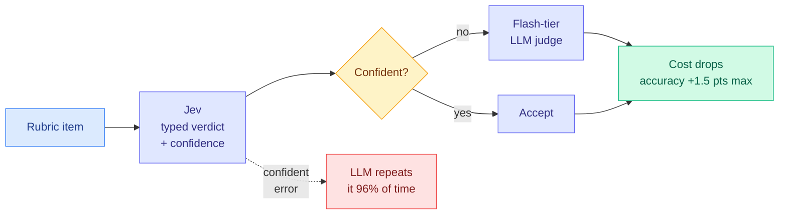

# Jev vs. LLMs as Rubric Judges: Cheaper, Faster, and Wrong in the Same Places

**Source:** arXiv [2609.29769](https://arxiv.org/abs/2609.29769) (Delip Rao, Chris Callison-Burch; University of Pennsylvania). Announced by [@deliprao](https://x.com/deliprao/status/2103585684736954718).
**Raw:** `raw/twitter/feed/2026-09-26-morning-ranked.json` (abstract in `articles[].content`); full paper HTML read for the numbers below.

## TL;DR

The day after a CMU paper showed a cheap-first cascade works for LLM judging, this Penn paper shows when it does not. Rao and Callison-Burch compare TypeSafe's Jev (a decision model that returns probabilities over allowed answers in one forward pass, no generated text) against three flash-tier LLM judges (GPT-5.6 Luna, Gemini 3.8 Flash, DeepSeek V4.1 Flash) on nine rubric-grading panels from seven benchmarks, 5,003 items. Jev's accuracy is statistically indistinguishable from the LLM judges in most comparisons, at 29 to 325 times lower cost. Its confidence also ranks its own errors. So a cascade should work. It does not, because **the LLM judges repeat 96.0% of Jev's most confident errors** (50.3% would be expected if errors were independent). A cascade replayed on the recorded verdicts lowers cost but gains at most **1.5 points** over the best single judge with honest thresholds, and at most 2.0 with oracle thresholds.

## Key findings

- **Accuracy parity at a fraction of the cost.** Only 8 of 27 paired comparisons separate Jev from an LLM judge at 95% confidence. Jev leads on binary criteria and trails on graded ones, mostly against Gemini.
- **Cost and time.** Summed over the nine panels, Luna costs 29x Jev, DeepSeek 66x, Gemini 325x (18x to 770x per panel). The LLM judges take 30 to 220 times as long.
- **Correlated errors kill the cascade.** On Jev's most confident errors, the LLM judges give the same wrong answer 96.0% of the time, against 50.3% under independence. The correlation is strongest exactly where Jev is most confident, which is the region a cascade accepts without checking.
- **Cascade ceiling.** Cross-fitted thresholds: no cascade beats the best single judge by more than 1.5 points on average. Oracle thresholds: 2.0 points. Items where only Jev is right are rare.
- **All judges share a scale bias.** On graded panels (ELLIPSE essays especially), judges agree with each other more than with the human labels and grade lower than raters. A constant shift removes most of the gap, which suggests the raters used scale conventions the criterion text did not state.

## How this relates to prior wiki pages

- **Genuine tension with [JEV-as-a-Judge (09-25)](2026-09-25-jev-as-a-judge-confidence-cascade.md)**, which found a confidence-gated cascade keeps 92.5% vs 93.1% of frontier accuracy at 56.8% of the fee. The two are compatible if the fallback matters: CMU escalated to **GPT-6 Astra**, a frontier judge with a different error profile. Penn escalated to **flash-tier** judges, which share Jev's mistakes. CMU also reported a GPT-5.6-fallback policy losing 2.35 points. Read together: **a cascade saves money whenever the first stage is calibrated, but it only buys accuracy when the fallback's errors are uncorrelated with the first stage's.** That is a diversity condition, not a calibration condition, and it refines the [llm-routing](llm-routing.md) page's 09-21 claim that calibration is the binding constraint.
- **Also explains CLM-8B's 09-24 chart**, where ungated Jev as a best-of-N selector scored below pass@1. A selector that shares the policy model's blind spots cannot catch its errors.
- **Different task shape from CMU.** Penn grades rubric criteria (absolute, often graded scales). CMU judged pairwise preference. Graded scales are where all judges drift from humans together.

## Research angle

The router literature measures calibration (does confidence predict error?) but almost never error correlation between tiers. A cascade's accuracy gain is bounded by the fraction of items where the tiers disagree and the fallback is right. That quantity is cheap to measure on a labelled sample and should be reported alongside ECE. A natural follow-up: choose the fallback model to minimize error correlation with the first stage, not to maximize its standalone accuracy.

## Links

- Concept page: [llm-routing](llm-routing.md)
- Related: [JEV-as-a-Judge](2026-09-25-jev-as-a-judge-confidence-cascade.md) · [CLM-8B](2026-09-24-clm-contrastive-system-one-model.md) · [decision-model ECE numbers](2026-09-23-decision-model-ece-numbers-arrive.md)
