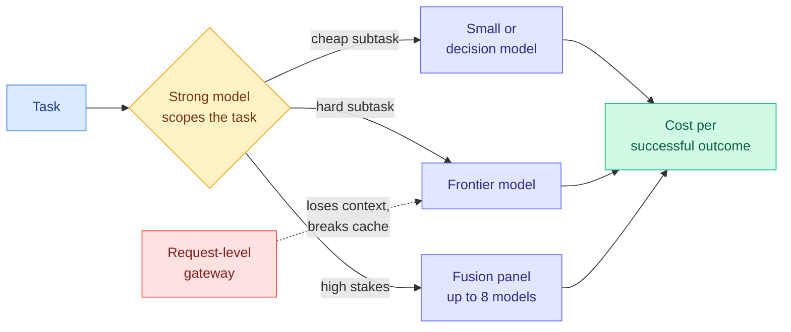

# Workflow economics: the router moves from the request to the task

**Sources (2026-09-26):** Ken Huang, "The Next AI Moat Is Workflow Economics" ([Agentic AI](https://kenhuangus.substack.com/p/the-next-ai-moat-is-workflow-economics), RSS + Gmail); a practitioner critique of request-level routing ([@kunchenguid](https://x.com/kunchenguid/status/2103895901140042044), X home feed); OpenRouter's Fusion announcement (Gmail, OpenRouter newsletter); Business Analytics Review, "The SaaSpocalypse has a winner" (Gmail). Raw: `raw/rss/2026-09-26-agentic-ai-the-next-ai-moat-is-workflow-economics.md`, `raw/gmail/2026-09-27-newsletters.md`.

## TL;DR

Four independent pieces on one day make the same argument from different seats. Cheap tokens did not make AI cheap: they raised appetite for agent steps (plan, act, verify, retry, repair), so the bill moved from the prompt to the workflow. Ken Huang argues the durable moat is "workflow economics": deciding which jobs deserve premium reasoning, with routing lanes, promotion rules, caps and a KPI of **cost per successful outcome** instead of cost per call. A practitioner critique sharpens where that routing has to live: a bare request is too little signal to judge difficulty ("how does this work" is trivial in a one-file repo and hard in the Linux kernel), and switching models mid-session throws away the prompt cache, so request-level routers can cost more than using the best model throughout. The fix is task-level routing inside the harness. OpenRouter, a request-level gateway, shipped the opposite tool the same week: Fusion fans one prompt out to up to eight models and has an analyst report agreements, contradictions and blind spots. Business Analytics Review names the profit pool: whoever controls the router between fixed-price contracts and falling compute cost.

## Key claims

- **Cheap units, expensive totals.** Every drop in model cost invites more steps; the unit price falls while workflow appetite rises faster (Huang, Figure 1).
- **Most margin leaks sit outside the model call:** fan-out, oversized context, repeated retries, and cleanup after a run went on longer than the job was worth.
- **Governance is cost control.** The same boundary that limits risk (permissions, stop rules, validators before planners) limits waste.
- **Request-level routing has two structural problems:** missing context and prompt-cache loss on model switches.
- **Fusion is overkill for tactical prompts**, by OpenRouter's own description; the calling model decides per request whether to invoke it.

## Relation to prior wiki pages

- **Names the frame the concept page has been building.** [llm-routing](llm-routing.md) recorded on 09-26 that error correlation between tiers, not calibration, decides whether a cascade gains anything ([Jev vs LLM rubric judges (09-26)](2026-09-26-jev-vs-llm-rubric-judges-correlated-errors.md)). Fusion's "blind spots" field is a product built on the same insight: diverse models are valuable only where their errors differ.
- **The cache argument has prior data.** The 09-23 price-war page found cache reads fell about 60% in the Opus 5.5 and GPT-6 Sol/Luna release ([price war, cache reads (09-23)](../hardware/2026-09-23-price-war-cache-reads.md)). Cheaper cache reads raise the penalty for a router that breaks the cache.
- **Harness research agrees on where cost lives.** [HarnessTax (09-22)](../agentic-systems/2026-09-22-harnesstax-cost-success-frontier.md) and [harness choice costs, not success (09-17)](../agentic-systems/2026-09-17-harness-choice-costs-not-success.md) found harness decisions move cost more than success rate.

## Open question

Nobody has published a head-to-head of request-level versus task-level routing with prompt-cache costs counted. That is the missing experiment.
