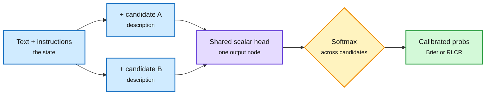

# Raschka on Jev, and Decision APIs Go Open (SGLang /v1/decisions, bev-decider)

**Source:** Ahead of AI (Sebastian Raschka), RSS + Gmail, 2026-09-29 · [Essay](https://magazine.sebastianraschka.com/p/classifier-history-and-jev) · X feed: [SGLang](https://x.com/sgl_project/status/2105095379272515603), [bev-decider-0.4B](https://x.com/neural_avb/status/2104667067047944500) ([HF](https://huggingface.co/avbiswas/bev-decider-0.4B), [code](https://github.com/avbiswas/bev-train))
**Raw:** [raw/rss/2026-09-29-ahead-of-ai-language-models-for-text-classification-from-bag-of-wor.md](../../raw/rss/2026-09-29-ahead-of-ai-language-models-for-text-classification-from-bag-of-wor.md)

## TL;DR

Jev is TypeSafe AI's "decision model": you send a text state plus typed questions (Choice for multi-class, Noul for a yes-probability, Score for ordinal rubrics) and get calibrated probabilities back, fast and cheap. Raschka's long essay places it in the history of text classification (bag-of-words, RNNs, CNNs, BERT, GPT) and runs it. On the full 25,000-review IMDb test set, Jev scores **96.47% (Choice) and 96.20% (Noul) for about $0.65 total** in about 22 minutes, roughly matching a fine-tuned ModernBERT that needed 23 minutes of training. His read: Jev is "the ChatGPT moment for classification." It is not fundamentally new, but it removes per-task fine-tuning. He shows how to retrofit a Jev-like API onto any BERT or GPT backbone: a one-output scoring head applied to (text, instructions, candidate description) for each option, then softmax across candidates, so the number of classes can change without changing the architecture. On training, TypeSafe says only "Reinforcement Learning for Calibrated Decisions (RLCD)" on 100% synthetic data. Raschka links it to the published RLCR method, which adds a Brier-score penalty on the model's stated confidence to the usual 0/1 correctness reward (HotpotQA calibration error 0.37 to 0.03 at similar accuracy). His own ModernBERT trained with cross-entropy plus Brier loss improved modestly over temperature scaling.

The same day, the serving stacks absorbed the interface. **SGLang shipped a native `/v1/decisions` endpoint** that turns any LLM or VLM into a classification and scoring model, plus a Jev-compatible `/v1/systemone` endpoint, and demoed Qwen3.8-27B beating Pokemon FireRed's Elite Four with sub-100 ms decisions. **bev-decider-0.4B** (first 20 layers of Qwen, choice-order invariant, one parallel forward pass, about 50 ms on a three-year-old Mac) shipped fully open with a `/v1/systemone` API.

A Jev-like head on any backbone

Score each candidate with one shared scalar head, then softmax. The class list becomes an input.

Blue is input and candidates, purple is the shared scoring head, amber is the decision, green is the calibrated output.

## Key claims

- **Cost:** IMDb at about $0.65 for 25k reviews (about 15M input tokens).
- **Non-determinism:** repeated runs differ slightly, which Raschka attributes to batch-dependent GPU kernel ordering.
- **Rule of thumb updated:** the old split was "cheap LLM for one-off decisions, fine-tuned classifier for repeated ones." A general decision model now sits between them; fine-tune only for very high volume on one task.
- **Clones:** a Jev-like API on ModernBERT is trivial; making it generalize across tasks is not. That depends on training data.

## How this relates to prior wiki pages

- **The routing page's 09-19 finding** was that decision models got cheap to *own*, not just rent: [six open clones in 72 hours](2026-09-19-jev-open-clones-commoditization.md), one at 2.8 MB. Today's step is different: the *interface* moved into the serving engines. With SGLang's `/v1/decisions`, any deployed model can be a router or grader, with no separate model.
- **Calibration thread:** [Jev calibration reckoning (09-21)](2026-09-21-jev-calibration-reckoning.md) and [ECE numbers arrive (09-23)](2026-09-23-decision-model-ece-numbers-arrive.md) questioned whether the probabilities are calibrated. Raschka's RLCR link gives the first public hypothesis for *how* one would train calibration in, and his own Brier-loss experiment is a small independent data point.
- **Production signal:** vLLM's office hours (10-01) introduce the llm-d Semantic Classifier: KV-cache routing picks the pod with your prefix warm, and semantic classification picks the model tier. The routing stack is converging on two decisions per request.

## Related

- [LLM routing concept page](llm-routing.md)
- [Jev as a decision-only model (09-16)](2026-09-16-jev-decision-only-model.md)
