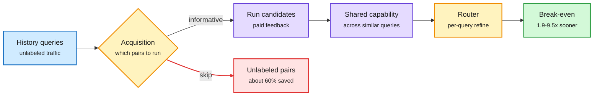

# SaveRouter: Routing Should Pay for Itself

**Source:** HuggingFace Daily Papers, listed 2026-09-30 · [arXiv 2609.37402](https://arxiv.org/abs/2609.37402) · [code](https://github.com/LAMDA-Model-Reuse/SaveRouter)
**Raw:** [raw/huggingface/2026-09-30-routing-should-pay-for-itself-sparse-supervision-for-economi.md](../../raw/huggingface/2026-09-30-routing-should-pay-for-itself-sparse-supervision-for-economi.md)

## TL;DR

An LLM router saves money at serving time by sending easy queries to cheap models. But to train it, you usually run every candidate model on thousands of historical queries to learn who is good at what. That labeling bill is paid before the router saves a cent, and prior routing papers ignore it. SaveRouter (LAMDA, Nanjing) asks when a router breaks even. It finds routing quality saturates long before all query-model labels are collected, so it buys feedback selectively (only the informative query-model pairs) and shares capability estimates across similar queries, then refines per query. On four routing benchmarks it uses 33 to 41% of the available feedback, matches or beats dense-supervision routers, and reaches break-even after **1.9x to 9.5x fewer deployed queries** than the fastest conventional router. The sharpest finding: the supervision level that minimizes long-run serving cost is not the one that pays back fastest.

The router's training bill is part of its cost

SaveRouter only buys labels that change a routing decision, so payback comes sooner.

Blue is input traffic, amber is the decisions, purple is paid work, red is labeling skipped, green is the payoff.

## Key findings

- **Dense supervision is over-provisioned.** Routing quality plateaus well before every query has been run on every model.
- **33-41% of the feedback** gives competitive or better routing on all four benchmarks.
- **Break-even deployment volume drops 1.9x to 9.5x** versus the fastest conventional router when supervision cost is counted.
- **Two optima, not one.** More labels can lower steady-state serving cost while delaying payback. Which one a team should pick depends on expected traffic volume.

## How it relates to prior wiki pages

- **Extends the cost-accounting thread on [llm-routing](llm-routing.md).** The 09-27 entry (workflow economics) argued routing should be judged by cost per successful outcome. SaveRouter adds the missing up-front term: what it cost to learn the router. The 09-19 entry where the router's own inference cost went to zero (scores read off candidate outputs) and the 09-29 MOPD-Router (routing score read off teachers' own outputs, no router parameters) are the same instinct applied at serving and training time. SaveRouter applies it to data collection.
- **Fits the decision-model tier poorly, which is the interesting tension.** The 09-30 Raschka and SGLang `/v1/decisions` entries make a zero-shot decision model the router, needing no per-deployment labels at all. SaveRouter assumes a trained router. Nobody has compared "zero-shot decision model" against "sparse-supervised trained router" on payback.
- **Gap:** benchmarks are static. Real traffic drifts, so the supervision bill recurs; the paper does not model re-labeling cost.

## Links

- Concept: [LLM routing](llm-routing.md)
- Digest: [2026-10-01](../daily-digest/2026-10/2026-10-01.md)
