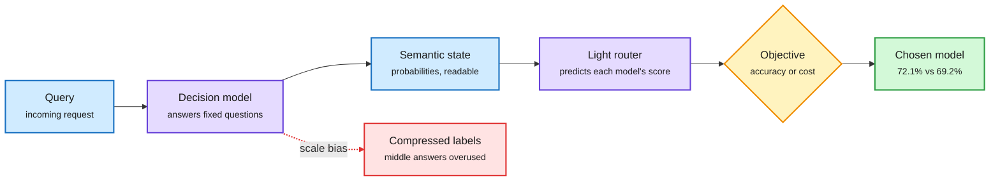

# SeLMRoute and the Limits of Decision Models as Routers

**Source:** HuggingFace Daily Papers (2026-10-01) + X Following feed
**Papers:** [SeLMRoute](https://arxiv.org/abs/2609.34736) · [Ordinal-Scale Bias in Jev-like Models](https://arxiv.org/abs/2609.38827) · [Jev for Recommendation Reranking](https://arxiv.org/abs/2609.40241)
**Posts:** [How to Cost Your AI-Powered Filters (Shankar et al.)](https://fsdatalab.github.io/blog/ai-filter-cost-estimates/) · [GLiDE (Fastino)](https://x.com/george_onx/status/2105726320357634303)
**Raw:** `raw/huggingface/2026-10-01-selmroute-*.md`, `-more-choices-fewer-decisions-*.md`, `-decision-oriented-recommendation-reranking-*.md`; X feed capture 2026-10-02 morning

## TL;DR

**SeLMRoute** splits routing into three steps. First a decision model answers a fixed set of readable questions about the query ("does it need multi-step reasoning?", "does it need outside knowledge?"), keeping each answer as a probability, not a yes/no. Then a small supervised router predicts how each candidate model will do from that probability vector. Only then is a deployment objective (best accuracy, or accuracy per dollar) applied. On LLMRouterBench (15 datasets, 20 models, 11,481 queries) it reaches 72.08% against 69.23% for the best single model, and its semantic representation beats dense, lexical and domain-level ones. In a 13-model cost setting it improves all five splits (mean PerfGain 2.66%).

Two companion papers test the decision models such routers now lean on. **Ordinal-scale bias**: Jev 1.13 and three open KEV models compress ordinal scales. On ANLI, Jev puts 38.8% of predictions and 51.3% of errors on "Neutral." Across 36 ordinal datasets, decisions use only 67 to 76% of the real label spread, falling to 26 to 75% when the scale has 14 points. A targeted LoRA fix lifts usage from about 47% to 86%, so it is learned, not architectural. **Jev for reranking**: quality holds up against recommendation baselines and latency grows more gently than pointwise Qwen rerankers with candidate count, but stays well above purpose-built recommenders.

On the systems side, Shreya Shankar's group shows calling a decision API once per row is far from optimal for batch work: the speed-of-light (the hardware floor from a roofline model) for one AI filter over 5,000 reviews with Qwen3-4B on one H100 is about 6.6 seconds, and no system, including their own Quail engine, comes close. Fastino's GLiDE adds "adaptive thinking" to a decision model: it reasons only when the fast probability distribution is uncertain, and claims a 6.9-point lead over Jev on the Decision Index.

Describe the query first, then pick the model

The same probability vector serves accuracy-first and cost-first routing.

Blue is input and the semantic state, purple is a model, amber is the objective, green is the decision, red is the known failure mode of the first stage.

## How it relates to prior wiki pages

- **Answers part of the 10-01 SaveRouter question.** [SaveRouter (10-01)](2026-10-01-saverouter-sparse-supervision-routing.md) argued a router must pay back its own labeling bill. SeLMRoute's semantic state is candidate-independent, so adding a new model needs only performance labels for that model, not a new encoder. That shortens payback, though the paper does not count the decision model's own inference cost.
- **The decision-model wave keeps growing.** The 10-01 Media Zone counted OpenAI, Ollama, Databricks and Cloudflare (clef) shipping decision endpoints in a week. GLiDE is the fifth. The ordinal-bias paper is the first systematic reliability check on the category, and it lands squarely on routing: a router that asks "how hard is this query, 1 to 10?" gets a squashed answer.
- **Connects to the cost-per-task thread.** Quail's speed-of-light analysis is the batch analogue of the 10-01 digest's point that per-call price hides the real bill: per-row API calls throw away KV reuse across rows (shared prompt prefix) and query planning (filter ordering).

## Gaps

- SeLMRoute does not report the decision model's latency or cost per query, which decides whether it saves money.
- The ordinal-bias paper tests one Jev version and three KEV models; GLiDE and clef are untested.
- GLiDE's benchmark is vendor-run.

Related: [LLM routing](llm-routing.md)
