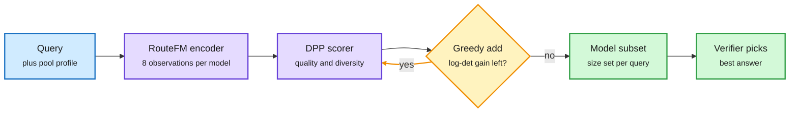

# FlexRouter, RouteFM and the Decision-Model Price Collapse

**Sources:** HuggingFace Daily Papers 2026-10-02: [FlexRouter, arXiv 2609.38585](https://arxiv.org/abs/2609.38585) · [RouteFM, arXiv 2609.37362](https://arxiv.org/abs/2609.37362) · [Jev for edge orchestration, arXiv 2609.22753](https://arxiv.org/abs/2609.22753) · [JevSpawn, arXiv 2610.00437](https://arxiv.org/abs/2610.00437). Industry: AI Weekly Espresso (10-02), The Decoder (10-02), X Following feed (Perplexity, Red Hat AI, Elastic, You.com).
**Raw:** [FlexRouter](../../raw/huggingface/2026-10-02-flexrouter-learning-complementary-model-sets-for-flexible-ll.md) · [RouteFM](../../raw/huggingface/2026-10-02-pretrain-once-route-anywhere-towards-a-foundation-model-for.md) · [Jev edge](../../raw/huggingface/2026-10-02-replacing-large-language-models-with-jev-decision-models-for.md) · [JevSpawn](../../raw/huggingface/2026-10-02-jevspawn-adaptive-agentic-inference-through-compositional-ac.md)

## TL;DR

Two routing papers change *what* a router optimizes. **FlexRouter** says top-k routing is wrong when a verifier or user picks the best of several answers: scoring models independently picks redundant models that fail on the same queries. It optimizes **coverage** (the chance at least one chosen model is right) with a Determinantal Point Process (a probability model that rewards picking items that are both good and different), trains it by marginalizing over failure sets, and grows the subset greedily until the marginal gain is small, so the budget is set per query. **RouteFM** says routers should not be refit per workload. It learns to characterize *anonymous* candidate models from a few behavioral observations, pretrained episodically across many routing environments, and then adapts to a new pool through context alone. On held-out MMR-Bench it beats the best baseline by **2.23 quality points with only eight observations per candidate**.

Around them, decision models (small models that return a typed choice with probabilities instead of prose) fell in price again: Perplexity open-sourced **pplx-decider-27b** at 4 cents per million input tokens with free output; Amazon released **Strands Decider 2B** (Apache 2.0, about 72% on JevBench v19, 106 ms median on an RTX 3090); Cloudflare's **Clef-flash** classifies in about 39 ms. An academic study finds Jev cuts median decision latency **22.7% to 64.5%** vs the fastest hosted LLM in edge orchestration, with **59.7% to 80.9% lower fees per correct decision** on narrow four-field contracts, but wide contracts mark where substitution stops working.

Pick a team, not the top-k

FlexRouter adds models only while they cover new failures.

Blue is input, purple is learned scoring, amber is the stop-or-add loop, green is the chosen set and final pick. (RouteFM and FlexRouter are separate papers; the diagram shows how they compose.)

## Key findings

- **FlexRouter:** higher coverage with lower redundancy than strong baselines on RouterEval, in and out of domain, without a fixed k.
- **RouteFM:** gains are largest when behavioral evidence is scarce; transfer holds across domains, modalities, pools and context budgets. Code is public.
- **Jev at the edge:** latency barely moves with input size or catalog size; it names unseen services as accurately as known ones; on a live admission path it keeps 0.91 to 0.95 of requests exact and on time where LLMs fall below 0.1. Caching repeated descriptions gives LLMs nearly the same latency, so the gain is on fresh decisions.
- **JevSpawn** spawns parallel finite actions from natural-language task specs and shares action prefixes to cut repeated generation.
- **Practitioner:** Red Hat found a ~200M classifier at 89.01% on prompt injection vs 89.31% for a 35B model (54 ms vs 312 ms). Elastic lifted nDCG@10 from 0.935 to 0.957 with Jev scores plus a short policy.

## How it relates to prior wiki pages

- **FlexRouter turns the routing target from one model to a portfolio.** Most entries on the [routing page](llm-routing.md) pick one model per query. FlexRouter fits the best-of-N plus verifier setups from [Mid-Harness (10-02)](../agentic-systems/2026-10-02-mid-harness-action-scaling-milo.md), where diversity of candidates matters more than the single best.
- **RouteFM addresses the training-bill problem.** [SaveRouter (10-01)](2026-10-01-saverouter-sparse-supervision-routing.md) counted the cost of labelling outcomes to train a router. RouteFM's answer is amortization: pretrain once, adapt from eight observations.
- **Decision-model limits still apply.** [SeLMRoute (10-02)](2026-10-02-selmroute-and-decision-model-limits.md) found decision models under-use ordinal scales (67% to 76% of the label spread). The edge study's "wide contracts mark the limit" is the same boundary from the latency side.
- **N-of-a-kind:** five vendors (TypeSafe Jev, Fastino GLiDE, Cloudflare Clef, Amazon Strands Decider, Perplexity pplx-decider) now ship decision endpoints, three of them open-weight within a week.

## Related

[LLM routing](llm-routing.md) · [Raschka on decision APIs (09-30)](2026-09-30-raschka-jev-classifier-history-open-decision-apis.md)
