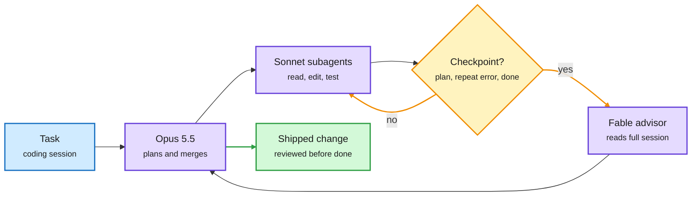

# Claude Code's advisor tool: routing by moment

**TL;DR.** Anthropic's experimental advisor tool pairs the main model with a stronger one that Claude consults at three moments: before committing to an approach, when the same error recurs, and before declaring a task done. The advisor reads the full session, every tool call included, runs server-side, and returns guidance. The practitioner setup that circulated on the US Saturday feed runs **Opus 5.5 to plan and merge, Sonnet 5.5 subagents to read, edit and test, and Fable 5.1 as the on-call advisor**, with a decision model (TypeSafe's Jev) handling mechanical forks below that. The docs flag it as experimental, Anthropic-API only, and note an impact on prompt caching.

The strongest model is on call, not on shift

Escalation is triggered by the state of the session, not by the incoming query.

Blue is input, purple a model, amber the escalation decision, green the result.

## Why it matters for routing research

- **A different routing axis.** Classic LLM routing (RouteLLM-style, FlexRouter and RouteFM on 10-03) decides per *query* which model answers. The advisor decides per *moment inside one long session* whether a stronger model should look. The trigger signals are agent-state events (plan boundary, repeated error, completion claim), not query difficulty.
- **Cost profile.** The advisor reads the full session, so each consultation is a large input. Its economics depend on the cache: if the advisor's prefix is not cached, three consultations on a long session can cost more than the Sonnet work. That is presumably why the docs call out prompt-caching impact.
- **Three-tier stack in practice.** Decision model (sub-second, mechanical forks) → workhorse model (execution) → frontier advisor (judgment). This is the same layering the decision-model wave of the past week implies, now packaged as a product feature.

## How this relates to prior wiki pages

- Complements the decision-model wave on [llm-routing](llm-routing.md) (Jev, Clef, pplx-decider, Strands Decider; [10-03](2026-10-03-flexrouter-routefm-decision-model-wave.md)): those handle the cheap bottom tier; the advisor is the top tier.
- Same-day research twin: Mixture of Self-Improving Branches ([10-04](../agentic-systems/2026-10-04-harness-learning-and-branch-routing.md)) routes each input to a specialized harness. Routing now operates over models, moments and programs.
- Mid-Harness (10-02) put a verifier between proposal and execution; the advisor puts one before "done". Both are verification-as-routing.

## Gaps

- No published numbers from Anthropic on how often the advisor fires, what it costs per session, or how much it lifts success. The 12-step "Dario PDF" threads around it are unverified engagement posts.

**Raw source:** X Following feed, 2026-10-03; [Claude Code docs](https://code.claude.com/docs/en/advisor).
