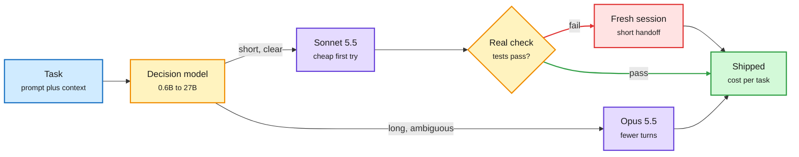

# Decision 2.0, Jev builds, and turn-priced routing

**TL;DR.** Three routing signals crossed the feed on the US Sunday. (1) The vLLM Semantic Router team (`vllm-sr`) released **Decision 2.0**, open decision models in six sizes from **0.6B to 27B** (Vega-27B, Lux-9B, Nox-4B, Sol-2B, Eos-0.8B, Kai-0.6B), billed as "towards open foundation decision models". Decision models are small classifiers that answer a typed question (which model, which skill, is this done) so a large model does not have to. (2) A practitioner list of ten open-source builds on the Jev decision API shows where these models are landing: per-step effort selection for Claude Code without breaking the prompt cache, a Stop hook that blocks "done" without evidence, a skill router, a Codex subagent model picker, a commit-message checker and semantic grep. (3) A small-account cost post argues that routing by list price is wrong once cache reads dominate: with cache hits billed the same on Opus 5.5 and Sonnet 5.5, Opus's premium per turn falls from about **1.88x at 20K context to 1.26x at 400K**, so the right unit is cost per shipped task.

The unit of routing is the finished task, not the token

A small decision model picks the path; cache reads flatten the price gap on long loops.

Blue is input, amber is a decision, purple is a model, red is the escalation after a failed check, green is the result.

## Key points

- **Decision 2.0 sizes:** 27B, 9B, 4B, 2B, 0.8B, 0.6B, all on Hugging Face under `vllm-sr`. No benchmark table was captured; the 0.6B model was the most downloaded in the first day.
- **Cache-aware switching cost (pricing page check):** Opus 5.5 lists $4/$20 per million input/output tokens and Sonnet 5.5 $2/$10; cache hits are $0.20 per million on both. The post's arithmetic: moving a 300K failed transcript into Opus costs about $1.50 just to re-cache, while a clean 20K handoff costs about $0.10. Its rule: never drag the whole failed transcript across models.
- **A skill router that got removed.** One of the Jev builds (jev-skill-router) reports that over a week only 28 of 539 suggestions were used before the author removed it. Honest negative evidence: routing a prompt to "one skill or none" is not yet reliable enough to automate.
- **Price distortion from aggregator routing.** Horace He (shared by Soumith Chintala) flagged "an interesting distortion in inference pricing that appears to be driven by OpenRouter's routing"; only the opening of the post was captured, so the specific mechanism is not recorded here.

## How this relates to prior wiki pages

- **Decision-model wave, week two.** On 10-03 ([FlexRouter/RouteFM page](2026-10-03-flexrouter-routefm-decision-model-wave.md)) Perplexity open-sourced a 27B decider at 4 cents per million input tokens, Amazon shipped Strands Decider 2B and Cloudflare Clef. Decision 2.0 is the first family spanning 0.6B to 27B from the vLLM router project itself, which puts the decision layer inside the serving stack rather than beside it.
- **Turn-priced routing extends the Claude Code advisor result (10-04).** That [page](2026-10-04-claude-code-advisor-routing-by-moment.md) described escalation by session moment (plan, repeated error, completion). Today's cost post adds the missing price logic: escalation should start a fresh, short session, because cross-model handoff resets the cache.
- **Same lesson as the compression study today** ([Beyond Token Savings](../inference-efficiency/2026-10-05-context-compression-beyond-token-savings.md)): token count is the wrong cost unit when cache reads dominate.
- Updates [llm-routing](llm-routing.md).

## Gaps

- The cost post is arithmetic, not a measured fleet. Turn counts per model per task are asserted, not logged.
- Decision 2.0 shipped without a captured eval card, so its accuracy against Jev, Clef and pplx-decider is unknown.

**Raw source:** X Following feed captures, 2026-10-04 evening and 2026-10-05 morning.
