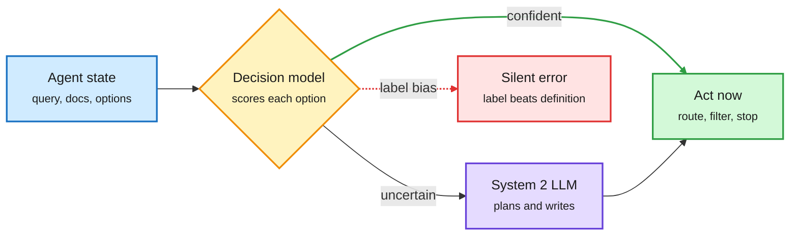

# OpenAI ships a decision endpoint, and five papers audit the primitive the same day

**Sources:** OpenAI Decisions API launch ([The Decoder](https://the-decoder.com/openai-launches-decisions-api-that-reduces-complex-evaluations-to-yes-no-or-pick-one/), [TLDR AI](https://tldr.tech/ai/2026-10-07), [OpenAI video](https://youtube.com/watch?v=FB6oCmrIj-Y)) · HuggingFace Daily Papers 2026-10-06: [SearchJev, arXiv 2610.05107](https://arxiv.org/abs/2610.05107) · [LLM-as-Jev, arXiv 2610.02076](https://arxiv.org/abs/2610.02076) · [Labels Override Definitions, arXiv 2610.02586](https://arxiv.org/abs/2610.02586) · [SoK: Semantic Decision Engines, arXiv 2610.06425](https://arxiv.org/abs/2610.06425) · [Jev vs LLMs in Open RAN, arXiv 2609.23136](https://arxiv.org/abs/2609.23136)
**Raw:** [SearchJev](../../raw/huggingface/2026-10-06-searchjev-a-fast-and-calibrated-system-1-model-for-search-ag.md) · [LLM-as-Jev](../../raw/huggingface/2026-10-06-llm-as-jev-llms-are-already-jev-style-decision-models-when-a.md) · [Labels](../../raw/huggingface/2026-10-06-labels-override-definitions-in-jev-style-typed-decision-mode.md) · [SoK](../../raw/huggingface/2026-10-06-sok-semantic-decision-engines-in-network-control-loops.md) · [Open RAN](../../raw/huggingface/2026-10-06-intent-interpretation-at-ric-timescales-jev-decision-models.md) · [The Decoder](../../raw/rss/2026-10-07-the-decoder-openai-launches-decisions-api-that-reduces-complex-eval.md)

## TL;DR

A decision model returns a probability over a fixed list of options (yes/no, pick one, a rating) instead of writing text. [Jev (09-16)](2026-09-16-jev-decision-only-model.md) introduced the pattern as a product; open clones followed within days. On 2026-10-06 **OpenAI launched its own Decisions API**: yes/no probabilities, category picks or scale ratings over text and images, about **10x faster than the Responses API, at $0.10 per million input tokens**. It also cut its paid API tiers from five to three. The launch video was the most-viewed AI video in the reader's subscriptions this window. A frontier lab adopting the interface ends the question of whether "stop sampling, read the probabilities" is a niche. The same HF list carried five papers that test the primitive, and they split cleanly: two say it works and is cheap, three say the interface hides failure modes.

The decision call sits beside the generator, not inside it

Short typed choices go to a fast scorer; only uncertain cases reach the expensive model.

Blue is the input, amber is the decision model, purple is the expensive generator, green is the action, red is the failure mode the audits found.

## The five papers

- **SearchJev (works, and is cheap).** A System-1 model scores search decisions (is this relevant, is the evidence enough, search again?) straight from logits, trained with soft labels so its confidence is calibrated. It hands only uncertain cases to the System-2 LLM. **5.2-5.3x faster decisions, 41-74% lower calibration error** than same-size Qwen3.5 generating its answer; on BrowseComp-Plus the dual-system agent searches **3.7-4.7x faster and accuracy rises from 45% to 54%**.
- **LLM-as-Jev (works, and you may not need a new model).** A stock LLM read through next-token probabilities over bracketed numeric IDs already matches community Jev clones on the same backbone at 4B with no training. Fine-tuning helps weak models and many-option intent routing, with diminishing returns on strong backbones. KL anchors keep chat behaviour intact.
- **Labels Override Definitions (hidden failure).** Developers write the rule in each option's *definition*, but the probability mostly follows the *label*. Deleting every definition leaves accuracy unchanged (0.8559 vs 0.8487). Renaming options to "A" and "B" raises accuracy 15 points. The cause is one prompt-formatting line ("{label}: {definition}"); flipping it, with no weight change, makes one model immune and breaks another (0.85 to 0.23 when label and definition disagree).
- **SoK on decision engines in network control loops (claims outrun evidence).** Of 139 paper families, 50 claim a decision engine fits a time budget; **4 back it with matched measurement**. A decision that meets a 10 s budget in isolation meets it for none once requests queue.
- **Jev vs hosted LLMs in Open RAN (latency is the product).** Jev-1.13.0 meets a 1 s near-real-time budget on **99.8%** of calls; two hosted LLMs meet it on 17.9% and 0%. But no radio-level SLA penalty from the slow interpreters was resolved at the base operating point.

## Relation to prior wiki pages

- **Confirms the commoditization read.** [The calibration reckoning (09-21)](2026-09-21-jev-calibration-reckoning.md) concluded "the mechanism is commoditized, the training data is not." LLM-as-Jev pushes further: on a strong backbone the mechanism needs no new model at all. OpenAI pricing at $0.10/M (vs Jev's $0.042/M and open local models at zero marginal cost) competes on integration, not price.
- **New failure axis.** Every prior entry on [LLM routing](llm-routing.md) measured accuracy, calibration, latency or price. Option-label bias is a *specification* failure: the router obeys the name of a route, not its rule. Any routing table whose route names hint at the answer is affected.
- **SoK echoes the 10-05 practitioner finding** ([Decision 2.0](2026-10-05-decision-2-and-turn-priced-routing.md)) that one-of-N skill routing kept 28 of 539 suggestions: the interface is easy to ship and hard to evaluate.

## Gaps

- No paper benchmarks OpenAI's endpoint yet; its calibration is unmeasured.
- Option-label bias is shown on open models only. Whether hosted Jev or OpenAI's API shows it is untested and cheap to test (rename options, compare).

## Related

[LLM routing](llm-routing.md) · [Test-time compute allocation](../inference-efficiency/test-time-compute-allocation.md) · [Agent benchmarks](../agentic-systems/agent-benchmarks.md)
