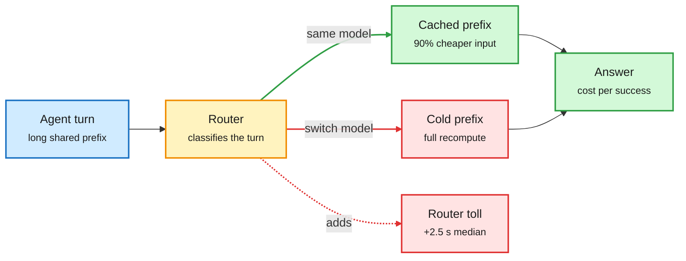

# Routing gets graded: Jev Router on Agent Arena, local routing in Copilot, Haiku 5.5 pricing (2026-10-08)

**Sources (X Following feed, RSS):** LMArena's Jev Router evaluation ([thread](https://x.com/arena/status/2107961555363213482), [latency post](https://x.com/arena/status/2107961562858492338), [summary](https://x.com/arena/status/2107961564821405897)); GitHub's local model routing announcement ([X](https://x.com/github/status/2107896916595884177)); Microsoft's MAI-Code-1.1-Flash on-device plan ([X via @rohanpaul_ai](https://x.com/rohanpaul_ai/status/2107914219408736463), [The Information](https://www.theinformation.com/briefings/microsoft-debuts-new-windows-pcs-features-powered-on-device-ai)); Claude Haiku 5.5 ([Simon Willison](https://simonwillison.net/2026/Oct/7/claude-haiku-5-5/), [The Decoder](https://the-decoder.com/claude-haiku-5-5-arrives-with-massive-price-cuts-proving-the-ai-pricing-arms-race-is-far-from-over/), [GitHub changelog](https://github.blog/changelog/2026-10-07-claude-haiku-5-5-in-github-copilot/)); Akshay Pachaar's routing explainer ([X](https://x.com/akshay_pachaar/status/2107746747674239324)); SambaNova prompt caching for MiniMax M3 ([blog](https://bit.ly/4emDQ71)); Liquid AI Open d1 ([HF blog](https://huggingface.co/blog/LiquidAI/open-d1)); Unsloth decision-model recipe ([docs](https://unsloth.ai/docs/basics/train-your-own-decision-model-with-unsloth)).

**TL;DR.** The first independent benchmark of a commercial router came back negative. LMArena ran TypeSafe's Jev Router over more than 4,700 real agentic sessions. It mostly picks models that sit on the cost-quality Pareto frontier (4 of its 5 most-used), and its steerability score (+10%) nearly matches Claude Opus 5.5 High. But calling DeepSeek V4.1 Flash directly gives similar task success for **38% less cost** and **1.7x lower median latency** (6.18 s vs 3.64 s; P90 30.6 s vs 14.3 s). The same day, routing moved to the device: Microsoft will route routine Copilot coding from Claude Haiku 4.5 to its own MAI-Code-1.1-Flash (137B total, 6.8B active, 3-bit, 256K context) running on Nvidia RTX Spark PCs at no inference charge, and GitHub announced local-model routing under Project HydraFusion. Anthropic's Claude Haiku 5.5 cut the cheap tier to $0.10/$0.50 per million tokens (up to 100K), matching GPT-6 Luna, but a new tokenizer uses ~1.25x more tokens and price rises 5x above 100K.

A router pays a toll before it saves anything

Classification latency and lost prefix cache are paid on every call; savings only arrive on the hard tail.

Amber is the routing decision, green the cheap path, red the two costs a router adds.

## Key points

- **Arena result.** Similar performance to DeepSeek V4.1 Flash (Max) at 38% higher cost and 1.7x higher median request latency. Most-picked models: DeepSeek V4.1 Flash, GPT-6.1 Sol, GPT-6 Luna. Arena's conclusion: "balancing task success, steerability, cost and latency all at once remains an open challenge."
- **Why routing can cost more (Pachaar).** Every classification adds latency, rules go stale, and switching models mid-session throws away the prefix cache. Agents need session pinning and model affinity. SambaNova's MiniMax M3 numbers show the size of that cache: cached input is 90% cheaper ($0.06 vs $0.60 per M) and cuts time-to-first-token 35-88% across 8K-192K contexts (8.4 s to 1.0 s at 192K).
- **Routing to the device.** MAI-Code-1.1-Flash keeps 3-bit weights and still scores the same as full precision on SWE-Bench Verified and Terminal-Bench 2.1, per Microsoft. Hardware: Surface Laptop Ultra ($2,599) and RTX Spark Dev Box ($5,999), Arm CPU plus Blackwell GPU, up to 128GB unified memory. Microsoft also showed DeepSeek V4 Flash (284B) at 1.6 bits in ~60GB on the same machine.
- **Cheap tier repriced.** Haiku 5.5: OSWorld 15.7% to 72.4% vs Haiku 4.5; GitHub says it matched Sonnet 5 on many coding tasks with fewer tokens and steps. Anthropic also halved Sonnet 5.5 cache-read prices and added monthly API credits for Max and Team plans.
- **Decision models keep getting smaller and open.** Liquid AI released Open d1 (d1-3B text+vision, experimental d1-omni-600M). Unsloth's recipe lifts Qwen3.5 0.8B from 20.7% to 74.3% on three decision benchmarks in 4GB of VRAM.

## How this relates to prior wiki pages

- **First field test of the router layer this page has tracked since the 10-01 HydraFusion entry.** The 10-07 [Decisions API page](2026-10-07-openai-decisions-api-and-decision-model-audits.md) recorded the primitive going first-party and an audit showing decision models follow option labels over definitions. Today's Arena result is the system-level counterpart: a good chooser that still loses on cost per success.
- **Confirms the 10-04 [Claude Code advisor](2026-10-04-claude-code-advisor-routing-by-moment.md) framing.** Escalating on session state (after a real failure) rather than per-turn difficulty avoids repeated cache loss. That is what the Arena loss suggests a router should do.
- **Contradiction to hold open.** Red Hat's llm-d routing (10-07) served 2x the users with up to 99% lower TTFT because it routes by cache locality inside one model family. Jev Router routes across families. Cache-aware routing wins; capability routing across vendors has not yet shown it does.

## Gaps

- Arena's run is one router on one platform; no per-task-type breakdown was published.
- Microsoft's 3-bit "no loss" claim is self-reported on two benchmarks.

## Related

[LLM routing](llm-routing.md) · [KV cache](../inference-efficiency/kv-cache.md) · [Quantization](../inference-efficiency/quantization.md) · [Compute economics](../hardware/compute-economics.md)
