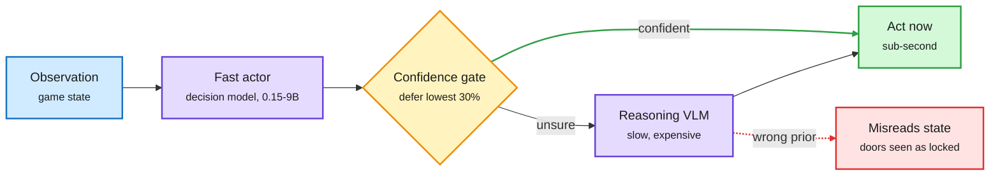

# When should a fast decision model hand off? System Switch, PersonTTS, Laya (2026-10-09)

**Sources:** HuggingFace Daily Papers 2026-10-08: System Switch ([arXiv 2610.09683](https://arxiv.org/abs/2610.09683), [raw](../../raw/huggingface/2026-10-08-system-switch-when-should-a-fast-decision-model-stop-and-thi.md)); PersonTTS, Personalized Test-Time Scaling ([arXiv 2610.09684](https://arxiv.org/abs/2610.09684), [raw](../../raw/huggingface/2026-10-08-from-pareto-to-preference-personalized-test-time-scaling-via.md)). X home feed and newsletters: Laya ([repo](http://github.com/NandhaKishorM/laya), via [@akshay_pachaar](https://x.com/akshay_pachaar/status/2107933081093210124)); Google Gemini Agent's per-task cost routing ([post](https://x.com/StockSavvyShay/status/2108170539118497827)); Understanding AI's Jev explainer (Gmail); Runpod's OpenJev guide (Gmail). Abstracts and posts.

**TL;DR.** Decision models (models that score a fixed set of answers and return probabilities instead of generating text, the Jev family) are now cheap and everywhere. The open question the [routing page](llm-routing.md) carried from 10-07 was whether they are *specified and evaluated* correctly. **System Switch** gives the first clean answer for escalation. A fast decision model takes every action in closed-loop Doom and hands control to a reasoning VLM only when its confidence is low. Offline, deferring the least-confident 30% beats random deferral **in proportion to the actor's AUROC** (how well its confidence separates right from wrong answers; rank correlation 0.87). Accuracy, calibration and AUROC are separate properties: models with similar accuracy differ widely in AUROC. In closed loop, though, no variant reaches the exit, and the reasoner mistakes ordinary doors for locked ones when told keys exist. **PersonTTS** treats test-time compute as a routing problem across three user constraints at once (accuracy, latency, cost) and amortizes controller search across user profiles.

Escalation is only as good as the cheap model's confidence ranking

Accuracy does not predict deferral gain; AUROC does.

Blue is input, purple the two models, amber the gate, green the action, red the reasoner's failure mode.

## Key points

- **AUROC is the metric routers should report.** The 10-07 audits showed option-label bias and a SoK where 4 of 50 time-budget claims were measured. System Switch adds the selection criterion: pick the cheap model for its confidence ranking, not its accuracy. It also confirms the 10-07 finding that option order changes some models' accuracy.
- **Offline gain did not survive closed loop.** +0.13 deferral gain offline, yet no agent finished a level. Same shape as Arena's Jev Router result (10-08): good per-decision choices, weak end-to-end outcome. Routing is graded per decision and fails per task.
- **Escalation by state now has two forms.** The Claude Code advisor (10-04) escalates at session moments (plan, repeated error, completion claim). System Switch escalates on per-decision confidence. Practitioners are already stacking both: Opus plans, Sonnet works, a decision model answers mechanical forks ("which file to open, retry or stop") in under 500 ms.
- **Laya is the open, local form.** An Apache-2.0 encoder plus decision head that scores masked options in one batched forward pass, with a language router in front; about 35 ms locally against about 380 ms for hosted Jev in one test. Runpod's 27B OpenJev scores 84.2% (FP8) against hosted Jev's 85.4% on its author's benchmark, non-commercial license.
- **Product side.** Google's Gemini Agent routes each enterprise task to the most cost-effective model, the first hyperscaler agent pitched on cost routing.

## Gaps

- System Switch: one game, small models; the closed-loop failure is reported but not explained beyond the key prior.
- PersonTTS: AIME and HMMT only.
- Laya's latency claim is from one independent test, not a benchmark.

## Related

[LLM routing](llm-routing.md) · [Test-time compute allocation](../inference-efficiency/test-time-compute-allocation.md) · [Routing graded (10-08)](2026-10-08-routing-graded-jev-router-local-routing.md) · [OpenAI Decisions API and audits (10-07)](2026-10-07-openai-decisions-api-and-decision-model-audits.md)
